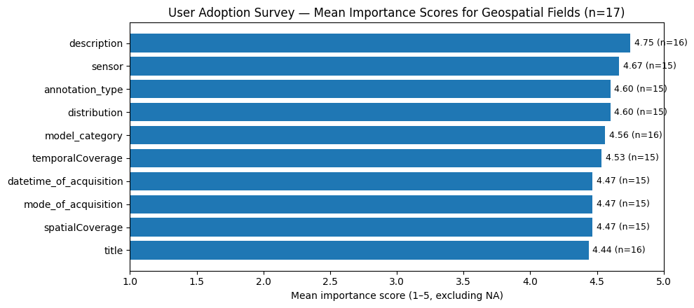
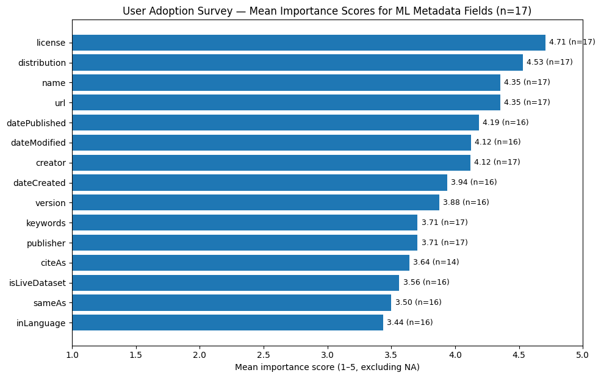

# **GeoCroissant format Specification**

Version 1.0

Published: 01/29/2026

<http://mlcommons.org/croissant/geo/1.0>

Authors:

-   Rajat Shinde - NASA Office of Data Science and Informatics - University of Alabama in Huntsville, US
-   Manil Maskey - NASA, US
-   Ag Stephens - STFC Centre for Environmental Data Analysis (UK)
-   Harsh Shinde - Independent Researcher, India
-   Joseph Edgerton - UVA
-   Tejasri N - IIT Hyderabad, India
-   Douglas Fils - San Diego SuperComputing Center, US
-   Edenna Chen - Massachusetts Institute of Technology, US
-   Claus Weiland - Senckenberg - Leibniz Institution for Biodiversity and Earth System Research
-   Pedram Ghamisi - Helmholtz-Zentrum Dresden-Rossendorf (HZDR), Germany \| Lancaster University, UK
-   Gerald Fenoy - GeoLabs, France
-   Yuhan Douglas Rao - National Oceanic and Atmospheric Administration
-   Omar Benjelloun - Google
-   Elena Simperl - King’s College London & Open Data Institute, UK

Contributors *(in alphabetical order)*:

-   Anna Boser - UCSB, US
-   Armin Mehrabian
-   Ben Lewis - Harvard University
-   Brianna R Pagan - Development Seed
-   Christine Kirkpatrick - San Diego Super Computing Center, US
-   Ed Parsons - Google
-   Gilles Quentin Hacheme - Microsoft AI /GeoAI Africa
-   Gobe Hobona - Open Geospatial Consortium
-   Harsha Vardhan Madiraju - Open Geospatial Consortium
-   Iksha Gurung - NASA Office of Data Science and Informatics - University of Alabama in Huntsville, US
-   Jim Antonoissee - National Geospatial-Intelligence Agency, US
-   Jon Marokhovsky - Clark University
-   Konstantin Klemmer
-   Luis Oala
-   Samapriya Roy - SpatialBytes and Desert Research Institute, US
-   Scott Simmons - Open Geospatial Consortium
-   Sidharth Subramaniam - Terrafloww Labs, India
-   Simon Ilyushchenko - Google
-   Siri Jodha Khalsa - IEEE Geosciences and Remote Sensing Society Standards Committee
-   Slava Tykhonov - CODATA
-   Ying-Jung Chen

Acknowledgements

-   MLCommons GeoCroissant Working Group
-   MLCommons Croissant Working Group
-   Open Geospatial Consortium (OGC) GeoAI Domain Working Group

[GeoCroissant](http://mlcommons.org/croissant/geo/1.0), [Croissant](https://mlcommons.org/croissant/1.1) © 2024–2026 by [MLCommons Association and contributors](https://mlcommons.org) is licensed under [CC BY-ND 4.0](https://creativecommons.org/licenses/by-nd/4.0/).

Note: The CC BY-ND license was selected to facilitate widespread adoption and use of the Croissant specification while maintaining a canonical reference version. However, this license can raise questions around what downstream uses are permissible. MLCommons wants to assure all prospective users that they are free to remix and adapt the Croissant specification for their internal use. If users want to distribute something they have created based on or that adds to the specification, they can as long as the Croissant specification is referenced through a link (i.e., not incorporated directly) and the specification itself isn't changed. Remember to include the attribution. Don’t hesitate to reach out if you have any questions.

# **Introduction & overview**

Croissant \[1\] is a metadata standard designed to describe datasets in a structured, machine-actionable way, improving how data is discovered, understood, and consumed by automated tools and AI/ML pipelines. Building on this foundation, GeoCroissant extends Croissant with GeoAI-specific concepts, including spatial and temporal extent, coordinate reference systems, tiling and grids, and geospatial assets to better support GeoAI and Earth observation (EO) workflows, where interoperability and precise geospatial context are essential.

With the growing availability of geospatial and Earth observation (EO) data, there is increasing emphasis on making datasets FAIR and machine-actionable for automated discovery and reuse. Consistently structured metadata is central to this goal, capturing key geospatial characteristics (e.g., spatial/temporal extent, CRS, and resolution) alongside provenance and licensing to enable interoperability across platforms. Geospatial initiatives such as the Group on Earth Observations (GEO) Data Sharing Principles, as well as broader frameworks like the OECD Recommendation on Enhancing Access to and Sharing of Research Data and the European Open Science Cloud (EOSC), further reinforce transparent, responsible data stewardship and cross-platform interoperability.

Efforts to standardize metadata documentation have led to the development of frameworks like the Data Catalog Vocabulary (DCAT) \[2\] and the dataset vocabulary in schema.org \[3\]. DCAT, for instance, enhances interoperability among web-based data catalogs, allowing users to efficiently aggregate, classify, and filter datasets. Similarly, schema.org \[3\] has become a widely adopted standard for metadata, enabling search engines to discover and index web content, including datasets. This improves the accessibility and understandability of datasets, making them more visible to a broader audience. Additionally, frameworks like Data Packages \[4\] and CSV on the Web \[5\] provide methods for describing and exchanging tabular data, further supporting data usability.

## **Pre-requisites**

Similar to non-geospatial aspects of the Croissant metadata standard, the GeoCroissant extension builds upon the schema.org/Dataset vocabulary.

The GeoCroissant vocabulary is defined in its own namespace, identified by the IRI:\
**http://mlcommons.org/croissant/geo/**

This namespace IRI is generally abbreviated using the prefix: **geocr**

In addition, this vocabulary relies on the following namespaces:

| Prefix | IRI                                   | Description                        |
|------------------------|------------------------|------------------------|
| sc     | <http://schema.org/>                  | The schema.org namespace           |
| cr     | <http://mlcommons.org/croissant/>     | MLCommons Croissant base namespace |
| geocr  | <http://mlcommons.org/croissant/geo/> | GeoCroissant extension namespace   |

The GeoCroissant specification is versioned, and the version is included in the URI of this specification:\
**http://mlcommons.org/croissant/geo/1.0**

Croissant datasets that conform to the GeoCroissant specification must declare both their base Croissant conformance (e.g., Croissant 1.0 or 1.1) and, in addition, GeoCroissant conformance at the dataset level by including the following property:

``` json
"dct:conformsTo": [
  "http://mlcommons.org/croissant/1.1",
  "http://mlcommons.org/croissant/geo/1.0"
]
```

Note that while the GeoCroissant specification is versioned, the geocr namespace itself is not. Therefore, the vocabulary terms within the GeoCroissant extension will retain stable URIs, even as the specification evolves. This approach supports machine-actionable compliance with the FAIR principles by making datasets **findable** through versioned URIs, **accessible** through standardized API endpoints and persistent URLs, **interoperable** via stable vocabulary terms, and **reusable** through explicit conformance declarations.

***Note: Refer to Appendix A for instructions on installing GeoCroissant.***

## **Why metadata is important!**

Metadata plays a critical role in making data meaningful and actionable. Without it, datasets can be challenging to interpret, leading to misunderstandings or underutilization. Metadata provides context, ensuring that users understand the origin, purpose, and structure of the data. It also enables efficient search and discovery, saving time and resources. By standardizing metadata, organizations can ensure consistency, improve data sharing, and foster collaboration across different platforms and systems.

## **Need for metadata in ML ready datasets & How Croissant helps**

Datasets are the foundation of Machine Learning (ML). However, the lack of standardization in how ML datasets are described and structured has created significant challenges for researchers and practitioners. Without clear and consistent descriptions, exploring, understanding, and utilizing datasets effectively becomes difficult. This has led to a situation where only a tiny fraction of popular datasets are widely used, while many others remain underutilized. To address these challenges, the Croissant metadata format has been introduced. Croissant simplifies using data in ML models by providing a standardized vocabulary based on [schema.org](http://schema.org) for describing dataset attributes. This standardization streamlines the way data is loaded across popular ML frameworks like PyTorch, TensorFlow, and JAX, enabling seamless interchange of datasets between different frameworks tackles key issues such as discoverability, portability, reproducibility, and responsible AI (RAI) practices via the [Croissant RAI extension](https://mlcommons.org/croissant/RAI/1.0).

Croissant simplifies working with datasets in machine learning by providing detailed metadata that allows ML platforms to load datasets seamlessly. Users can integrate Croissant datasets into model training or evaluation with just a few lines of code. It is also easy to incorporate Croissant into tools commonly used by ML practitioners, such as those for data preprocessing, analysis, or labeling. Beyond enabling cross-platform compatibility, Croissant enhances dataset discovery. When publishers create Croissant metadata and set up compatible repositories, search engines can help users find and use datasets from various sources effortlessly. Additionally, publishers can create or modify Croissant descriptions using a visual editor or a Python library, making the process user-friendly.

# **Geospatial Artificial Intelligence - GeoAI**

Geospatial Artificial Intelligence (GeoAI) refers to the application of AI techniques to geospatial data for advanced, location-based analysis, mapping, and decision-making. GeoAI leverages diverse data streams from satellites, airborne platforms, in-situ sensors, and ground observations, resulting in rich, high-volume datasets with complex spatio-temporal structures.

As the volume and resolution of Earth data continue to grow, GeoAI enables new frontiers in applications such as climate modeling, disaster response, urban planning, and crop yield forecasting. The credibility and performance of AI models in these domains depend heavily on well-prepared, context-aware datasets.

Several considerations are critical in the development of AI-ready geospatial datasets:

1.  **Importance of Location:** Accurate spatial information is fundamental, as geolocation errors or coarse annotations can directly compromise model predictions and reduce reliability in downstream tasks.
2.  **Sampling Strategy:** With petabyte-scale datasets, careful sampling is essential to avoid class imbalance and ensure fair representation of diverse regions and phenomena.
3.  **Data Lifecycle:** Many GeoAI applications are time-sensitive; stale or temporally mismatched data can reduce model relevance and generalizability.
4.  **Cloud-Based Access:** Centralized, cloud-optimized storage and access enable efficient training, evaluation, and validation of large-scale datasets, and support collaborative workflows and scalable computation.
5.  **End-to-End AI Workflow Integration:** Metadata-rich, modular formats like GeoCroissant allow seamless dataset ingestion into modern AI workflows, improving scalability and automation across the model lifecycle.

While this specification emphasizes structural and semantic consistency, it also aligns with emerging practices in **Responsible AI** by promoting transparency, reproducibility, and ethical use of geospatial data in AI applications.

## **Croissant and Geo-AI datasets**

Modern Earth observation systems, such as NASA’s satellite fleet, generate massive volumes of high-resolution, multi-modal geospatial data daily. Analyzing this data manually is infeasible and AI and machine learning are essential for extracting insights at scale. However, turning raw geospatial data into AI-ready form requires rich, structured metadata.

While the Croissant format introduces a strong foundation for ML dataset metadata, it lacks specific support for the unique characteristics of geospatial datasets. Earth observation data often exhibits high dimensionality, temporal complexity, and heterogeneity across formats (e.g., raster, vector, point cloud). It also demands spatial context, quality indicators, and privacy-aware attributes.

The table below summarizes representative geospatial dataset types, the complexities common to Earth observation (EO) data, and the areas where Croissant core does not prescribe geospatial conventions (e.g., CRS, resolution, modality, and band semantics). GeoCroissant addresses these gaps by extending Croissant with standardized, interoperable metadata constructs that improve discoverability, interoperability, and ML-readiness for scalable and responsible GeoAI workflows.

| Types of Geospatial Datasets                                | Issues in GeoAI datasets as compared to “generic” datasets      | How does GeoCroissant (and Croissant) address these issues?                              |
|------------------------|------------------------|------------------------|
| EO imagery (multi-band; optical/SAR)                        | Band semantics and modality-specific acquisition parameters     | Standardize sensor/band descriptors and ML task metadata (Interoperability, ML workflow) |
| Spatiotemporal datasets (time series, in-situ, simulations) | Time indexing + spatiotemporal coverage consistency             | Consistent temporal modeling and time-series support (Time-series support, Discovery)    |
| Complex geo formats (NetCDF/HDF5/Zarr)                      | Nested variables, chunking, multiple assets per logical sample  | Clear-mapping from raw containers to AI-ready datasets                                   |
| Mixed geometry data (vector, raster, point clouds)          | Heterogeneous geometry types and spatial reference handling     | Uniform spatial semantics and discovery/query support                                    |
| Human-labeled / crowdsourced GeoAI datasets                 | Sampling choices and spatial representativeness affect outcomes | Explicit provenance and spatial bias/sampling documentation based on Croissant RAI       |

## **GeoCroissant**

As geospatial datasets grow to petabyte-scale and are distributed across multiple archives, there is a need for fast and efficient data access. We aim to create a standardized way to define geospatial datasets for AI through a new specification called **GeoCroissant**. Building on the core Croissant framework, **GeoCroissant** is explicitly designed for geospatial machine learning (Geo-ML) datasets. It enhances Croissant by adding essential geospatial metadata elements such as coordinate reference systems, temporal information, spatial and spectral resolution to make datasets easily discoverable and accessible with machine learning/deep learning frameworks such as PyTorch, TensorFlow, Keras, and HuggingFace for tasks such as land cover classification, climate modeling and forecasting extreme weather events. It also emphasizes responsible Geo-AI practices, as location-based attributes can vary significantly in Earth observation tasks. Key considerations like sampling strategies and geospatial biases are significant data-centric concepts that can impact model accuracy and will be efficiently represented in GeoCroissant to improve end-to-end data processing workflows.

Below is an illustrative example of GeoCroissant metadata for a representative GeoAI dataset, highlighting key geospatial and machine-learning descriptors.

### **Sample GeoCroissant Metadata**

Sample GeoCroissant Metadata for the HLS Burn Scars GeoAI-ready dataset (Hugging Face: <https://huggingface.co/datasets/ibm-nasa-geospatial/hls_burn_scars>).

``` json
{
  "@context": {
    "@language": "en",
    "@vocab": "https://schema.org/",
    "cr": "http://mlcommons.org/croissant/",
    "dct": "http://purl.org/dc/terms/",
    "geocr": "http://mlcommons.org/croissant/geo/",
    "sc": "https://schema.org/",
    "conformsTo": "dct:conformsTo",
    "citeAs": "cr:citeAs",

    "recordSet": "cr:recordSet",
    "field": "cr:field",
    "dataType": { "@id": "cr:dataType", "@type": "@vocab" },
    "source": "cr:source",
    "extract": "cr:extract",
    "fileSet": "cr:fileSet",
    "fileProperty": "cr:fileProperty",
    "includes": "cr:includes",
    "containedIn": "cr:containedIn",
    "references": "cr:references",
    "key": "cr:key",
    "arrayShape": "cr:arrayShape"
  },
  "@type": "Dataset",
  "name": "GeoCroissant Example: HLS Burn Scars",
  "description": "Minimal GeoCroissant example illustrating CRS, spatial/temporal coverage, spatial resolution, band configuration, per-band spectral metadata, and RecordSets for images and masks.",
  "datePublished": "2024-01-01",
  "version": "1.0",
  "conformsTo": [
    "http://mlcommons.org/croissant/1.1",
    "http://mlcommons.org/croissant/geo/1.0"
  ],
  "citeAs": "https://doi.org/10.0000/example-doi",
  "license": "https://creativecommons.org/licenses/by/4.0/",

  "spatialCoverage": {
    "@type": "Place",
    "geo": {
      "@type": "GeoShape",
      "box": "24.0 -125.0 49.0 -66.0"
    }
  },
  "temporalCoverage": "2018-01-01/2021-12-31",

  "geocr:coordinateReferenceSystem": "EPSG:4326",
  "geocr:spatialResolution": { "@type": "QuantitativeValue", "value": 30, "unitText": "m" },

  "geocr:bandConfiguration": {
    "@type": "geocr:BandConfiguration",
    "geocr:totalBands": 6,
    "geocr:bandNameList": ["Blue", "Green", "Red", "NIR", "SW1", "SW2"]
  },

  "geocr:spectralBandMetadata": [
    {
      "@type": "geocr:SpectralBand",
      "name": "Blue",
      "geocr:centerWavelength": { "@type": "QuantitativeValue", "value": 490, "unitText": "nm" },
      "geocr:bandwidth": { "@type": "QuantitativeValue", "value": 98, "unitText": "nm" }
    },
    {
      "@type": "geocr:SpectralBand",
      "name": "NIR",
      "geocr:centerWavelength": { "@type": "QuantitativeValue", "value": 865, "unitText": "nm" }
    }
  ],

  "distribution": [
    {
      "@type": "cr:FileSet",
      "@id": "images",
      "name": "Images",
      "encodingFormat": "image/tiff",
      "includes": "images/**/*.tif"
    },
    {
      "@type": "cr:FileSet",
      "@id": "masks",
      "name": "Masks",
      "encodingFormat": "image/tiff",
      "includes": "masks/**/*.tif"
    }
  ],

  "recordSet": [
    {
      "@type": "cr:RecordSet",
      "@id": "images_recordset",
      "name": "Images",
      "description": "Image assets (multi-band).",
      "key": { "@id": "images_recordset/image" },
      "field": [
        {
          "@type": "cr:Field",
          "@id": "images_recordset/image",
          "name": "image",
          "dataType": "sc:ImageObject",
          "source": {
            "fileSet": { "@id": "images" },
            "extract": { "fileProperty": "content" }
          },
          "arrayShape": [512, 512, 6],

          "geocr:bandConfiguration": {
            "@type": "geocr:BandConfiguration",
            "geocr:totalBands": 6,
            "geocr:bandNameList": ["Blue", "Green", "Red", "NIR", "SW1", "SW2"]
          },
          "geocr:spectralBandMetadata": [
            {
              "@type": "geocr:SpectralBand",
              "name": "Blue",
              "geocr:centerWavelength": { "@type": "QuantitativeValue", "value": 490, "unitText": "nm" }
            }
          ]
        }
      ]
    },
    {
      "@type": "cr:RecordSet",
      "@id": "masks_recordset",
      "name": "Masks",
      "description": "Mask assets (single-band).",
      "key": { "@id": "masks_recordset/mask" },
      "field": [
        {
          "@type": "cr:Field",
          "@id": "masks_recordset/mask",
          "name": "mask",
          "dataType": "sc:ImageObject",
          "source": {
            "fileSet": { "@id": "masks" },
            "extract": { "fileProperty": "content" }
          },
          "arrayShape": [512, 512, 1],

          "geocr:bandConfiguration": {
            "@type": "geocr:BandConfiguration",
            "geocr:totalBands": 1,
            "geocr:bandNameList": ["mask"]
          }
        }
      ]
    }
  ]
}
```

***Note: Refer to Appendix B for the use-case study results, based on a survey conducted as part of the GeoCroissant user study.***

# **GeoCroissant Properties**

The following table situates GeoCroissant terms within the broader metadata ecosystem by showing, for each use case, how GeoCroissant properties align with and complement existing vocabularies and standards (e.g., schema.org, Croissant core, and domain-specific ontologies).

| GeoCroissant Use Case                                                     | GeoCroissant Properties                                                                                                                | External Vocabulary Properties                                                  | Croissant Core Properties                            | Schema.org Properties                                                     |
|---------------|---------------|---------------|---------------|---------------|
| **Generic Geospatial Datasets**                                           | geocr:coordinateReferenceSystem, geocr:spatialResolution, geocr:bandConfiguration, geocr:spectralBandMetadata                          | dcat:bbox, stac:bbox, proj:epsg,\\                                              |                                                      |                                                                           |
| **Use case 1: SpaceWeather Datasets**                                     | geocr:multiWavelengthConfiguration, geocr:solarInstrumentCharacteristics (with geocr:channelList, geocr:observatory, geocr:instrument) | spase:MeasurementType, spase:Observatory, spase:Instrument, spase:NumericalData | cr:description, cr:distribution, cr:Field            | sc:description, sc:encodingFormat                                         |
| **Use case 2: Interoperability with other standards**                     | geocr:coordinateReferenceSystem, geocr:spatialResolution, geocr:bandConfiguration                                                      | dct:temporal (when mapping STAC datetime, etc.)                                 | cr:distribution, cr:Field                            | sc:spatialCoverage, sc:temporalCoverage, sc:contentUrl, sc:encodingFormat |
| **Use case 3: Programmatic Metadata Access**                              | geocr:recordEndpoint                                                                                                                   | FeatureCollection, Feature, geometry, bbox                                      | cr:distribution, cr:description                      | sc:url, sc:locationCreated                                                |
| **Use case 4: Search and Discovery (GeoSPARQL)**                          | geocr:spatialIndex                                                                                                                     | geosparql:hasGeometry, geosparql:asWKT                                          | cr:recordSet                                         | —                                                                         |
| **Use case 5: ML Pipeline Integration**                                   | \-                                                                                                                                     | tdml-ai: AI_EOTask(OGC Training DML)                                            | cr:FileObject, cr:RecordSet, cr:Field                | sc:encodingFormat, sc:name                                                |
| **Use case 6: Responsible GeoAI**                                         | geocr:spatialBias, geocr:samplingStrategy                                                                                              | rai:dataCollection, rai:dataBiases, rai:annotatorDemographics, rai:dataUseCases | cr:description, cr:distribution                      | sc:creator, sc:license, sc:description                                    |
| **Use case 7: Time-Series Support**                                       | geocr:temporalResolution, geocr:timeSeriesIndex                                                                                        | \-                                                                              | cr:RecordSet, cr:Field                               | sc:temporalCoverage, sc:datePublished                                     |
| **Use case 8: Adding custom properties**                                  | \-                                                                                                                                     |                                                                                 |                                                      | sc:additionalProperty                                                     |
| **Use case 9: Caching AI-ready transformations of large geospatial data** | \-                                                                                                                                     |                                                                                 | cr:transform, cr:extract, cr:FileSet / cr:FileObject | sc:encodingFormat, sc:contentUrl                                          |

The concepts which cannot be cleanly expressed using existing, widely adopted vocabularies are introduced as GeoCroissant (geocr:) properties. Below, we provide concise definitions and illustrative examples for each GeoCroissant property introduced in this specification grouped by specific geospatial metadata.

### **Spatial Metadata**

**`geocr:coordinateReferenceSystem`**\
Coordinate Reference System (CRS)/projection used to interpret spatial data. Applicable to datasets requiring explicit spatial referencing and interoperability across geospatial tools and standards.\
Expected data type: `sc:Text`\
Domain: `sc:Dataset`\
Range: `sc:Text`\
Cardinality: ONE\
Example:

``` json
{
  "@type": "Dataset",
  "name": "Example dataset",
  "geocr:coordinateReferenceSystem": "EPSG:4326"
}
```

**`geocr:spatialResolution`**\
Nominal spatial resolution (ground sampling distance) represented by one pixel on the ground. Applicable when consumers need consistent resolution metadata for discovery, comparison, and ML-readiness; may be defined at dataset level or per record when resolution varies.\
Expected data type: `sc:Text` or `sc:QuantitativeValue`\
Domain: `sc:Dataset`, `cr:RecordSet` (or data-level)\
Range: `sc:Text`, `sc:QuantitativeValue`\
Cardinality: ONE

Example: Dataset-level

``` json
{
  "@type": "Dataset",
  "name": "Example dataset (dataset-level resolution)",
  "geocr:spatialResolution": { "@type": "QuantitativeValue", "value": 30, "unitText": "m" }
}
```

Example: Data-level (spatial resolution varies per record, for eg. [Harmonized Landsat and Sentinel-2 Product](https://www.earthdata.nasa.gov/data/projects/hls/spectral-bands))

``` json
{
  "@type": "Dataset",
  "name": "Example dataset (data-level resolution)",
  "recordSet": [
    {
      "@type": "cr:RecordSet",
      "@id": "records",
      "name": "Records",
      "field": [
        {
          "@type": "cr:Field",
          "@id": "records/spatialResolution",
          "name": "spatialResolution",
          "dataType": "sc:Text"
        }
      ],
      "data": [
        { "records/spatialResolution": "10m" },
        { "records/spatialResolution": "30m" }
      ]
    }
  ]
}
```

**`geocr:spatialIndex`**\
Precomputed spatial index token(s) to support scalable, coarse spatial filtering (e.g., DGGS/H3/geohash-like identifiers). Applicable for large catalogs where indexing enables faster spatial discovery prior to exact geometry operations.\
Expected data type: `sc:Text`\
Domain: `sc:Dataset`, `cr:RecordSet` (or record-level)\
Range: `sc:Text`\
Cardinality: MANY

Example: Dataset-level

``` json
{
  "@type": "Dataset",
  "name": "Example dataset (dataset-level spatial index)",
  "geocr:spatialIndex": ["h3:8a2a1072b59fff", "h3:8a2a1072b5bfff"]
}
```

Example: Record-level

``` json
{
  "@type": "Dataset",
  "name": "Example dataset (data-level spatial index)",
  "recordSet": [
    {
      "@type": "cr:RecordSet",
      "@id": "records",
      "name": "Records",
      "field": [
        {
          "@type": "cr:Field",
          "@id": "records/spatialIndex",
          "name": "spatialIndex",
          "dataType": "sc:Text"
        }
      ],
      "data": [
        { "records/spatialIndex": "h3:8a2a1072b59fff" },
        { "records/spatialIndex": "h3:8a2a1072b5bfff" }
      ]
    }
  ]
}
```

### **Spectral and Band Semantics Metadata**

**`geocr:bandConfiguration`**\
Band organization and semantics (e.g., band count, ordering, and names) for raster datasets. Applicable for multi-band EO datasets to ensure consistent interpretation of channels across workflows and standards.\
Expected data type: `geocr:BandConfiguration`\
Domain: `sc:Dataset`, `cr:Field`\
Range: `geocr:BandConfiguration`\
Cardinality: ONE

Example: Dataset-level

``` json
{
  "@type": "Dataset",
  "name": "Example dataset (dataset-level band configuration)",
  "geocr:bandConfiguration": {
    "@type": "geocr:BandConfiguration",
    "geocr:totalBands": 6,
    "geocr:bandNameList": ["Blue", "Green", "Red", "NIR", "SW1", "SW2"]
  }
}
```

Example: Data-level

``` json
{
  "@type": "Dataset",
  "name": "Example dataset (field-level band configuration)",
  "recordSet": [
    {
      "@type": "cr:RecordSet",
      "@id": "records",
      "name": "Records",
      "field": [
        {
          "@type": "cr:Field",
          "@id": "records/image",
          "name": "image",
          "dataType": "sc:ImageObject",
          "geocr:bandConfiguration": {
            "@type": "geocr:BandConfiguration",
            "geocr:totalBands": 6,
            "geocr:bandNameList": ["Blue", "Green", "Red", "NIR", "SW1", "SW2"]
          }
        },
        {
          "@type": "cr:Field",
          "@id": "records/mask",
          "name": "mask",
          "dataType": "sc:ImageObject",
          "geocr:bandConfiguration": {
            "@type": "geocr:BandConfiguration",
            "geocr:totalBands": 1,
            "geocr:bandNameList": ["mask"]
          }
        }
      ]
    }
  ]
}
```

**`geocr:totalBands`**\
Number of bands in the raster asset.\
Expected data type: `sc:Integer`\
Domain: `geocr:BandConfiguration`\
Range: `sc:Integer`\
Cardinality: ONE

Example: `"geocr:totalBands": 6`

**`geocr:bandNameList`**\
Ordered list of band names corresponding to the raster band stack.\
Expected data type: `sc:Text`\
Domain: `geocr:BandConfiguration`\
Range: `sc:Text`\
Cardinality: MANY

Example: `"geocr:bandNameList": ["Blue", "Green", "Red", "NIR", "SW1", "SW2"]`

**`geocr:spectralBandMetadata`**\
Per-band spectral descriptors (e.g., center wavelength, bandwidth), enabling interoperable description of EO spectral characteristics. Applicable when downstream users/models require band physics/semantics beyond names alone.\
Expected data type: `geocr:SpectralBand`\
Domain: `sc:Dataset`, `cr:Field`\
Range: `geocr:SpectralBand`\
Cardinality: MANY

Example: Dataset-level

``` json
{
  "@type": "Dataset",
  "name": "Example dataset (dataset-level spectral band metadata)",
  "geocr:spectralBandMetadata": [
    {
      "@type": "geocr:SpectralBand",
      "name": "Blue",
      "geocr:centerWavelength": { "@type": "QuantitativeValue", "value": 490, "unitText": "nm" },
      "geocr:bandwidth": { "@type": "QuantitativeValue", "value": 98, "unitText": "nm" }
    },
    {
      "@type": "geocr:SpectralBand",
      "name": "NIR",
      "geocr:centerWavelength": { "@type": "QuantitativeValue", "value": 865, "unitText": "nm" }
    }
  ]
}
```

Example: Data-level

``` json
{
  "@type": "Dataset",
  "name": "Example dataset (field-level spectral band metadata)",
  "recordSet": [
    {
      "@type": "cr:RecordSet",
      "@id": "records",
      "name": "Records",
      "field": [
        {
          "@type": "cr:Field",
          "@id": "records/image",
          "name": "image",
          "dataType": "sc:ImageObject",
          "geocr:spectralBandMetadata": [
            {
              "@type": "geocr:SpectralBand",
              "name": "Blue",
              "geocr:centerWavelength": { "@type": "QuantitativeValue", "value": 490, "unitText": "nm" },
              "geocr:bandwidth": { "@type": "QuantitativeValue", "value": 98, "unitText": "nm" }
            },
            {
              "@type": "geocr:SpectralBand",
              "name": "NIR",
              "geocr:centerWavelength": { "@type": "QuantitativeValue", "value": 865, "unitText": "nm" }
            }
          ]
        }
      ]
    }
  ]
}
```

**`geocr:centerWavelength`**\
Center wavelength for a spectral band entry.\
Expected data type: `sc:QuantitativeValue`\
Domain: `geocr:SpectralBand`\
Range: `sc:QuantitativeValue`\
Cardinality: ONE

Example: `"geocr:centerWavelength": { "@type": "QuantitativeValue", "value": 490, "unitText": "nm" }`

**`geocr:bandwidth`**\
Spectral bandwidth (e.g., full-width at half-maximum) for a spectral band entry.\
Expected data type: `sc:QuantitativeValue`\
Domain: `geocr:SpectralBand`\
Range: `sc:QuantitativeValue`\
Cardinality: ZERO or ONE

Example: `"geocr:bandwidth": { "@type": "QuantitativeValue", "value": 98, "unitText": "nm" }`

### **Programmatic Metadata Access**

**`geocr:recordEndpoint`**\
A URL that points to a service where the dataset’s metadata records can be queried and retrieved programmatically. This is useful when GeoCroissant metadata is maintained or served dynamically (e.g., a catalog or registry) and clients need to discover and access record-level metadata at scale. In practice, a user can start from the GeoCroissant JSON-LD, follow `geocr:recordEndpoint`, and then use that endpoint to list records, page through results, and apply supported filters (such as spatial, temporal, or keyword constraints) to obtain the specific records relevant to their workflow.

For example, users can retrieve all records within a region by appending the dataset’s bounding box values as a query parameter to the `geocr:recordEndpoint`, e.g., `.../api/records?bbox=-125,24,-66,49`. Similarly, records within a temporal window can be requested by passing the dataset’s temporal range, e.g., `.../api/records?datetime=2018-01-01/2021-12-31`.

Expected data type: `sc:Text`, `sc:URL`\
Domain: `sc:Dataset`\
Range: `sc:Text`, `sc:URL`\
Cardinality: ZERO or ONE

Example: Dataset-level

``` json
{
  "@type": "Dataset",
  "name": "Example dataset with an API records endpoint",
  "description": "Example dataset whose record-level metadata is accessible via OGC API – Records.",
  "geocr:recordEndpoint": "https://example.org/ogcapi/records"}
```

### **Responsible GeoAI**

**`geocr:spatialBias`**\
Spatial representativeness limitations that may affect model generalization and evaluation (e.g., geographic concentration, under-sampled regions/biomes). Applicable for responsible reporting and risk-aware model use.\
Expected data type: `sc:Text`\
Domain: `sc:Dataset`\
Range: `sc:Text`\
Cardinality: ZERO or ONE

Example: Dataset-level

``` json
{
  "@type": "Dataset",
  "name": "Example dataset (spatial bias)",
  "geocr:spatialBias": "Geographically concentrated over CONUS; limited coverage elsewhere."
}
```

**`geocr:samplingStrategy`**\
Description of how samples were selected or constructed (e.g., windowing/chipping strategy, filtering criteria), improving transparency and reproducibility. Applicable for documenting dataset construction choices that influence downstream performance.\
Expected data type: `sc:Text`\
Domain: `sc:Dataset`\
Range: `sc:Text`\
Cardinality: ZERO or ONE

Example: Dataset-level

``` json
{    "@type": "Dataset",  "name": "Example dataset (sampling strategy)",  "geocr:samplingStrategy": "512×512 chips centered on burn polygons; cloudy scenes removed."}
```

### **Temporal Metadata**

**`geocr:temporalResolution`**\
Temporal cadence of the collection (e.g., 1 month), enabling consistent time-series interpretation, alignment, and sampling. Applicable to time-series EO and spatiotemporal datasets; can be dataset-level or record-level when cadence varies.\
Expected data type: `sc:Text` or `sc:QuantitativeValue`\
Domain: `sc:Dataset`, `cr:RecordSet` (or record-level)\
Range: `sc:Text`, `sc:QuantitativeValue`\
Cardinality: ZERO or ONE\
Example: `"geocr:temporalResolution": { "@type":"QuantitativeValue","value":1,"unitText":"month" }`

Example: Dataset-level

``` json
{  "@type": "Dataset",  "name": "Example dataset (dataset-level temporal resolution)",  "geocr:temporalResolution": { "@type": "QuantitativeValue", "value": 1, "unitText": "month" }}
```

Example: Data-level

``` json
{
  "@type": "Dataset",
  "name": "Example dataset (record-level temporal resolution)",
  "recordSet": [
    {
      "@type": "cr:RecordSet",
      "@id": "records",
      "name": "Records",
      "field": [
        {
          "@type": "cr:Field",
          "@id": "records/temporalResolution",
          "name": "temporalResolution",
          "dataType": "sc:Text"
        }
      ],
      "data": [
        { "records/temporalResolution": "1 month" },
        { "records/temporalResolution": "1 week" }
      ]
    }
  ]
}
```

**`geocr:timeSeriesIndex`**\
Identifies the record-level field used to order/index the time series (e.g., a timestamp field), enabling deterministic sorting and slicing of temporal sequences. Applicable to RecordSets representing ordered temporal observations.\
Expected data type: `sc:Text`\
Domain: `cr:RecordSet`\
Range: `sc:Text`\
Cardinality: ZERO or ONE

Example: Dataset-level

``` json
{
  "@type": "Dataset",
  "name": "Example dataset",
  "recordSet": [
    {
      "@type": "cr:RecordSet",
      "@id": "timeseries_recordset",
      "name": "Time series records",
      "geocr:timeSeriesIndex": { "@id": "timeseries_recordset/timestamp" },
      "field": [
        {
          "@type": "cr:Field",
          "@id": "timeseries_recordset/timestamp",
          "name": "timestamp",
          "dataType": "sc:DateTime"
        },
        {
          "@type": "cr:Field",
          "@id": "timeseries_recordset/image",
          "name": "image",
          "dataType": "sc:ImageObject",
          "cr:arrayShape": [512, 512, 6]
        }
      ]
    }
  ]
}
```

### **Space Weather Metadata**

**`geocr:multiWavelengthConfiguration`**\
Composite wrapper for multi-wavelength configuration to simplify authoring and later mapping to SPASE constructs. Applicable to Space Weather/heliophysics datasets with multiple wavelength channels.\
Expected data type: `geocr:MultiWavelengthConfiguration`\
Domain: `sc:Dataset`\
Range: `geocr:MultiWavelengthConfiguration`\
Cardinality: ZERO or ONE

Example: Dataset-level

``` json
{
  "@type": "Dataset",
  "name": "Example Space Weather dataset (multi-wavelength configuration)",
  "geocr:multiWavelengthConfiguration": {
    "@type": "geocr:MultiWavelengthConfiguration",
    "geocr:channelList": ["171Å", "193Å"]
  }
}
```

**`geocr:solarInstrumentCharacteristics`**\
Composite wrapper for solar/heliophysics instrument characterization to simplify authoring and later mapping to SPASE constructs. Applicable to Space Weather datasets requiring instrument-specific descriptors.\
Expected data type: `geocr:SolarInstrumentCharacteristics`\
Domain: `sc:Dataset`\
Range: `geocr:SolarInstrumentCharacteristics`\
Cardinality: ZERO or ONE

Example: Dataset-level

``` json
{
  "@type": "Dataset",
  "name": "Example Space Weather dataset (solar instrument characteristics)",
  "geocr:solarInstrumentCharacteristics": {
    "@type": "geocr:SolarInstrumentCharacteristics",
    "geocr:observatory": "SDO",
    "geocr:instrument": "AIA"
  }
}
```

**`geocr:observatory`**\
Name or identifier of the observatory/platform associated with a solar/heliophysics measurement.\
Expected data type: `sc:Text`\
Domain: `geocr:SolarInstrumentCharacteristics`\
Range: `sc:Text`\
Cardinality: ZERO or ONE\
Example: `"geocr:observatory": "SDO"`

**`geocr:instrument`**\
Name or identifier of the instrument producing the measurement.\
Expected data type: `sc:Text`\
Domain: `geocr:SolarInstrumentCharacteristics`\
Range: `sc:Text`\
Cardinality: ZERO or ONE\
Example: `"geocr:instrument": "AIA"`

**`geocr:channelList`**\
Composite wrapper to capture the wavelength channels used in a Space Weather/heliophysics dataset, to support mapping to SPASE constructs.\
Expected data type: `sc:Text`\
Domain: `geocr:MultiWavelengthConfiguration`\
Range: `sc:Text`\
Cardinality: ZERO or ONE\
Example: `"geocr:channelList": ["171Å", "193Å"]`

# **Use cases**

This section provides an overview of the various use cases that would be served by the vocabulary. Generally speaking, we distinguish between metadata attributes at dataset level, akin to existing data cards and similar formats, and at record level (e.g. extracting information from the lexical and semantic content of records in a dataset using them as record-level annotations), which are needed to respond to use cases around fairness or safety that require a more granular view of the dataset life cycle. We consider records to be the atomic units of the dataset, e.g. sentence, conversations, images, videos, etc. Ultimately, these record-level annotations will also be aggregated at a dataset-level metadata indicating descriptions such as, e.g. coverage of concepts, topics and level of adversariality for safety, and extracting insights for context-specific bias present in the dataset.

## **Use case 1: Space Weather Datasets**

This use case demonstrates the integration of space weather datasets into the GeoCroissant format through automated metadata conversion workflows. Specifically, it explores the use of large language models (LLMs) and custom parsing logic to convert metadata from the Space Physics Archive Search and Extract (SPASE) standard into Croissant-compliant metadata. The datasets, derived from NASA’s GOES satellite missions, include both single CSV files and ZIP archives containing multiple CSVs with associated SPASE XML metadata.

A proof-of-concept tool named **SPASECroissant Oven** was developed to automate this process. It builds Croissant metadata layers, including description, distribution, and recordSet by leveraging LLMs to infer spase:MeasurementType, data types, and column descriptors. The tool also demonstrates the feasibility of integrating SPASE-specific metadata elements (e.g., NumericalData, Observatory, and InstrumentTypes) into the GeoCroissant structure, enabling richer scientific documentation.

Furthermore, the use case identifies opportunities to support multiple data formats (e.g., NetCDF), incorporate "loose" or contextual metadata via descriptive fields, and handle varied file extractions. These explorations suggest a path toward broader interoperability between GeoCroissant and existing domain-specific metadata standards, while supporting automated tooling for scalable metadata generation.

### **Key Properties in Use:**

| GeoCroissant Property                  | Notes                                                                                                                                                                                                                                                           |
|------------------------------------|------------------------------------|
| `geocr:multiWavelengthConfiguration`   | Structured GeoCroissant property (typed as `geocr:MultiWavelengthConfiguration`) that captures the set of wavelength channels (e.g., via `geocr:channelList`) to simplify authoring and support subsequent mapping to SPASE                                     |
| `geocr:solarInstrumentCharacteristics` | Structured GeoCroissant property (typed as `geocr:SolarInstrumentCharacteristics`) that captures observatory/platform and instrument identifiers (e.g., `geocr:observatory`, `geocr:instrument`) to simplify authoring and support subsequent mapping to SPASE. |

## **Use case 2: Interoperability with other standards**

This use case addresses the need for interoperability between the GeoCroissant metadata format and other established geospatial metadata standards, specifically the **Spatio-Temporal Asset Catalog (STAC)** and **GeoDCAT**. As geospatial data infrastructures increasingly rely on standard-compliant catalogs and APIs, enabling attribute-level alignment across these formats is critical for ensuring data discoverability and reuse.

The table below demonstrates a mapping between commonly used metadata fields in STAC, GeoCroissant, and GeoDCAT. This mapping enables metadata interoperability, facilitates automated format conversion, and supports integration with existing data catalogs, search engines, and metadata brokers.

| STAC field                        | GeoCroissant field                                        | External vocabulary field                            |
|------------------------|------------------------|------------------------|
| id                                | @id                                                       | N/A                                                  |
| type                              | @type                                                     | N/A                                                  |
| title                             | name                                                      | dcat:title                                           |
| description                       | description                                               | dcat:description                                     |
| datetime (or properties.datetime) | \-                                                        | schema:temporalCoverage, dct:temporal                |
| bbox                              | \-                                                        | schema:spatialCoverage (schema:GeoShape) / dcat:bbox |
| geometry                          | \-                                                        | geosparql:hasGeometry, geosparql:asWKT               |
| assets                            | distribution                                              | dcat:distribution                                    |
| assets\[\<key\>\].href            | distribution\[ \].contentUrl                              | schema:contentUrl                                    |
| assets\[\<key\>\].type            | distribution\[ \].encodingFormat                          | schema:encodingFormat                                |
| proj:epsg                         | geocr:coordinateReferenceSystem                           | proj:epsg                                            |
| gsd (or properties.gsd)           | geocr:spatialResolution                                   | stac:gsd                                             |
| eo:bands (or band list in assets) | geocr:bandConfiguration and/or geocr:spectralBandMetadata | STAC EO extension (eo:bands)                         |

### **Key Properties in Use:**

| Property                                                           | Purpose                                                                                                                                                                                                                                                      |
|------------------------------------|------------------------------------|
| `geocr:coordinateReferenceSystem`                                  | Specifies the dataset CRS/projection (e.g., EPSG code) to ensure consistent spatial referencing and interoperability across geospatial tools and standards.                                                                                                  |
| `geocr:spatialResolution`                                          | Captures the dataset’s nominal spatial resolution (e.g., ground sampling distance) to support discovery, interoperability, and ML-readiness.                                                                                                                 |
| `geocr:bandConfiguration (value typed as geocr:BandConfiguration)` | Describes raster band organization and semantics (e.g., band count and ordered band names) to support interoperable use of multi-band imagery. Spectral descriptors are represented separately via geocr:spectralBandMetadata (typed as geocr:SpectralBand). |

## **Use case 3: Programmatic Metadata Access (OGC APIs)**

To improve discoverability and enable programmatic access to geospatial metadata, this use case aligns GeoCroissant with the Open Geospatial Consortium (OGC) API – Records standard. OGC API – Records defines a RESTful interface for publishing and querying metadata records in a consistent, interoperable manner, supporting common discovery workflows across catalogs and registries.

When a GeoCroissant dataset exposes its record-level metadata through an OGC API – Records endpoint (e.g., `/records`, referenced via `geocr:recordEndpoint`), clients can retrieve individual records and apply spatial and temporal filters. The returned records can be expressed as a GeoJSON FeatureCollection, allowing GeoCroissant-style descriptors, such as geometry, bounding boxes, and resolution which can be consumed directly by web clients, spatial dashboards, and registry services for visualization and downstream integration.

Below is an example JSON response from a `/records` endpoint showing how GeoCroissant-style metadata can be represented in a **GeoJSON FeatureCollection**, making it suitable for direct spatial querying and client-side rendering.

``` json
{
  "@context": {
    "@language": "en",
    "@vocab": "https://schema.org/",
    "cr": "http://mlcommons.org/croissant/",
    "dct": "http://purl.org/dc/terms/",
    "geocr": "http://mlcommons.org/croissant/geo/",
    "sc": "https://schema.org/",
    "conformsTo": "dct:conformsTo",
    "citeAs": "cr:citeAs",
    "recordSet": "cr:recordSet",
    "field": "cr:field",
    "dataType": { "@id": "cr:dataType", "@type": "@vocab" },
    "source": "cr:source",
    "extract": "cr:extract",
    "fileSet": "cr:fileSet",
    "fileProperty": "cr:fileProperty",
    "includes": "cr:includes",
    "containedIn": "cr:containedIn",
    "references": "cr:references",
    "key": "cr:key",
    "arrayShape": "cr:arrayShape"
  },
  "@type": "Dataset",
  "name": "GeoCroissant Example: Programmatic Metadata Access",
  "description": "Minimal example showing how a GeoCroissant dataset can advertise a record-query endpoint for programmatic access to record-level metadata.",
  "datePublished": "2024-01-01",
  "version": "1.0",
  "conformsTo": [
    "http://mlcommons.org/croissant/1.1",
    "http://mlcommons.org/croissant/geo/1.0"
  ],
  "citeAs": "https://doi.org/10.0000/example-doi",
  "license": "https://creativecommons.org/licenses/by/4.0/",

  "geocr:recordEndpoint": "https://example.org/api/records",

  "spatialCoverage": {
    "@type": "Place",
    "geo": {
      "@type": "GeoShape",
      "box": "24.0 -125.0 49.0 -66.0"
    }
  },
  "temporalCoverage": "2018-01-01/2021-12-31",
  "geocr:spatialResolution": { "@type": "QuantitativeValue", "value": 30, "unitText": "m" },
  "geocr:coordinateReferenceSystem": "EPSG:4326",

  "recordSet": [
    {
      "@type": "cr:RecordSet",
      "@id": "records_recordset",
      "name": "Records",
      "description": "Illustrative record-level metadata that may be retrieved from geocr:recordEndpoint (e.g., using bbox/datetime filters).",
      "key": { "@id": "records_recordset/recordId" },
      "field": [
        {
          "@type": "cr:Field",
          "@id": "records_recordset/recordId",
          "name": "recordId",
          "dataType": "sc:Text"
        },
        {
          "@type": "cr:Field",
          "@id": "records_recordset/spatialCoverage",
          "name": "spatialCoverage",
          "description": "Record footprint or bounding region expressed using schema.org spatialCoverage.",
          "dataType": "sc:Place"
        },
        {
          "@type": "cr:Field",
          "@id": "records_recordset/temporalCoverage",
          "name": "temporalCoverage",
          "description": "Record temporal interval (ISO 8601 interval string).",
          "dataType": "sc:Text"
        },
        {
          "@type": "cr:Field",
          "@id": "records_recordset/spatialResolution",
          "name": "geocr:spatialResolution",
          "description": "Record-level spatial resolution when it varies across records.",
          "dataType": "sc:QuantitativeValue"
        },
        {
          "@type": "cr:Field",
          "@id": "records_recordset/spatialIndex",
          "name": "geocr:spatialIndex",
          "description": "Optional coarse spatial index token(s) for scalable filtering.",
          "dataType": "sc:Text"
        }
      ],
      "data": [
        {
          "records_recordset/recordId": "rec-001",
          "records_recordset/spatialCoverage": {
            "@type": "Place",
            "geo": { "@type": "GeoShape", "box": "33.0 -118.5 34.0 -117.0" }
          },
          "records_recordset/temporalCoverage": "2019-06-01/2019-06-30",
          "records_recordset/spatialResolution": { "@type": "QuantitativeValue", "value": 30, "unitText": "m" },
          "records_recordset/spatialIndex": "h3:8a2a1072b59fff"
        }
      ]
    }
  ]
}
```

### **Key Properties in Use:**

| Property               | Purpose                                                                                                                                       |
|------------------------------------|------------------------------------|
| `geocr:recordEndpoint` | Declares the OGC API – Records endpoint (e.g., /records) where the dataset’s metadata records can be programmatically retrieved and filtered. |

## **Use case 4: Search and Discovery - GeoSPARQL**

This use case demonstrates querying GeoCroissant metadata using **GeoSPARQL**, a W3C standard vocabulary and SPARQL extension that enables spatial reasoning over RDF data. In this pattern, GeoCroissant datasets express geometry using **GeoSPARQL terms** (e.g., `geosparql:hasGeometry` with geometries serialized via `geosparql:asWKT`), allowing a semantic graph database (e.g., GraphDB) to evaluate spatial predicates such as containment and intersection.

To complement GeoSPARQL reasoning, GeoCroissant introduces `geocr:spatialIndex` as an **optional indexing hook** (e.g., a DGGS cell identifier, geohash-like token, or other spatial key) that supports efficient coarse filtering and scalable discovery prior to executing exact GeoSPARQL geometry operations. We envisage that GeoSPARQL geometry semantics and the optional `geocr:spatialIndex` enable interoperable spatial querying and improved performance for large GeoCroissant collections in linked-data ecosystems.

### **Key Properties in Use:**

| Property                | Purpose                                                                                                                                             |
|------------------------------------|------------------------------------|
| `geocr:spatialIndex`    | Stores precomputed spatial index tokens (e.g., DGGS/H3/geohash-like keys) for scalable coarse spatial filtering prior to exact geometry operations. |
| `geosparql:hasGeometry` | Links a dataset/record to a GeoSPARQL geometry node to enable spatial predicates (e.g., intersects, within).                                        |
| `geosparql:asWKT`       | Encodes geometry as WKT (typed literal) for standardized GeoSPARQL queries.                                                                         |
| `cr:recordSet`          | Exposes record-level (atomic) metadata entries that can be individually queried and filtered.                                                       |

***Note: Refer to Appendix C for examples showing querying in GeoCroissant format using GeoSPARQL.***

## **Use case 5: ML Pipeline Integration**

Given a sample Geo-AI [dataset](https://huggingface.co/datasets/ibm-nasa-geospatial/hls_burn_scars) consisting of image-label pairs, this use-case highlights how data can be loaded to PyTorch using a custom pipeline for ML workflows.

Example 1: Loading the GeoCroissant

``` py
import mlcroissant as mlc

jsonld = "geocroissant_ml.json"
dataset = mlc.Dataset(jsonld)

print(dataset.metadata.to_json())
```

Output-

``` json
{'@context': {'@language': 'en', '@vocab': 'https://schema.org/', 'column': 'ml:column', 'data': {'@id': 'ml:data', '@type': '@json'}, 'dataType': {'@id': 'ml:dataType', '@type': '@vocab'}, 'extract': 'ml:extract', 'field': 'ml:field', 'fileProperty': 'ml:fileProperty', 'format': 'ml:format', 'includes': 'ml:includes', 'isEnumeration': 'ml:isEnumeration', 'jsonPath': 'ml:jsonPath', 'ml': 'http://mlcommons.org/schema/', 'parentField': 'ml:parentField', 'path': 'ml:path', 'recordSet': 'ml:recordSet', 'references': 'ml:references', 'regex': 'ml:regex', 'repeated': 'ml:repeated', 'replace': 'ml:replace', 'sc': 'https://schema.org/', 'separator': 'ml:separator', 'source': 'ml:source', 'subField': 'ml:subField', 'transform': 'ml:transform', 'geocr': 'http://mlcommons.org/croissant/geo/', 'cr': 'http://mlcommons.org/croissant/', 'dct': 'http://purl.org/dc/terms/', 'version': '1.0'}, '@type': 'sc:Dataset', 'name': 'Example_GeoCroissant_Dataset', 'description': 'An example dataset following the GeoCroissant format.', 'url': 'https://example.com/geocroissant', 'distribution': [{'@type': 'sc:FileObject', 'name': 'satellite_image', 'contentUrl': 'https://example.com/image.tif', 'encodingFormat': 'image/tiff', 'sha256': 'your_checksum_here'}]}
```

Example 2: The ML workflow for loading dataset using custom dataloader is as follows-

``` py
import mlcroissant as mlc
import torch
from torch.utils.data import Dataset, DataLoader
import rasterio
import numpy as np
from pathlib import Path

# Step 1: Point to the local Croissant metadata file
url = "geocroissant.json"
# Step 2: Load the dataset metadata
dataset = mlc.Dataset(url)

# Step 3: Get image paths from Croissant metadata
metadata = dataset.metadata
base_path = Path(metadata.distribution[0].content_url)
image_pattern = metadata.distribution[1].includes[0]

# Find all image files matching the pattern
image_files = sorted(base_path.glob(image_pattern))

# Step 4: Create a PyTorch Dataset
class CroissantDataset(Dataset):
    """PyTorch Dataset using Croissant metadata."""
    
    def __init__(self, image_paths, split=None):
        if split:
            self.image_paths = [p for p in image_paths if split in str(p)]
        else:
            self.image_paths = image_paths
    
    def __len__(self):
        return len(self.image_paths)
    
    def __getitem__(self, idx):
        image_path = self.image_paths[idx]
        mask_path = str(image_path).replace("_merged.tif", ".mask.tif")
        
        # Read the GeoTIFF image
        with rasterio.open(image_path) as src:
            image = src.read().astype(np.float32)
        
        # Read the mask
        with rasterio.open(mask_path) as src:
            mask = src.read(1).astype(np.int64)
        
        return {
            'image': torch.from_numpy(image),
            'mask': torch.from_numpy(mask)
        }

# Step 5: Create dataset splits
train_data = CroissantDataset(image_files, split="training")
val_data = CroissantDataset(image_files, split="validation")

# Step 6: Create DataLoaders
train_loader = DataLoader(train_data, batch_size=1, shuffle=False)
val_loader = DataLoader(val_data, batch_size=1, shuffle=False)

# Step 7: Iterate over the dataset
for i, example in enumerate(train_loader):
    if i >= 3:
        break
    print(example)
```

``` json
{'image': tensor([[[[0.0304, 0.0135, 0.0114,  ..., 0.0149, 0.0180, 0.0198],
          [0.0135, 0.0130, 0.0098,  ..., 0.0145, 0.0151, 0.0173],
          ...,
          [0.0378, 0.0597, 0.0653,  ..., 0.0233, 0.0200, 0.0179],
          [0.0508, 0.0806, 0.0809,  ..., 0.0230, 0.0237, 0.0262],
          [0.0674, 0.0907, 0.0806,  ..., 0.0343, 0.0337, 0.0296]]]]]), 'mask': tensor([[[0, 0, 0,  ..., 0, 0, 0],
         ...,
         [0, 0, 0,  ..., 1, 1, 1],
         [0, 0, 0,  ..., 1, 1, 1]]])}
```

## **Use case 6: Responsible GeoAI**

This use case demonstrates how Responsible AI (RAI) metadata can be used to document the end-to-end lifecycle, provenance, and intended use of GeoAI datasets. Using the HLS Burn Scar dataset as an illustrative example, it shows how the Croissant RAI extension can be integrated within GeoCroissant to capture ethical, quality, and transparency considerations alongside core geospatial descriptors.

RAI fields such as `rai:dataCollection`, `rai:dataCollectionType`, `rai:dataUseCases`, and `rai:citationInfo` describe how the dataset was produced, the contexts in which it is appropriate to apply, and its source and attribution (See [Croissant RAI specification](http://mlcommons.org/croissant/RAI/1.0) for more details). In GeoAI settings, pairing these RAI descriptors with GeoCroissant-specific annotations (e.g., `geocr:spatialBias` and `geocr:samplingStrategy`) helps make spatial representativeness and sampling decisions explicit, improving auditability, comparability, and reproducibility for applications such as disaster response, environmental monitoring, and land-cover mapping.

``` json
{
  "@context": {
    "@language": "en",
    "@vocab": "https://schema.org/",
    "cr": "http://mlcommons.org/croissant/",
    "dct": "http://purl.org/dc/terms/",
    "geocr": "http://mlcommons.org/croissant/geo/",
    "rai": "http://mlcommons.org/croissant/RAI/",
    "sc": "https://schema.org/",
    "conformsTo": "dct:conformsTo",
    "citeAs": "cr:citeAs",

    "recordSet": "cr:recordSet",
    "field": "cr:field",
    "dataType": { "@id": "cr:dataType", "@type": "@vocab" },
    "source": "cr:source",
    "extract": "cr:extract",
    "fileSet": "cr:fileSet",
    "fileProperty": "cr:fileProperty",
    "includes": "cr:includes",
    "containedIn": "cr:containedIn",
    "references": "cr:references",
    "key": "cr:key"
  },

  "@type": "Dataset",
  "name": "GeoCroissant + RAI Example: HLS Burn Scars",
  "description": "Minimal GeoCroissant + RAI example showing CRS, spatial/temporal coverage, spatial resolution, ML task, sensor + spectral bands, and Responsible GeoAI annotations (spatial bias, sampling strategy, and RAI fields).",
  "datePublished": "2024-01-01",
  "version": "1.0",
  "conformsTo": [
    "http://mlcommons.org/croissant/1.1",
    "http://mlcommons.org/croissant/geo/1.0",
    "http://mlcommons.org/croissant/RAI/1.0"
  ],
  "citeAs": "https://doi.org/10.0000/example-doi",
  "license": "https://creativecommons.org/licenses/by/4.0/",

  "spatialCoverage": {
    "@type": "Place",
    "geo": { "@type": "GeoShape", "box": "24.0 -125.0 49.0 -66.0" }
  },
  "temporalCoverage": "2018-01-01/2021-12-31",
  "geocr:spatialResolution": { "@type": "QuantitativeValue", "value": 30, "unitText": "m" },
  "geocr:coordinateReferenceSystem": "EPSG:4326",

  "geocr:spatialBias": "Spatial coverage is concentrated over the contiguous United States; high-latitude regions and other global biomes are under-represented.",
  "geocr:samplingStrategy": "512×512 chips are sampled by centering windows on burn-scar polygons; scenes are filtered to remove high cloud cover and missing data.",

  "rai:dataCollection": "Chips are generated by co-locating HLS scenes with reference burn polygons and extracting fixed-size windows centered on burn scars.",
  "rai:dataBiases": "Potential geographic bias (CONUS focus), temporal bias (2018–2021), and class imbalance between burned and unburned pixels.",
  "rai:dataUseCases": ["Training", "Validation", "Testing", "Fine-tuning"],

  "distribution": [
    {
      "@type": "cr:FileSet",
      "@id": "images",
      "name": "Images",
      "encodingFormat": "image/tiff",
      "includes": "images/**/*.tif"
    },
    {
      "@type": "cr:FileSet",
      "@id": "masks",
      "name": "Masks",
      "encodingFormat": "image/tiff",
      "includes": "masks/**/*.tif"
    }
  ],

  "recordSet": [
    {
      "@type": "cr:RecordSet",
      "@id": "images_recordset",
      "name": "Images",
      "description": "Image files",
      "key": { "@id": "images_recordset/image" },
      "field": [
        {
          "@type": "cr:Field",
          "@id": "images_recordset/image",
          "name": "image",
          "dataType": "sc:ImageObject",
          "source": {
            "fileSet": { "@id": "images" },
            "extract": { "fileProperty": "content" }
          },
          "cr:arrayShape": [512, 512, 6]
        }
      ]
    },
    {
      "@type": "cr:RecordSet",
      "@id": "masks_recordset",
      "name": "Masks",
      "description": "Mask files",
      "key": { "@id": "masks_recordset/mask" },
      "field": [
        {
          "@type": "cr:Field",
          "@id": "masks_recordset/mask",
          "name": "mask",
          "dataType": "sc:ImageObject",
          "source": {
            "fileSet": { "@id": "masks" },
            "extract": { "fileProperty": "content" }
          },
          "cr:arrayShape": [512, 512, 1]
        }
      ]
    }
  ]
}
```

### **Mapped RAI Attributes**

| Property                 | Purpose                                                                                                                                                                             |
|------------------------------------|------------------------------------|
| `geocr:spatialBias`      | Documents spatial representativeness limitations (e.g., geographic concentration, under-sampled regions/biomes) that may affect model generalization and evaluation.                |
| `geocr:samplingStrategy` | Describes how samples were selected or constructed (e.g., chip/windowing strategy, filtering criteria), enabling reproducible dataset creation and interpretation of training data. |

## **Use case 7: Support for Time-Series Data**

Time-series Earth observation (EO) datasets are foundational for GeoAI tasks such as change detection, phenology monitoring, disturbance mapping, and forecasting. Unlike static datasets, time-series collections require explicit metadata for temporal cadence and record ordering, so that downstream systems can reliably align, subset, and batch observations across time. GeoCroissant addresses this by supporting time-series constructs (e.g., `geocr:temporalResolution` and `geocr:timeSeriesIndex`) alongside core geospatial descriptors (coverage, CRS, resolution) and record-level assets.

Below is an illustrative example showing how GeoCroissant can represent time-series datasets.

``` json
{
  "@context": {
    "@language": "en",
    "@vocab": "https://schema.org/",
    "cr": "http://mlcommons.org/croissant/",
    "geocr": "http://mlcommons.org/croissant/geo/",
    "dct": "http://purl.org/dc/terms/",
    "sc": "https://schema.org/",
    "conformsTo": "dct:conformsTo",
    "citeAs": "cr:citeAs",
    "recordSet": "cr:recordSet",
    "field": "cr:field",
    "dataType": { "@id": "cr:dataType", "@type": "@vocab" },
    "source": "cr:source",
    "extract": "cr:extract",
    "fileSet": "cr:fileSet",
    "fileProperty": "cr:fileProperty",
    "includes": "cr:includes",
    "key": "cr:key"
  },
  "@type": "Dataset",
  "name": "HLS Sentinel-2 Time Series (Example)",
  "description": "Monthly multispectral EO time series with an explicit temporal index for ordering.",
  "datePublished": "2025-01-27",
  "version": "1.0.0",
  "conformsTo": [
    "http://mlcommons.org/croissant/1.1",
    "http://mlcommons.org/croissant/geo/1.0"
  ],
  "license": "https://creativecommons.org/licenses/by/4.0/",

  "spatialCoverage": {
    "@type": "Place",
    "geo": { "@type": "GeoShape", "box": "24.0 -125.0 49.0 -66.0" }
  },
  "temporalCoverage": "2018-01-01/2021-12-31",
  "geocr:spatialResolution": { "@type": "QuantitativeValue", "value": 30, "unitText": "m" },
  "geocr:coordinateReferenceSystem": "EPSG:4326",
  "geocr:temporalResolution": { "@type": "QuantitativeValue", "value": 1, "unitText": "month" },

  "distribution": [
    {
      "@type": "cr:FileSet",
      "@id": "timeseries_images",
      "name": "Time Series Images",
      "encodingFormat": "image/tiff",
      "includes": "images/**/*.tif"
    }
  ],

  "recordSet": [
    {
      "@type": "cr:RecordSet",
      "@id": "timeseries_recordset",
      "name": "Time Series Records",
      "description": "Each record links an image to its acquisition timestamp for temporal ordering.",
      "key": { "@id": "timeseries_recordset/image" },
      "geocr:timeSeriesIndex": { "@id": "timeseries_recordset/timestamp" },
      "field": [
        {
          "@type": "cr:Field",
          "@id": "timeseries_recordset/timestamp",
          "name": "timestamp",
          "description": "Acquisition timestamp used to order the time series.",
          "dataType": "sc:DateTime"
        },
        {
          "@type": "cr:Field",
          "@id": "timeseries_recordset/image",
          "name": "image",
          "description": "Multispectral image for a given time step.",
          "dataType": "sc:ImageObject",
          "source": {
            "fileSet": { "@id": "timeseries_images" },
            "extract": { "fileProperty": "content" }
          },
          "cr:arrayShape": [3660, 3660, 13]
        }
      ]
    }
  ]
}
```

## **Use case 8: Adding custom properties**

If a required metadata attribute is already defined in an established external vocabulary (e.g., GeoSPARQL, SPASE, Dublin Core Terms), GeoCroissant recommends reusing that term verbatim by declaring the appropriate prefix/IRI mapping in the JSON-LD @context and employing the external property directly (refer to the Croissant 1.1 specification on [adding external vocabularies](https://docs.mlcommons.org/croissant/docs/croissant-spec-1.1.html#using-external-vocabularies)). If no suitable term exists in any recognized vocabulary, the metadata should be expressed in a vocabulary-agnostic manner using sc:additionalProperty with sc:PropertyValue (and sc:QuantitativeValue for numeric values with units), as illustrated below.

``` json
{
  "@type": "sc:Dataset",
  "name": "Example",
  "additionalProperty": [
    {
      "@type": "PropertyValue",
      "name": "cloudCoverMedian",
      "value": {
        "@type": "QuantitativeValue",
        "value": 12.3,
        "unitText": "%"
      }
    },
    {
      "@type": "PropertyValue",
      "name": "tilingScheme",
      "value": "MGRS"
    }
  ]
}
```

***Note: Refer to Appendix B (Section 3.3) for example showing definition of custom properties after porting a NASA-UMM metadata model to GeoCroissant.***

## **Use case 9: Caching AI-ready transformations of large geospatial data**

Use case 9 focusses on the scenario where the source data consists of large geospatial datasets held on servers and/or cloud services formats such as NetCDF and Zarr. The scientific user wishes to work with the data in a form that is AI-ready, meaning that any extractions, filtering and transformations should be computed in advance so that the data is optimized for Tensor access on GPUs. The natural solution is to enable a large data cache (O(TBs)) on the platform running the GPUs. Given its cloud-optimized structure, which works on both POSIX file systems and Object Storage, Zarr is chosen as the payload for the AI-ready version of the data, with a Croissant record providing the high-level metadata and entry-point to the Zarr content.

This approach requires a comprehensive Zarr-to-Croissant mapping that enables auto-generation from Zarr files and additional configuration templates. Extensions are being developed to enable integration of the Zarr payload with the existing *mlcroissant* library. The aim is to allow ML workflows to load datasets from Zarr stores as easily as is currently done with a CSV file, enabling the Data Scientist to focus on the ML training and evaluation whilst the tools provide the data interfaces and transformations at scale.

Example notebook recipes demonstrating GeoCroissant usage are available on the MLCommons Croissant GitHub repository.

# **References**

1.  https://docs.mlcommons.org/croissant/docs/croissant-spec.html
2.  Riccardo Albertoni, David Browning, Simon J D Cox, Alejandra Gonzalez Beltran, Andrea Perego, and Peter Winstanley. Data catalog vocabulary (DCAT) - version 3. https://www.w3.org/TR/vocab-dcat-3/, 01 2024.
3.  schema.org. Schema.org v26.0.https://github.com/schemaorg/schemaorg/tree/main/data/releases/26.0/, 02 2024.
4.  Ramanathan V Guha, Dan Brickley, and Steve Macbeth. Schema. org: evolution of structured data on the web. Communications of the ACM, 59(2):44–51, 2016.
5.  Frictionless Working Group. Data packages <https://specs.frictionlessdata.io/,2024>
6.  W3C Working Group. CSV on the web: A primer. https://www.w3.org/TR/tabular-data-primer/,
7.  <https://docs.mlcommons.org/croissant/docs/croissant-spec.html>
8.  <https://www.earthdata.nasa.gov/news/blog/introducing-croissant-format-machine-learning-datasets>
9.  <https://docs.mlcommons.org/croissant/docs/croissant-rai-spec.html>
10. [GeoCroissant- A Metadata Framework for Geospatial ML-ready Datasets](https://www.grss-ieee.org/events/geocroissant-a-metadata-framework-for-geospatial-ml-ready-datasets/)
11. Akhtar, M., Benjelloun, O., Conforti, C., Foschini, L., Giner-Miguelez, J., Gijsbers, P., Goswami, S., Jain, N., Karamousadakis, M., Kuchnik, M. and Krishna, S., 2024. Croissant: A metadata format for ml-ready datasets. *Advances in Neural Information Processing Systems*, *37*, pp.82133-82148.
12. Jain, N., Akhtar, M., Giner-Miguelez, J., Shinde, R., Vanschoren, J., Vogler, S., Goswami, S., Rao, Y., Santos, T., Oala, L. and Karamousadakis, M., 2024. A Standardized Machine-readable Dataset Documentation Format for Responsible AI. *arXiv preprint arXiv:2407.16883*.

## **Appendix A - Installation**

The "mlcroissant\[geo\]" is an optional /extra dependency package for mlcroissant that adds geospatial data processing capabilities. When you install "mlcroissant\[geo\]", you get additional functionality specifically designed for working with converters that convert your current metadata into geocroissant metadata format.

``` shell
!pip install mlcroissant[geo]

# Installed through `pip install -e .[geo]` -- while development
```

## **Appendix B: User Adoption Survey**

This appendix summarizes responses from the GeoCroissant user adoption survey and highlights which dataset fields practitioners consider most important for spatial machine learning and GeoAI workflows.

### **Rating scale**

-   Very important = 5
-   Important = 4
-   Neither important nor unimportant = 3
-   Unimportant = 2
-   Very unimportant = 1

### **Summary of responses**

Overall, most spatial machine learning dataset fields received an average rating of **“Important.”** No spatial or non-spatial fields were rated **“Very unimportant.”** Across both spatial and non-spatial metadata, **description** was consistently identified as the most important field. Respondents noted that the description provides critical context required to interpret and responsibly use a dataset, including information on provenance, background, assumptions, and limitations (Refer table below).

| Rank | Top five most important ML fields         | Top five most important Geospatial fields |
|---------------------------:|----------------------|----------------------|
|    1 | Description                               | Description                               |
|    2 | License                                   | Sensor (e.g., optical, thermal)           |
|    3 | Distribution (file representation/format) | Annotation type (e.g., mask, bbox)        |
|    4 | Name                                      | Distribution (file representation/format) |
|    5 | URL                                       | Model category (e.g., classification)     |

: Top five metadata fields ranked by survey respondents for machine learning and geospatial dataset description in GeoCroissant.





**Figure: Summary of mean importance ratings from the GeoCroissant user adoption survey.**

Together, these figures report the mean importance (1–5, excluding NA) assigned by respondents to ML and geospatial metadata fields. ML respondents prioritized core reuse and access metadata, especially **license** and **distribution**, followed by **name** and **URL**, while geospatial respondents emphasized GeoAI-critical context, ranking **description**, **sensor**, and **annotation type** highest. Overall, the results indicate that users most value metadata that clarifies dataset usability, legal reuse, and the geospatial/labeling characteristics needed to reliably integrate datasets into spatial ML workflows.

## **Appendix C - Examples showing querying on GeoCroissant Dataset**

*Query 1: Finding GeoCroissant dataset by querying via GeoSPARQL Geometry*

``` sql
PREFIX geosparql: <http://www.opengis.net/ont/geosparql#>
PREFIX geocr:     <http://mlcommons.org/croissant/geo/1.0/>
PREFIX dct:       <http://purl.org/dc/terms/>

SELECT ?dataset ?record ?wkt
WHERE {
  ?dataset a geocr:Dataset ;
           geocr:recordSet ?record .

  ?record geosparql:hasGeometry ?geom .
  ?geom geosparql:asWKT ?wkt .

  FILTER(geof:sfWithin(?geom, "POLYGON((-120 30, -110 30, -110 40, -120 40, -120 30))"^^geosparql:wktLiteral))
}
```

*Query 2: Discovering GeoCroissant Datasets by Exact Bounding Box Match*

``` sql
PREFIX geocr: <http://mlcommons.org/croissant/geo/1.0/>

SELECT ?dataset ?record ?bbox
WHERE {
  ?dataset a geocr:Dataset ;
           geocr:recordSet ?record .
  ?record geocr:BoundingBox ?bbox .
  FILTER(STR(?bbox) = "[-120.0, 30.0, -110.0, 40.0]")
}
```

[GeoCroissant](http://mlcommons.org/croissant/geo/1.0), [Croissant](https://mlcommons.org/croissant/1.1) © 2024-2026 by [MLCommons Association and contributors](https://mlcommons.org) is licensed under [CC BY-ND 4.0](https://creativecommons.org/licenses/by-nd/4.0/).   