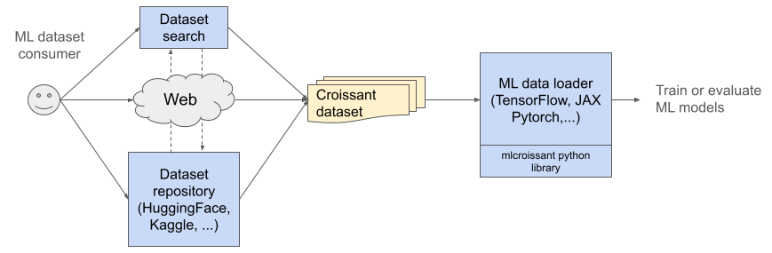
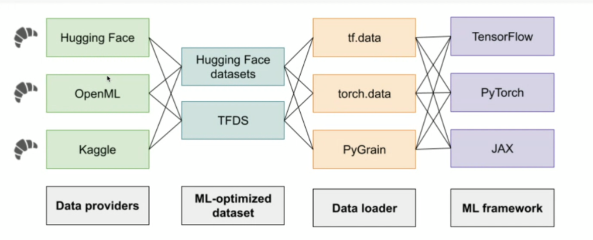
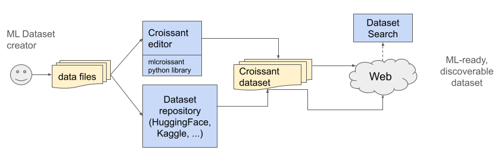

# Croissant Format Specification

Status: Version 1.0

Published: 2024/03/01

Authors: 

- Omar Benjelloun (Google), 
- Elena Simperl (King’s College London & ODI), 
- Pierre Marcenac (Google), 
- Pierre Ruyssen (Google), 
- Costanza Conforti (Google),  
- Michael Kuchnik (Meta), 
- Jos van der Velde (Open ML), 
- Luis Oala (Dotphoton), 
- Steffen Vogler (Bayer), 
- Mubashara Akthar (King’s College London), 
- Nitisha Jain (King’s College London), 
- Slava Tykhonov (DANS-KNAW)


# Introduction

Datasets are the basis of machine learning (ML). However, a lack of standardization in the description and semantics of ML datasets has made it increasingly difficult for researchers and practitioners to explore, understand, and use all but a small fraction of popular datasets. 

The Croissant metadata format simplifies how data is used by ML models. It provides a vocabulary for dataset attributes, streamlining how data is loaded across ML frameworks such as PyTorch, TensorFlow or JAX. In doing so, Croissant enables the interchange of datasets between ML frameworks and beyond, tackling a variety of **discoverability**,  **portability**, **reproducibility**,  and **responsible AI (RAI)** challenges.


## Discoverability

Once a dataset has Croissant metadata attached to it, dataset search engines can parse this metadata, allowing users to find and use the datasets they need no matter where these datasets have been published (**Figure 1**). For dataset creators, it means their data is discoverable no matter where it is made available online, as long as they use the format.



**Figure 1:** A user can search for datasets from a dataset repository or a dataset search engine. Upon finding a dataset that matches user goals, it can be seamlessly loaded into an ML data loader.


## Portability and Reproducibility

Croissant provides sufficient information for an ML tool to load a dataset, allowing users to incorporate Croissant datasets in the training and evaluation of a model with just a few lines of code (**Figure 2**). Croissant can easily be added to any tools e.g., for data preprocessing, analysis and visualization, or labeling. Since the format is standardized, any Croissant-compliant tool will have an identical interpretation of the data. Furthermore, the information stored in a Croissant record attached to a dataset helps people understand its content and context and compare it with other datasets. All this leads to increased portability and reproducibility in the entire ML ecosystem.



**Figure 2:** Croissant metadata helps loading ML datasets into different ML frameworks

Creating or changing the metadata is straightforward. A dataset repository can infer it from existing documentation such as a data card; beyond that, editing Croissant dataset descriptions is also supported through a visual editor and a Python library (**Figure 3**).



**Figure 3:** Croissant benefits dataset creators by providing a standardized representation to edit and catalog datasets, supported by an editor and Python library. Once a dataset is published with the associated metadata, it can be found by dataset search engines. 


## Responsible AI

As AI advances at rapid speed there is increased recognition among researchers, practitioners and policy makers that we need to explore, understand, manage, and assess [its economic, social, and environmental impacts](https://link.springer.com/book/10.1007/978-3-030-30371-6). One of the main instruments to operationalise responsible AI (RAI) is dataset documentation. 

This is how Croissant helps address RAI: 

1. It proposes a machine-readable way to capture and publish metadata about ML datasets – this makes existing documentation solutions like [Data Cards](https://sites.research.google/datacardsplaybook/) easier to publish, share, discover, and reuse;

2. It records at a granular level how a dataset was created, processed and enriched throughout its lifecycle – this process is meant to be automated as much as possible by integrating Croissant with popular ML frameworks. By allowing the metadata to be loaded automatically, Croissant also enables developers to compute RAI metrics automatically and systematically, identifying potential data quality issues to be fixed.

Croissant is designed to be modular and extensible. One such extension is the Croissant RAI vocabulary, which addresses 7 specific use cases, starting with the data life cycle, data labeling, and participatory scenarios to AI safety and fairness evaluation, traceability, regulatory compliance and inclusion. More details are available in the . We welcome additional extensions from the community to meet the needs of specific data modalities (e.g. audio or video) and domains (e.g. geospatial, life sciences, cultural heritage). 

# Terminology

**Dataset**: A collection of data points or items reflecting the results of such activities as measuring, reporting, collecting, analyzing, or observing.

**Croissant dataset**: A dataset that comes with a description in the Croissant format. Note that the Croissant description of a dataset does not generally[^1] contain the actual data of the dataset. The data itself is contained in separate files, referenced in the Croissant dataset description.

**Data record**: A granular part of a dataset, such as an image, text file, or a row in a table.

**Recordset**: A set of homogeneous data records, such as a collection of images, text files, or all the rows in a table.


# Format Example

To understand the various pieces of a Croissant dataset description, let's look at an example, based on the [PASS](https://www.robots.ox.ac.uk/~vgg/data/pass/) dataset. 

Croissant metadata is encoded in JSON-LD.

```json
{
  "@context": {
    "@language": "en",
    "@vocab": "https://schema.org/",
    ...
  },
  "@type": "sc:Dataset",
  "name": "simple-pass",
  "conformsTo": "http://mlcommons.org/croissant/1.0",
  "description": "PASS is a large-scale image dataset that does not include any humans…",
  "citeAs": "@Article{asano21pass, author = \"Yuki M. Asano and Christian Rupprecht and ...",
  "license": "https://creativecommons.org/licenses/by/4.0/",
  "url": "https://www.robots.ox.ac.uk/~vgg/data/pass/",
```

The beginning of the Croissant description contains general information about the dataset such as name, short description, license and URL. Most of these attributes are from [schema.org](http://schema.org), with a few additions described in the [Dataset-level information](?tab=t.0#heading=h.3pk4k9jobvly) section.

```json
  "distribution": [
    {
      "@type": "sc:FileObject",
      "@id": "metadata.csv",
      "contentUrl": "https://zenodo.org/record/6615455/files/pass_metadata.csv",
      "encodingFormat": "text/csv",
      "sha256": "0b033707ea49365a5ffdd14615825511"
    },
    {
      "@type": "sc:FileObject",
      "@id": "pass9",
      "contentUrl": "https://zenodo.org/record/6615455/files/PASS.9.tar",
      "encodingFormat": "application/x-tar",
      "sha256": "f4f87af4327fd1a66dd7944b9f59cbcc"
    },
    {
      "@type": "sc:FileSet",
      "@id": "image-files",
      "containedIn":  { "@id" : "pass9"},
      "encodingFormat": "image/jpeg",
      "includes": "*.jpg"
    }
  ],
```

The distribution property contains a description of the resources contained in the dataset, i.e., : 

*   files, represented using the `FileObject` class. This dataset contains one CSV file and one archive file. 
*   Directory & archive contents, represented using the `FileSet` class. In this dataset, the archive contains a set of jpeg image files.

See the [Resources](?tab=t.0#heading=h.if3uiif22bhw) section for a complete description.

```json
  "recordSet": [
    {
      "@type": "ml:RecordSet",
      "@id": "images",
      "key": {"@id":"hash"},
      "field": [
        {
          "@type": "ml:Field",
          "@id": "images/image_content",
          "description": "The image content.",
          "dataType": "sc:ImageObject",
          "source": {
            "fileSet": { "@id" : "image-files"},
            "extract": {
              "fileProperty": "content"
            }
          }
        },
        {
          "@type": "ml:Field",
          "@id": "images/hash",
          "description": "The hash of the image, as computed from YFCC-100M.",
          "dataType": "sc:Text",
          "source": {
            "fileSet": { "@id" : "image-files"},
            "extract": {
              "fileProperty": "filename"
            },
            "transform": {
              "regex": "([^\\/]*)\\.jpg"
            }
          }
          "references": { "@id": "metadata/hash"},
        }
        {
          "@type": "ml:Field",
          "@id": "images/date_taken",
          "description": "The date the photo was taken.",
          "dataType": "sc:Date",
          "source": { "@id": "metadata/datetaken"}
        }
      ]
    }
  ]
```

Furthermore, we can describe the structure and the data types in the data using a simple schema that supports flat and nested records called `RecordSet`. In this example, the dataset defines a single `RecordSet,` with one record per image in the dataset. Each record has 3 fields:

*   the content of the image
*   the hash of the image, extracted from its filename
*   the date the image was taken, extracted from the metadata CSV file

The [RecordSets](?tab=t.0#heading=h.4o1ap838u4u8) section explains how to define recordsets and fields, as well as extract, transform and join their data.


# Prerequisites

Before jumping into the main components of a Croissant dataset, we describe some constructs that are used throughout.


## Namespaces

The Croissant vocabulary is defined in its owned namespace, identified by the IRI:


```
http://mlcommons.org/croissant/
```


We generally abbreviated this namespace IRI using the prefix `cr`.

In addition, Croissant relies on the following namespaces:


<table>
  <tr>
   <td>Prefix
   </td>
   <td>IRI
   </td>
   <td>Description
   </td>
  </tr>
  <tr>
   <td>sc
   </td>
   <td>http://schema.org/
   </td>
   <td>The <a href="http://schema.org">schema.org</a> namespace.
   </td>
  </tr>
  <tr>
   <td>dct
   </td>
   <td>http://purl.org/dc/terms/
   </td>
   <td>Dublin Core terms.
   </td>
  </tr>
  <tr>
   <td>wd
   </td>
   <td>http://www.wikidata.org/wiki/
   </td>
   <td>Wikidata namespace
   </td>
  </tr>
</table>


Because Croissant builds on [schema.org](http://schema.org), we use that as the default namespace in all examples. Croissant terms should be prefixed with `cr`. We use the JSON-LD context mechanism to define aliases for these terms, so that specifying a prefix is not necessary.

The Croissant specification is versioned, and the version is included in the URI of this Croissant specification: `http://mlcommons.org/croissant/1.0`

Croissant datasets must declare that they conform to this specification by including the following property, at the dataset level:

```json
"dct:conformsTo" : "http://mlcommons.org/croissant/1.0"
```

Note that while the Croissant specification is versioned, the Croissant namespace above is not, so the constructs within the Croissant vocabulary will keep stable URIs even when the specification version changes.


## ID and Reference Mechanism

In Croissant datasets, various elements need to be connected to each other. For instance, a `FileObject` may be extracted from another `FileObject`, or a column of a table may reference another table. We therefore need a mechanism to define **identifiers** for parts of a dataset,  and to reference them in other places.

We use the standard JSON-LD mechanism for IDs and references, which relies on using the special `@id` property. References to objects are also specified using the `@id` property. They can be differenciated from ID definitions by the fact that no other properties are specified within the same object, e.g., **<code>{"@id": "flores200_dataset.tar.gz"}</code></strong> is a reference<strong><code>.</code></strong>

IDs may be specified as short strings, but they are interpreted as IRIs. The "base" IRI is either the URL of the document (when accessed on the Web), or is specified explicitly in the context, via the @base property (see [JSON-LD specification](https://www.w3.org/TR/json-ld11/#base-iri)).

As a consequence, IDs must be unique within a Croissant dataset. This is fairly natural for "top-level" objects, like instances of `FileObject`, `FileSet` or `RecordSet`. For nested objects, such as `field`s in `RecordSet`s, we recommend prefixing their IDs with the ID of the containing object, with a '/' separator. For example the "date taken" `field` of an "images" `RecordSet` should have ID "images/date\_taken".

Here are some examples of IDs and references to them.

A set of JSON files included in a tar archive:

```json
{
  "@type": "cr:FileObject",
  "@id": "flores200_dataset.tar.gz",        
  "name": "Flores 200 archive",
  "description": "Flores 200 is hosted on a webserver.",
  "contentSize": "25585843 B",
  "contentUrl": "https://tinyurl.com/flores200dataset",
  "encodingFormat": "application/x-gziptar",
  "sha256": "b8b0b76783024b85797e5cc75064eb83fc5288b41e9654dabc7be6ae944011f6"
},
{
  "@type": "cr:FileSet",
  "@id": "flores200_dev_files",        
  "name": "Flores 200 dev files",
  "description": "dev files are inside the tar.",
  "containedIn": { "@id": "flores200_dataset.tar.gz"},
  "encodingFormat": "application/json",
  "includes": "flores200_dataset/dev/*.dev"
}
```

A "foreign key" reference on column "movie\_id" from a "ratings" table to a "movies" table:

```json
{
  "@type": "cr:RecordSet",
  "@id": "ratings",        
  "name": "IMDB ratings",
  "field": [
     {
       "@type": "cr:Field",
       "@id": "ratings/movie_id",        
       "name": "Movie id",
       "dataType": "sc:Integer",
       "references": {"@id": "movies/movie_id"}
     }, ...
  ]
}
```

In the above example, the `@id` of a `field` is prefixed by the `@id` of the corresponding `RecordSet`. This ensures the uniqueness, and makes it possible to disambiguate between `field`s of the same name in different `RecordSet`s. In this example, both the ratings and movies `RecordSet`s have a movie\_id `field`.


## Croissant in Web Pages

Because Croissant builds on [schema.org](http://schema.org), a vocabulary for adding structured information to web pages, any Croissant JSON-LD metadata needs to be embedded inside a web page in order to be indexed and crawled by search engines. You can see an example of how schema.org metadata is embedded in a web page in the schema.org [developer documentation](https://developers.google.com/search/docs/appearance/structured-data/intro-structured-data).

In the rest of this document, we only describe the actual JSON-LD of Croissant metadata, and omit the wrapping HTML.

# Dataset-level Information

## schema.org/Dataset

Croissant builds on the [schema.org/Dataset](http://schema.org/Dataset) vocabulary, which is widely adopted by datasets on the web. An introduction to describing datasets with this vocabulary can be found [here](https://developers.google.com/search/docs/appearance/structured-data/dataset).

[Schema.org](http://Schema.org) properties are known to be very flexible in terms of the types of values they accept. We list below the main properties of the vocabulary and their expected type.To facilitate more consistent use of these properties we provide additional constraints on their usage in the context of Croissant datasets. We also specify cardinalities to clarify if a property can take one or many values.

We organize [schema.org](http://schema.org) properties in three categories: Required, recommended and other properties. The properties starting with the symbol @ are defined in JSON-LD, which is our RDF syntax of choice for Croissant.


### Required

The following list of properties from [schema.org](http://schema.org) must be specified for every Croissant dataset. 


<table>
  <tr>
   <td style="background-color: #d9d9d9"><strong>Property</strong>
   </td>
   <td style="background-color: #d9d9d9"><strong>ExpectedType</strong>
   </td>
   <td style="background-color: #d9d9d9"><strong>Cardinality</strong>
   </td>
   <td style="background-color: #d9d9d9"><strong>Comments</strong>
   </td>
  </tr>
  <tr>
   <td style="background-color: null">@context
   </td>
   <td style="background-color: #ffffff"><a href="http://schema.org/URL">URL</a>
   </td>
   <td style="background-color: #ffffff">ONE
   </td>
   <td>A set of JSON-LD context definitions that make the rest of the Croissant description less verbose. See the recommended JSON-LD context in Appendix 1. 
   </td>
  </tr>
  <tr>
   <td style="background-color: null">@type
   </td>
   <td style="background-color: #ffffff"><a href="http://schema.org/Text">Text</a>
   </td>
   <td style="background-color: #ffffff">ONE
   </td>
   <td>The type of a croissant dataset must be <a href="http://schema.org/Dataset">schema.org/Dataset</a>.
   </td>
  </tr>
  <tr>
   <td style="background-color: null"><a href="https://www.dublincore.org/specifications/dublin-core/dcmi-terms/#conformsTo">@dct:conformsTo</a>
   </td>
   <td style="background-color: #ffffff"><a href="http://schema.org/URL">URL</a>
   </td>
   <td style="background-color: #ffffff">ONE
   </td>
   <td>Croissant datasets must declare that they conform to the versioned schema:
<p>
<a href="http://mlcommons.org/croissant/1.0">http://mlcommons.org/croissant/1.0</a> 
   </td>
  </tr>
  <tr>
   <td style="background-color: null"><a href="http://schema.org/description">description</a>
   </td>
   <td style="background-color: #ffffff"><a href="http://schema.org/Text">Text</a>
   </td>
   <td style="background-color: #ffffff">ONE
   </td>
   <td>Description of the dataset.
   </td>
  </tr>
  <tr>
   <td style="background-color: null"><a href="http://schema.org/license">license</a>
   </td>
   <td style="background-color: #ffffff"><a href="http://schema.org/CreativeWork">CreativeWork</a>
<p>
<a href="http://schema.org/URL">URL</a>
   </td>
   <td style="background-color: #ffffff">MANY
   </td>
   <td>The license of the dataset. Croissant recommends using the URL of a known license, e.g., one of the licenses listed at <a href="https://spdx.org/licenses/">https://spdx.org/licenses/</a>.
   </td>
  </tr>
  <tr>
   <td style="background-color: null"><a href="http://schema.org/name">name</a>
   </td>
   <td style="background-color: #ffffff"><a href="http://schema.org/Text">Text</a>
   </td>
   <td style="background-color: #ffffff">ONE
   </td>
   <td>The name of the dataset. 
   </td>
  </tr>
  <tr>
   <td style="background-color: null"><a href="http://schema.org/url">url</a>
   </td>
   <td style="background-color: #ffffff"><a href="http://schema.org/URL">URL</a>
   </td>
   <td style="background-color: #ffffff">ONE
   </td>
   <td>The URL of the dataset. This generally corresponds to the Web page for the dataset.
   </td>
  </tr>
  <tr>
   <td style="background-color: null"><a href="http://schema.org/creator">creator</a>
   </td>
   <td style="background-color: null"><a href="http://schema.org/Organization">Organization</a>
<p>
<a href="http://schema.org/Person">Person</a>
   </td>
   <td style="background-color: null">MANY
   </td>
   <td>The creator(s) of the dataset.
   </td>
  </tr>
  <tr>
   <td style="background-color: null"><a href="http://schema.org/datePublished">datePublished</a>
   </td>
   <td style="background-color: null"><a href="http://schema.org/Date">Date</a>
<p>
<a href="http://schema.org/DateTime">DateTime</a>
   </td>
   <td style="background-color: null">ONE
   </td>
   <td>The date the dataset was published.
   </td>
  </tr>
</table>


### Recommended

These [schema.org](http://schema.org) properties are recommended for every Croissant dataset.


<table>
  <tr>
   <td style="background-color: #d9d9d9"><strong>Property</strong>
   </td>
   <td style="background-color: #d9d9d9"><strong>ExpectedType</strong>
   </td>
   <td style="background-color: #d9d9d9"><strong>Cardinality</strong>
   </td>
   <td style="background-color: #d9d9d9"><strong>Comments</strong>
   </td>
  </tr>
  <tr>
   <td style="background-color: null"><a href="http://schema.org/keywords">keywords</a>
   </td>
   <td style="background-color: #ffffff"><a href="https://schema.org/DefinedTerm">DefinedTerm</a>
<p>
<a href="http://schema.org/Text">Text</a>
<p>
<a href="http://schema.org/URL">URL</a>
   </td>
   <td style="background-color: #ffffff">MANY
   </td>
   <td>A set of keywords associated with the dataset, either as free text, or a DefinedTerm with a formal definition.
   </td>
  </tr>
  <tr>
   <td style="background-color: null"><a href="http://schema.org/publisher">publisher</a>
   </td>
   <td style="background-color: null"><a href="http://schema.org/Organization">Organization</a>
<p>
<a href="http://schema.org/Person">Person</a>
   </td>
   <td style="background-color: null">MANY
   </td>
   <td>The publisher of the dataset, which may be distinct from its creator.
   </td>
  </tr>
  <tr>
   <td style="background-color: null"><a href="http://schema.org/version">version</a>
   </td>
   <td style="background-color: null"><a href="http://schema.org/Number">Number</a>
<p>
<a href="http://schema.org/Text">Text</a>
   </td>
   <td style="background-color: null">ONE
   </td>
   <td>The version of the dataset following the requirements below.
   </td>
  </tr>
  <tr>
   <td style="background-color: null"><a href="http://schema.org/dateCreated">dateCreated</a>
   </td>
   <td style="background-color: null"><a href="http://schema.org/Date">Date</a>
<p>
<a href="http://schema.org/DateTime">DateTime</a>
   </td>
   <td style="background-color: null">ONE
   </td>
   <td>The date the dataset was initially created.
   </td>
  </tr>
  <tr>
   <td style="background-color: null"><a href="http://schema.org/dateModified">dateModified</a>
   </td>
   <td style="background-color: null"><a href="http://schema.org/Date">Date</a>
<p>
<a href="http://schema.org/DateTime">DateTime</a>
   </td>
   <td style="background-color: null">ONE
   </td>
   <td>The date the dataset was last modified.
   </td>
  </tr>
  <tr>
   <td style="background-color: null"><a href="http://schema.org/sameAs">sameAs</a>
   </td>
   <td style="background-color: null"><a href="http://schema.org/URL">URL</a>
   </td>
   <td style="background-color: null">MANY
   </td>
   <td>The URL of another Web resource that represents the same dataset as this one.
   </td>
  </tr>
  <tr>
   <td style="background-color: null"><a href="http://schema.org/sdLicense">sdLicence</a>
   </td>
   <td style="background-color: null"><a href="http://schema.org/CreativeWork">CreativeWork</a>
<p>
<a href="http://schema.org/URL">URL</a>
   </td>
   <td style="background-color: null">MANY
   </td>
   <td>A license document that applies to this structured data, typically indicated by URL.
   </td>
  </tr>
  <tr>
   <td style="background-color: null"><a href="http://schema.org/inLanguage">inLanguage</a>
   </td>
   <td style="background-color: null"><a href="https://schema.org/Language">Language</a>
<p>
<a href="https://schema.org/Text">Text</a>
   </td>
   <td style="background-color: null">MANY
   </td>
   <td>The language(s) of the content of the dataset. 
   </td>
  </tr>
</table>


### Other schema.org Properties

Other properties from [schema.org/Dataset](http://schema.org/Dataset) or its parent classes can also be specified for Croissant datasets. Dataset authors should decide whether they are useful for their datasets or not.


## Modified and Added Properties

Croissant modifies the meaning of one [schema.org](http://schema.org) property, and requires its presence:


<table>
  <tr>
   <td style="background-color: #d9d9d9"><strong>Property</strong>
   </td>
   <td style="background-color: #d9d9d9"><strong>ExpectedType</strong>
   </td>
   <td style="background-color: #d9d9d9"><strong>Cardinality</strong>
   </td>
   <td style="background-color: #d9d9d9"><strong>Comments</strong>
   </td>
  </tr>
  <tr>
   <td style="background-color: null"><a href="http://schema.org/distribution">distribution</a>
   </td>
   <td style="background-color: null"><a href="https://docs.google.com/document/d/11E1x2rIKo_9C2Hh7pMpHtTE30iizVCWUMQ9rDysBoeA/edit?resourcekey=0-drT2urhsv5QnaBr57G0coQ#bookmark=id.gcwjbmdlofws">FileObject</a>
<p>
<a href="https://docs.google.com/document/d/11E1x2rIKo_9C2Hh7pMpHtTE30iizVCWUMQ9rDysBoeA/edit?resourcekey=0-drT2urhsv5QnaBr57G0coQ#bookmark=id.tca3dm5ygbqf">FileSet</a>
   </td>
   <td style="background-color: null">MANY
   </td>
   <td>By contrast with <a href="http://schema.org/Dataset">schema.org/Dataset</a>, Croissant requires the distribution property to have values of type FileObject or FileSet.
   </td>
  </tr>
</table>


The Croissant vocabulary also defines the following optional attributes:

<table>
  <tr>
   <td style="background-color: #d9d9d9"><strong>Property</strong>
   </td>
   <td style="background-color: #d9d9d9"><strong>ExpectedType</strong>
   </td>
   <td style="background-color: #d9d9d9"><strong>Cardinality</strong>
   </td>
   <td style="background-color: #d9d9d9"><strong>Comments</strong>
   </td>
  </tr>
  <tr>
   <td style="background-color: null"><a href="?tab=t.0#heading=h.t7okrv8eq4vh">isLiveDataset</a>
   </td>
   <td style="background-color: null"><a href="http://schema.org/Boolean">Boolean</a>
   </td>
   <td style="background-color: null">ONE
   </td>
   <td>Whether the dataset is a live dataset.
   </td>
  </tr>
  <tr>
   <td style="background-color: null">citeAs
   </td>
   <td style="background-color: null">Text
   </td>
   <td style="background-color: null">ONE
   </td>
   <td>A citation for a publication that describes the dataset. Ideally, citations should be expressed using the <a href="https://www.bibtex.org/">bibtex</a> format.
<p>
Note that this is different from <a href="http://schema.org/citation">schema.org/citation</a>, which is used to make a citation to another publication from this dataset.
   </td>
  </tr>
</table>


## Dataset Versioning/Checkpoints

Datasets may change over time. Versioning is hence important to enable reproducibility and reliable documentation. For this, Croissant uses the combination of two elements: a version, and files checksums.


### Version

Croissant datasets are versioned using the `version` property defined in [schema.org](http://schema.org). The recommended versioning scheme to use for datasets is` MAJOR.MINOR.PATCH`, following [Semantic Versioning 2.0.0](https://semver.org/spec/v2.0.0.html). More specifically:

*   If the `PATCH` version is incremented, the data remains the same, although it might be serialized differently or is packaged using different file formats.
*   If the `MINOR` version is incremented, the existing data is the same and can still be retrieved as it: there might be additional data (e.g. new fields, new RecordSet), or even new records in existing RecordSets, as long as the old recordSets can still be retrieved (eg: the new records are added to a different Split). 
*   If the `MAJOR` version is incremented, the existing data has been changed (edited, removed or shuffled records across splits), or extended in a way which doesn't allow for easy access to the data as it was at the previous version.


### Checksums

Each one of the <code>[FileObject](#bookmark=id.gcwjbmdlofws)</code> in a Croissant file may provide a checksum using the [sha256](https://schema.org/sha256) property, which contains the hash of the content of the file.

In versioned datasets, it is strongly recommended to record such checksums for all used `FileObjects`, as it allows for robustly checking whether the downloaded files correspond to the ones which are declared in the Croissant definition.


### Live Datasets

Live datasets constitute a special form of datasets. The term refers to non-static datasets, whose underlying data evolves continuously (for example, a new snapshot of data is released regularly). However, apart from the underlying change of the data, the logic behind the example generation (e.g. the way the data is extracted, the transformations it undergoes, the main attributes that are collected etc.) is usually stable over time.

For live datasets, the Croissant boolean property  `isLiveDataset` should be set to True. Moreover, Croissant recommends not to specify checksum on files which are expected to be updated in the future. For example, if a dataset contains one file per calendar day, days that have already occurred in the past are not expected to change and should provide a checksum. However, if the data for the current day is being refreshed hourly, the Croissant file should not have a checksum until the file is no longer expected to be updated. Failing to update the checksum for an updated file may result in the implementation throwing a checksum error. For live datasets, applications are expected to be aware that the dataset is live and subject to changes going forward. For example, to maintain reproducibility, an application should filter data by dates if new data is added over time. Croissant recommends only updating the `version` property if the dataset structure changes or a backwards-incompatible change is made. For example, if files are updated to reflect more recent data with no other semantic changes, the dataset `version` should not be updated. However, if an update is a major semantic change for users, updating the version property may be appropriate. 


#### Example 1: Daily refreshes

A financial dataset corresponding to stock prices is now being used for machine learning. To make analysis more modular, the dataset has been historicallyorganized by year. The dataset was initiated in 2000 and has been constantly updated till today. Each year has a CSV file of the format “stock\_data\_&lt;YEAR>.csv”, where &lt;YEAR> is the year of the data. The data for the most recent year is updated daily to account for new data. This directory of these files looks something like this: 

```
stock_data_2000.csv
stock_data_2001.csv
stock_data_2002.csv
...
stock_data_2021.csv
stock_data_2022.csv
stock_data_2023.csv
```

Because the dataset is updated continuously, the dataset should set the isLiveDataset to` true`. Assuming the year is 2023, it is safe to add a checksum for files corresponding to years 2000 to 2022 (inclusive). However, Croissant does not recommend setting the checksum for 2023 until the year is 2024 to avoid mismatches between a prior checksum and the current file. Finally, all files corresponding to prior years should trigger a version update if they are changed (e.g., to reflect a bug fix), since the semantics of the dataset have changed (i.e., history was “rewritten”). However, the current year is understood to be incomplete, so appending new data to the data in the current year should not trigger a version update.


#### Example 2: Daily snapshots

The same data from Example 1 is exported at a finer granularity to match the daily refresh of the dataset. Accordingly, the data is “snapshotted” into files of the form “stock\_data\_&lt;MONTH>\_&lt;DAY>\_&lt;YEAR>.csv” to reflect the month, day, and year of the data in the file. Each file is only written once—when all data from that date is finalized at the end of day.

```
stock_data_1_1_2000.csv
stock_data_1_2_2000.csv
stock_data_1_3_2000.csv
...
stock_data_6_8_2023.csv
stock_data_6_9_2023.csv
stock_data_6_10_2023.csv
```

Because the dataset is updated continuously, the dataset should set the `isLiveDataset`` property to true. Since all files are written only once, checksums can be included without risk of synchronization issues. The dataset version should only be updated if a backwards-incompatible change is made (e.g., a bug fix to a file), since it is expected that a new file will be added every day.

# Resources

Croissant datasets contain data. Resources describe how that data is organized. Croissant defines two types of resources:

*   `FileObject` for individual files that are part of a dataset.
*   `FileSet `for homogeneous sets of files that are part of the dataset (e.g., a directory of images).

While [schema.org/Dataset](http://schema.org/Dataset) defines a `distribution` property, it's insufficient to adequately represent the contents of a dataset, as each distribution corresponds to a single downloadable form of the dataset. In practice, datasets often use `distribution` to represent separate files that are part of the dataset, but that is technically not a correct use of the property, and is still insufficient to describe datasets with a more complex layout, which is often the case of ML datasets.

In Croissant, the `distribution` property contains one or more `FileObject` or `FileSet `instead of schema.org's `DataDownload.`


## FileObject

`FileObject` is the Croissant class used to represent individual files that are part of a dataset.

`FileObject` is a general purpose class that inherits from [Schema.org](http://Schema.org) `CreativeWork`, and can be used to represent instances of more specific types of content like `DigitalDocument` and `MediaObject`.

Most of the important properties needed to describe a `FileObject` are defined in the classes it inherits from:


<table>
  <tr>
   <td style="background-color: #d9d9d9"><strong>Property</strong>
   </td>
   <td style="background-color: #d9d9d9"><strong>ExpectedType</strong>
   </td>
   <td style="background-color: #d9d9d9"><strong>Cardinality</strong>
   </td>
   <td style="background-color: #d9d9d9"><strong>Description</strong>
   </td>
  </tr>
  <tr>
   <td style="background-color: null"><a href="https://schema.org/name">sc:name</a>
   </td>
   <td style="background-color: null">Text
   </td>
   <td style="background-color: null">ONE
   </td>
   <td style="background-color: null">The name of the file.  As much as possible, the name should reflect the name of the file as downloaded, including the file extension. e.g. “images.zip”.
   </td>
  </tr>
  <tr>
   <td style="background-color: null"><a href="https://schema.org/contentUrl">sc:contentUrl</a>
   </td>
   <td style="background-color: null">Url
   </td>
   <td style="background-color: null">ONE
   </td>
   <td style="background-color: null">Actual bytes of the media object, for example the image file or video file.
   </td>
  </tr>
  <tr>
   <td style="background-color: null"><a href="https://schema.org/contentSize">sc:contentSize</a>
   </td>
   <td style="background-color: null">Text
   </td>
   <td style="background-color: null">ONE
   </td>
   <td style="background-color: null">File size in (mega/kilo/…)bytes. Defaults to bytes if a unit is not specified.
   </td>
  </tr>
  <tr>
   <td style="background-color: null"><a href="https://schema.org/encodingFormat">sc:encodingFormat</a>
   </td>
   <td style="background-color: null">Text
   </td>
   <td style="background-color: null">ONE
   </td>
   <td style="background-color: null">The format of the file, given as a mime type.
   </td>
  </tr>
  <tr>
   <td style="background-color: null"><a href="https://schema.org/sameAs">sc:sameAs</a>
   </td>
   <td style="background-color: null">URL
   </td>
   <td style="background-color: null">MANY
   </td>
   <td style="background-color: null">URL (or local name) of a FileObject with the same content, but in a different format.
   </td>
  </tr>
  <tr>
   <td style="background-color: null"><a href="https://schema.org/sha256">sc:sha256</a>
   </td>
   <td style="background-color: null">Text
   </td>
   <td style="background-color: null">ONE
   </td>
   <td style="background-color: null">Checksum for the file contents.
   </td>
  </tr>
</table>

In addition, `FileObject` defines the following properties:

<table>
  <tr>
   <td style="background-color: #d9d9d9"><strong>Property</strong>
   </td>
   <td style="background-color: #d9d9d9"><strong>ExpectedType</strong>
   </td>
   <td style="background-color: #d9d9d9"><strong>Cardinality</strong>
   </td>
   <td style="background-color: #d9d9d9"><strong>Description</strong>
   </td>
  </tr>
  <tr>
   <td style="background-color: null"><a href="https://github.com/mlcommons/croissant/blob/main/docs/croissant-spec.md#containedin">containedIn</a>
   </td>
   <td style="background-color: null">Text
   </td>
   <td style="background-color: null">MANY
   </td>
   <td style="background-color: null">Another <code>FileObject</code> or <code>FileSet</code> that this one is contained in, e.g., in the case of a file extracted from an archive. When this property is present, the <code>contentUrl</code> is evaluated as a relative path within the container object
   </td>
  </tr>
</table>


Let's look at a few examples of `FileObject` definitions. 

First, a single CSV file:

```json
{
  "@type": "cr:FileObject",
  "@id": "pass_metadata.csv",
  "contentUrl":     "https://zenodo.org/record/6615455/files/pass_metadata.csv",
  "encodingFormat": "text/csv",
  "sha256": "0b033707ea49365a5ffdd14615825511"
}
```


Next: An archive and some files extracted from it (represented via the `containedIn` property):

```json
{
  "@type": "cr:FileObject",
  "@id": "ml-25m.zip",
  "contentUrl": "https://files.grouplens.org/datasets/movielens/ml-25m.zip",
  "encodingFormat": "application/zip",
  "sha256": "6b51fb2759a8657d3bfcbfc42b592ada"
},
{
  "@type": "cr:FileObject",
  "@id": "ratings-table",
  "contentUrl": "ratings.csv",
  "containedIn": {"@id" : "ml-25m.zip" },
  "encodingFormat": "text/csv"
},
{
  "@type": "cr:FileObject",
  "@id": "movies-table",
  "contentUrl": "movies.csv",
  "containedIn": {"@id" : "ml-25m.zip"},
  "encodingFormat": "text/csv"
}
```

## FileSet

In many datasets, data comes in the form of collections of homogeneous files, such as images, videos or text files, where each file needs to be treated as an individual item, e.g., as a training example. `FileSet` is a class that describes such collections of files.

A `FileSet` is a set of files located in a container, which can be an archive `FileObject` or a "manifest" file. A FileSet may also specify inclusion / exclusion filters: these are file patterns that give the user flexibility to define which files should be part of the `FileSet`. For example, include patterns may refer to all images under one or more directories, which exclude patterns may be used to exclude specific images.

`FileSet` extends `sc:Intangible`, and defines the following properties:

<table>
  <tr>
   <td style="background-color: #d9d9d9"><strong>Property</strong>
   </td>
   <td style="background-color: #d9d9d9"><strong>ExpectedType</strong>
   </td>
   <td style="background-color: #d9d9d9"><strong>Cardinality</strong>
   </td>
   <td style="background-color: #d9d9d9"><strong>Description</strong>
   </td>
  </tr>
  <tr>
   <td style="background-color: null"><a href="https://github.com/mlcommons/croissant/blob/main/docs/croissant-spec.md#containedin">containedIn</a>
   </td>
   <td style="background-color: null">Reference
   </td>
   <td style="background-color: null">MANY
   </td>
   <td style="background-color: null">The source of data for the <code>FileSet</code>, e.g., an archive. If multiple values are provided for <code>containedIn</code>, then the union of their contents is taken (e.g., this can be used to combine files from multiple archives).
   </td>
  </tr>
  <tr>
   <td style="background-color: null"><a href="https://github.com/mlcommons/croissant/blob/main/docs/croissant-spec.md#includes">includes</a>
   </td>
   <td style="background-color: null">Text
   </td>
   <td style="background-color: null">MANY
   </td>
   <td style="background-color: null">A glob pattern that specifies the files to include.
   </td>
  </tr>
  <tr>
   <td style="background-color: null"><a href="https://github.com/mlcommons/croissant/blob/main/docs/croissant-spec.md#excudes">excludes</a>
   </td>
   <td style="background-color: null">Text
   </td>
   <td style="background-color: null">MANY
   </td>
   <td style="background-color: null">A glob pattern that specifies the files to exclude.
   </td>
  </tr>
</table>

The properties `includes` and `excludes` are used to filter the content that should be part of the FileSet. They both use [glob patterns](https://en.wikipedia.org/wiki/Glob_(programming)), a common mechanism to specify a set of files along a path, like ".jpg" for all jpg images, or "/foo/pic.jpg" for all  jpg images under the "foo" directory whose filename starts with "pic". To get the set of FileObjects included in the FileSet, the include pattern(s) are evaluated first. If multiple `includes` are specified, the union of their results is taken. Then all the files corresponding to the `excludes` patterns are removed from that set. `includes` and `excludes` patterns are evaluated from the root of the `containedIn` contents (e.g., the top level directory extracted from an archive).

Let's now see some examples of how `FileSet` is used:

A zip file containing images:

```json
{
  "@type": "cr:FileObject",
  "@id": "train2014.zip",
  "contentSize": "13510573713 B",
  "contentUrl": "http://images.cocodataset.org/zips/train2014.zip",
  "encodingFormat": "application/zip",
  "sha256": "sha256"
},
{
  "@type": "cr:FileSet",
  "@id": "image-files",
  "containedIn":  {"@id" : "train2014.zip" },
  "encodingFormat": "image/jpeg",
  "includes": "*.jpg"
}
```

A zip file containing multiple `FileSet`s and `FileObject`s:

```json
{
  "@type": "cr:FileObject",
  "@id": "flores200_dataset.tar.gz",
  "description": "Flores 200 is hosted on a webserver.",
  "contentSize": "25585843 B",
  "contentUrl": "https://tinyurl.com/flores200dataset",
  "encodingFormat": "application/x-gzip",
  "sha256": "c764ffdeee4894b3002337c5b1e70ecf6f514c00"
},
{
  "@type": "cr:FileSet",
  "@id": "files-dev",
  "description": "dev files are inside the tar.",
  "containedIn": {"@id" : "flores200_dataset.tar.gz" },
  "encodingFormat": "application/json",
  "includes": "flores200_dataset/dev/*.dev"
},
{
  "@type": "cr:FileSet",
  "@id": "files-devtest",
  "description": "devtest files are inside the tar.",
  "containedIn": {"@id" : "flores200_dataset.tar.gz" },
  "encodingFormat": "application/json",
  "includes": "flores200_dataset/devtest/*.devtest"
},
{
  "@type": "cr:FileObject",
  "@id": "metadata-dev",
  "description": "Contains labels for the records in each line in the dev files.",
  "contentUrl": "flores200_dataset/metadata_dev.tsv",
  "containedIn": {"@id" : "flores200_dataset.tar.gz" },
  "encodingFormat": "text/tsv"
},
{
  "@type": "cr:FileObject",
  "@id": "metadata-devtest",
  "description": "Contains labels for the records in each line in the devtest files.",
  "contentUrl": "flores200_dataset/metadata_devtest.tsv",
  "containedIn": {"@id" : "flores200_dataset.tar.gz" },
  "encodingFormat": "text/tsv"
}
```

# RecordSets

While `FileObject` and `FileSet` describe the resources contained in a dataset, they do not tell us anything about the way the content within the resources is organized. This is the role of `RecordSet`.

A key challenge is that ML data comes in many different formats, including unstructured formats such as text, audio and video, and structured ones such as CSV and JSON. All these formats, no matter their level of machine-readable structuredness, need to be loaded into a common representation for ML purposes, and sometimes combined despite their heterogeneity.

`RecordSet` provides a common structure description that can be used across different modalities, in terms of records_ _that may contain multiple fields_._ Unstructured content, like text and images, is represented as single-field records. Tabular data yields one record per row in the table, with fields for each column. Tree-structured data can be described with nested and repeated fields.

Let's introduce the relevant classes first, before illustrating how they are used through examples.

## RecordSet

A `RecordSet` describes a set of structured records obtained from one or more data sources (typically a file or set of files) and the structure of these records, expressed as a set of fields (e.g., the columns of a table). A `RecordSet` can represent flat or nested data.

In addition to `Field`s, RecordSet also supports defining a `key` for the records, i.e., one or more fields whose values are unique across the records. In case the RecordSet represents a small enumeration of values, those can be embedded directly via the `data` property. Larger `RecordSet`s will reference `FileObject`s or `FileSet`s for their data, via their field definitions, as we will see below.

`RecordSet` is a subclass of [sc:Intangible](https://schema.org/Intangible). It defines the following additional properties:

<table>
  <tr>
   <td style="background-color: #d9d9d9"><strong>Property</strong>
   </td>
   <td style="background-color: #d9d9d9"><strong>ExpectedType</strong>
   </td>
   <td style="background-color: #d9d9d9"><strong>Cardinality</strong>
   </td>
   <td style="background-color: #d9d9d9"><strong>Description</strong>
   </td>
  </tr>
  <tr>
   <td style="background-color: null"><a href="https://github.com/mlcommons/croissant/blob/main/docs/croissant-spec.md#field">field</a>
   </td>
   <td style="background-color: null">Field
   </td>
   <td style="background-color: null">MANY
   </td>
   <td style="background-color: null">A data element that appears in the records of the <code>RecordSet</code> (e.g., one column of a table).
   </td>
  </tr>
  <tr>
   <td style="background-color: null"><a href="https://github.com/mlcommons/croissant/blob/main/docs/croissant-spec.md#key">key</a>
   </td>
   <td style="background-color: null">Text
   </td>
   <td style="background-color: null">MANY
   </td>
   <td style="background-color: null">One or more fields whose values uniquely identify each record in the <code>RecordSet</code>. (See example below.)
   </td>
  </tr>
  <tr>
   <td style="background-color: null"><a href="https://github.com/mlcommons/croissant/blob/main/docs/croissant-spec.md#data">data</a>
   </td>
   <td style="background-color: null">JSON
   </td>
   <td style="background-color: null">MANY
   </td>
   <td style="background-color: null">One or more records that constitute the data of the <code>RecordSet</code>.
   </td>
  </tr>
  <tr>
   <td style="background-color: null"><a href="https://github.com/mlcommons/croissant/blob/main/docs/croissant-spec.md#examples">examples</a>
   </td>
   <td style="background-color: null">JSON
<p>
URL
   </td>
   <td style="background-color: null">MANY
   </td>
   <td style="background-color: null">One or more records provided as example content of the  <code>RecordSet</code>, or a reference to data source that contains examples.
   </td>
  </tr>
</table>

## Field

A `Field` is part of a `RecordSet`. It may represent a column of a table, or a nested data structure or even a nested `RecordSet` in the case of hierarchical data.

`Field` is a subclass of [sc:Intangible](https://schema.org/Intangible). It defines the following additional properties:

<table>
  <tr>
   <td style="background-color: #d9d9d9"><strong>Property</strong>
   </td>
   <td style="background-color: #d9d9d9"><strong>ExpectedType</strong>
   </td>
   <td style="background-color: #d9d9d9"><strong>Cardinality</strong>
   </td>
   <td style="background-color: #d9d9d9"><strong>Description</strong>
   </td>
  </tr>
  <tr>
   <td style="background-color: null"><a href="https://github.com/mlcommons/croissant/blob/main/docs/croissant-spec.md#source">source</a> 
   </td>
   <td style="background-color: null">DataSource or URL
   </td>
   <td style="background-color: null">
   </td>
   <td style="background-color: null">The data source of the field. This will generally reference a <code>FileObject</code> or <code>FileSet</code>'s contents (e.g., a specific column of a table).
   </td>
  </tr>
  <tr>
   <td style="background-color: null"><a href="https://github.com/mlcommons/croissant/blob/main/docs/croissant-spec.md#datatype">dataType</a>
   </td>
   <td style="background-color: null">DataType
   </td>
   <td style="background-color: null">
   </td>
   <td style="background-color: null">The data type of the field, identified by the URI of the corresponding class. It could be either an atomic type (e.g, <code>sc:Integer</code>) or a semantic type (e.g., <code>sc:GeoLocation</code>).
   </td>
  </tr>
  <tr>
   <td style="background-color: null"><a href="https://github.com/mlcommons/croissant/blob/main/docs/croissant-spec.md#repeated">repeated</a>
   </td>
   <td style="background-color: null">Boolean
   </td>
   <td style="background-color: null">
   </td>
   <td style="background-color: null">If true, then the Field is a list of values of type dataType.
   </td>
  </tr>
  <tr>
   <td style="background-color: null">equivalentProperty
   </td>
   <td style="background-color: null">URL
   </td>
   <td style="background-color: null">
   </td>
   <td style="background-color: null">A property that is equivalent to this Field. Used in the case a dataType is specified on the RecordSet to map specific fields to specific properties associated with that dataType.
   </td>
  </tr>
  <tr>
   <td style="background-color: null"><a href="https://github.com/mlcommons/croissant/blob/main/docs/croissant-spec.md#references">references</a>
   </td>
   <td style="background-color: null">Reference
   </td>
   <td style="background-color: null">
   </td>
   <td style="background-color: null">Another <code>Field</code> of another <code>RecordSet</code> that this field references. This is the equivalent of a foreign key reference in a relational database.
   </td>
  </tr>
  <tr>
   <td style="background-color: null"><a href="https://github.com/mlcommons/croissant/blob/main/docs/croissant-spec.md#subfield">subField</a>
   </td>
   <td style="background-color: null">Field
   </td>
   <td style="background-color: null">
   </td>
   <td style="background-color: null">Another <code>Field</code> that is nested inside this one.
   </td>
  </tr>
  <tr>
   <td style="background-color: null"><a href="https://github.com/mlcommons/croissant/blob/main/docs/croissant-spec.md#parentfield">parentField</a>
   </td>
   <td style="background-color: null">Reference
   </td>
   <td style="background-color: null">
   </td>
   <td style="background-color: null">A special case of <code>SubField</code> that should be hidden because it references a <code>Field</code> that already appears in the <code>RecordSet</code>.
   </td>
  </tr>
</table>

Each field has a `name`, which is its unique identifier within the `RecordSet`, and a `dataType`, which can be either an atomic data type or a semantic type (more on that below). 

`source` is the property that is used to specify where the data for the field comes from. This may be a `FileObject` or `FileSet`, or a specific subset (e.g., a particular column in a table, or values extracted through a regular expression). 

A `Field` may reference another `Field` in another `RecordSet`, similarly to foreign keys in relational databases, so that they can be joined together. 

Let's see a simple example: The ratings `RecordSet` below defines the fields user\_id, movie\_id, rating and timestamp. The movie\_id field is a reference to another `RecordSet`, movies.

```json
{
  "@type": "cr:RecordSet",
  "@id": "ratings",
  "key": [
    {"@id": "ratings/user_id"},
    {"@id": "ratings/movie_id"}
  ],
  "field": [
    {
      "@type": "cr:Field",
      "@id": "ratings/user_id",
      "dataType": "sc:Integer",
      "source": {
        "fileObject": {"@id" : "ratings-table"},
        "extract": {
          "column": "userId"
        }
      }
    },
    {
      "@type": "cr:Field",
      "@id": "ratings/movie_id",
      "dataType": "sc:Integer",
      
      "source": {
        "fileObject": {"@id" : "ratings-table"},
        "extract": {
          "column": "movieId"
        }
      },
   "references": {
        "@idfield": "movies/movie_id"
      }
    },
    {
      "@type": "cr:Field",
      "@id": "ratings/rating",
      "description": "The score of the rating on a five-star scale.",
      "dataType": "sc:Float",
      "source": {
        "fileObject": {"@id" : "ratings-table"},
        "extract": {
          "column": "rating"
        }
      }
    },
    {
      "@type": "cr:Field",
      "@id": "ratings/timestamp",
      "dataType": "sc:Integer",
      "source": {
        "fileObject": {"@id" : "ratings-table"},
        "extract": {
          "column": "timestamp"
        }
      }
    }
  ]
}
```

The ratings `RecordSet` above corresponds to a CSV table, declared elsewhere as a ratings table `FileObject`. Each field specifies as a source the corresponding column of the CSV file. 


## DataSource

`RecordSet`s specify where to get their data via the `dataSource` property of Field. `DataSource` is the class describing the data that can be extracted from files to populate a `RecordSet`. This class should be used when the data coming from the source needs to be transformed or formatted to be included in the ML dataset; otherwise a simple `Reference` can be used instead to point to the source.

`DataSource` is a subclassOf: [sc:Intangible](https://schema.org/Intangible) and defines the following properties:


<table>
  <tr>
   <td style="background-color: #d9d9d9"><strong>Property</strong>
   </td>
   <td style="background-color: #d9d9d9"><strong>ExpectedType</strong>
   </td>
   <td style="background-color: #d9d9d9"><strong>Cardinality</strong>
   </td>
   <td style="background-color: #d9d9d9"><strong>Description</strong>
   </td>
  </tr>
  <tr>
   <td style="background-color: null">fileObject
   </td>
   <td style="background-color: null">Reference
   </td>
   <td style="background-color: null">ONE
   </td>
   <td style="background-color: null">The name of the referenced <code>FileObject</code> source of the data.
   </td>
  </tr>
  <tr>
   <td style="background-color: null">fileSet
   </td>
   <td style="background-color: null">Reference
   </td>
   <td style="background-color: null">ONE
   </td>
   <td style="background-color: null">The name of the referenced <code>FileSet</code> source of the data.
   </td>
  </tr>
  <tr>
   <td style="background-color: null"><a href="https://github.com/mlcommons/croissant/blob/main/docs/croissant-spec.md#recordset">recordSet</a>
   </td>
   <td style="background-color: null">Reference
   </td>
   <td style="background-color: null">ONE
   </td>
   <td style="background-color: null">The name of the referenced <code>RecordSet</code> source.
   </td>
  </tr>
  <tr>
   <td style="background-color: null"><a href="https://github.com/mlcommons/croissant/blob/main/docs/croissant-spec.md#extract">extract</a>
   </td>
   <td style="background-color: null">Extract
   </td>
   <td style="background-color: null">
   </td>
   <td style="background-color: null">The extraction method from the provided source.
   </td>
  </tr>
  <tr>
   <td style="background-color: null"><a href="https://github.com/mlcommons/croissant/blob/main/docs/croissant-spec.md#transform">transform</a>
   </td>
   <td style="background-color: null">Transform
   </td>
   <td style="background-color: null">
   </td>
   <td style="background-color: null"> A transformation to apply on source data on top of the extracted method as specified through <code>extract</code>, e.g., a regular expression or JSON query.
   </td>
  </tr>
  <tr>
   <td style="background-color: null">format
   </td>
   <td style="background-color: null">Format
   </td>
   <td style="background-color: null">
   </td>
   <td style="background-color: null">A format to parse the values of the data from text, e.g., a date format or number format.
   </td>
  </tr>
</table>


We now describe each of these properties and the corresponding classes in more detail.


### Extract

Sometimes, not all the data from the source is needed, but only a subset. The `Extract` class can be used to specify how to do that, depending on the type of the data. Here is a breakdown:


<table>
  <tr>
   <td>Source type
   </td>
   <td>Extract property
   </td>
   <td>Expected property value
   </td>
   <td>Result
   </td>
  </tr>
  <tr>
   <td>FileObject or FileSet
   </td>
   <td>fileProperty
   </td>
   <td>One of:<ul>

<li><code>fullpath</code>: The full path to the file within the Croissant extraction or download folders. Example: <code>data/train/metadata.csv</code>.
<li><code>filename</code>: The name of the file. In <code>data/train/metadata.csv</code>, the file name is <code>metadata.csv</code>.
<li><code>content</code>: The byte content of the file.
<li><code>lines</code>: The byte content of each line in the file.
<li><code>lineNumbers</code>: The number of each line in the file (starting from 0).</li></ul>

   </td>
   <td>The corresponding property for the FileObject, e.g., the filename.
   </td>
  </tr>
  <tr>
   <td>CSV (FileObject)
   </td>
   <td>column
   </td>
   <td>A column name
   </td>
   <td>Values in the specified column
   </td>
  </tr>
  <tr>
   <td>JSON
   </td>
   <td>jsonPath
   </td>
   <td>A <a href="https://goessner.net/articles/JsonPath/">JSONPath</a> expression
   </td>
   <td>The value(s) obtained by evaluating the JSON path expression
   </td>
  </tr>
</table>


### Transform

Croissant supports a few simple transformations that can be applied on the source data:

*   delimiter: split a string into an array using the supplied character.
*   regex: A regular expression to parse the data.
*   jsonQuery: A JSON query to evaluate on the (JSON) data source.

For example, to extract information from a filename using a regular expression, we can write:

```json
{
  "fileSet": {"@id": "files"},
  "extract": {
    "fileProperty": "filename"
  },
  "transform": {
    "regex": "^(train|val|test)2014/.*\\.jpg$"
  }
}
```

### Format

A format string used to parse the values coming from a `DataSource`. For example, a date may be represented as the string "2022/11/10", and interpreted into the correct date via the format "yyyy/MM/dd". Formats correspond to a target data type. 

Here are some formats that can be used in Croissant:

<table>
  <tr>
   <td>Data types
   </td>
   <td>Format
   </td>
   <td>Example
   </td>
  </tr>
  <tr>
   <td><a href="http://schema.org/Date">sc:Date</a>, <a href="http://schema.org/DateTime">sc:DateTime</a>
   </td>
   <td><a href="https://cldr.unicode.org/translation/date-time/date-time-patterns">CLDR Date/Time Patterns</a>
   </td>
   <td>MM/dd/yyyy
   </td>
  </tr>
  <tr>
   <td><a href="http://schema.org/Number">sc:Number</a>, <a href="http://schema.org/Float">sc:Float</a>, <a href="http://schema.org/Integer">sc:Integer</a>
   </td>
   <td><a href="https://cldr.unicode.org/translation/number-currency-formats/number-and-currency-patterns">CLDR Number and Currency patterns</a>
   </td>
   <td>0.##E0 (scientific notation with max 2 decimals).
   </td>
  </tr>
  <tr>
   <td>cr:BoundingBox
   </td>
   <td><a href="https://keras.io/api/keras_cv/bounding_box/formats/">Keras bounding box format</a>
   </td>
   <td>CENTER_XYWH
   </td>
  </tr>
</table>


Note that this list is not exhaustive, and not all Croissant implementations will support all formats.


## Data Types

Specifying data types on the `Fields` of `RecordSets` is crucial for data validation, and downstream processing, e.g., to enable ML frameworks to automatically populate the right data structures when loading datasets.

Croissant supports two kinds of data types: simple, atomic data types such as integers and strings, and semantic data types, which convey more meaning and can be structured (more on that below).

Data types can be specified at two levels:


*   On individual `Field`s, to specify a type that each value of that specific field will conform to. This is a standard notion of typing, similar to, say, assigning a type to a column in a database table.
*   On an entire `RecordSet`, to specify a type that each record conforms to, as well as possibly mandatory fields.


### DataType

The data type of values expected for a `Field` in a `RecordSet`. This class is inspired by the `Datatype` class in [CSVW](https://csvw.org/). In addition to simple atomic types, types can be semantic types, such as `schema.org` classes, as well types defined in other vocabularies.

A field may have more than a single assigned `dataType`, in which case at least one must be an atomic data type (e.g.: `sc:Text`), while other types can provide more semantic information, possibly in the context of ML.

Commonly used atomic data types:


<table>
  <tr>
   <td style="background-color: null"><strong>dataType</strong>
   </td>
   <td style="background-color: null"><strong>Usage</strong>
   </td>
  </tr>
  <tr>
   <td style="background-color: null"><a href="https://schema.org/Boolean">sc:Boolean</a>
   </td>
   <td style="background-color: null">Describes a boolean.
   </td>
  </tr>
  <tr>
   <td style="background-color: null"><a href="https://schema.org/Date">sc:Date</a>
   </td>
   <td style="background-color: null">Describes a date.
   </td>
  </tr>
  <tr>
   <td style="background-color: null"><a href="https://schema.org/Float">sc:Float</a>
   </td>
   <td style="background-color: null">Describes a float.
   </td>
  </tr>
  <tr>
   <td style="background-color: null"><a href="https://schema.org/Integer">sc:Integer</a>
   </td>
   <td style="background-color: null">Describes an integer.
   </td>
  </tr>
  <tr>
   <td style="background-color: null"><a href="https://schema.org/Text">sc:Text</a>
   </td>
   <td style="background-color: null">Describes a string.
   </td>
  </tr>
</table>


Other data types commonly used in ML datasets:


<table>
  <tr>
   <td style="background-color: null"><strong>dataType</strong>
   </td>
   <td style="background-color: null"><strong>Usage</strong>
   </td>
  </tr>
  <tr>
   <td style="background-color: null"><a href="https://schema.org/ImageObject">sc:ImageObject</a>
   </td>
   <td style="background-color: null">Describes a field containing the content of an image (pixels).
   </td>
  </tr>
  <tr>
   <td style="background-color: null"><a href="http://mlcommons.org/schema/BoundingBox">cr:BoundingBox</a>
   </td>
   <td style="background-color: null">Describes the coordinates of a bounding box (4-number array). Refer to the section “ML-specific features > Bounding boxes.
   </td>
  </tr>
  <tr>
   <td style="background-color: null"><a href="http://mlcommons.org/schema/Split">cr:Split</a>
   </td>
   <td style="background-color: null">Describes a RecordSet used to divide data into multiple sets according to intended usage with regards to models. Refer to the section “ML-specific features > Splits”.
   </td>
  </tr>
</table>

### Using data types from other vocabularies

Croissant datasets can use data types from other vocabularies, such as Wikidata. These may be supported by the tools consuming the data, but don’t need to. For example:


<table>
  <tr>
   <td style="background-color: null"><strong>dataType</strong>
   </td>
   <td style="background-color: null"><strong>Usage</strong>
   </td>
  </tr>
  <tr>
   <td style="background-color: null"><a href="https://www.wikidata.org/wiki/Q48277">wd:Q48277</a>
<p>
(gender)
   </td>
   <td style="background-color: null">Describes a Field or a RecordSet whose values are indicative of someone’s gender. This could be used for instance by RAI frameworks and tools to flag possible biases in the data. Values for this RecordSet can be associated with specific gender URLs (eg: <a href="https://www.wikidata.org/wiki/Q6581097">wd:Q6581097</a>, <a href="https://www.wikidata.org/wiki/Q6581072">wd:Q6581072</a>, etc.). Refer to the “Typed RecordSets > Enumerations” section for an example.
   </td>
  </tr>
</table>


In the following example, `color_sample` is a field containing an image, but with no associated machine-readable semantics.

```json
{
  "@id": "images/color_sample",
  "@type": "cr:Field",
  "dataType": "sc:ImageObject",
}
```

In the following example, the `url` field is expected to be a URL, whose semantic type is [City](https://www.wikidata.org/wiki/Q515), so one will expect values of this field to be URLs referring to cities (e.g.: “https://www.wikidata.org/wiki/Q90”).

```json
{
  "@id": "cities/url",
  "@type": "cr:Field",
  "dataType": [
    "https://schema.org/URL",
    "https://www.wikidata.org/wiki/Q515"
  ]
}
```

### Typing RecordSets

As mentioned above, Croissant supports setting the `dataType` of an entire `RecordSet`. This means that the records it contains are instances of the corresponding data type. For example, if a `RecordSet` has the data type [sc:GeoCoordinates](http://schema.org/GeoCoordinates), then its records will be geopoints with a latitude and a longitude. 

More generally, when a `RecordSet `is assigned a `dataType`, some or all of its fields must be mapped to properties associated with the data type. These can be done in two ways:

*   Either the `@id` of the field has the name of the property as a suffix, e.g., a field with  `@id `"cities/latitude" corresponds to the property "[sc:latitude](http://schema.org/latitude)" associated with the data type [sc:GeoCoordinates](http://schema.org/GeoCoordinates).
*   Or there is an explicit mapping specified on the Field, via the property `equivalentProperty`.

When a field is mapped to a property, it can inherit the range type of that property (e.g., latitude and longitude can be or of type Text or Number). It may also specify a more restrictive type, as long as it doesn't contradict the rang of the property (e.g., require the values of latitude and longitude to be of type Float).

A cities `RecordSet` with fields implicitly mapped to latitude and longitude:

```json
{
  "@id": "cities",
  "@type": "cr:RecordSet",
  "dataType": "sc:GeoCoordinates" 
  "field": [
   {
     "@id": "cities/latitude",
     "@type": "cr:Field"
   },
   {
     "@id": "cities/longitude",
     "@type": "cr:Field"
   },
  ]
}
```

A cities `RecordSet` with fields explicitly mapped to latitude and longitude:

```json
{
  "@id": "cities",
  "@type": "cr:RecordSet",
  "dataType": "sc:GeoCoordinates" 
  "field": [
   {
     "@id": "cities/lat",
     "@type": "cr:Field",
     "equivalentProperty": "sc:latitude"
   },
   {
     "@id": "cities/long",
     "@type": "cr:Field",
     "equivalentProperty": "sc:longitude"
   },
  ]
}
```

Note that, just like for `Field`, a RecordSet might specify multiple `dataType`s, and have separate fields mapping to their respective properties. We will see below how this feature is used to specify ML-specific information such as splits.


## Embedding data

While `RecordSet`s generally describe data that is stored in separate files, it is sometimes useful to include the data of a `RecordSet` directly in the Croissant dataset definition:


*   **Enumerations**: Some `RecordSet`s represent small enumerations of values that are referenced by fields in other `RecordSet`s. Creating a separate data file for them would be too much of an overhead.
*   **Examples**: It is often useful to include a few examples of data in `RecordSet`s, so that users can get an idea of their contents without downloading the corresponding data files. This is particularly important if the dataset is not available for free, or requires access credentials.


### Data

For enumerations, `RecordSet` provides a `data` property with the range JSON Text.

In the JSON list of the value of the property, each element corresponds to a record, and uses keys that correspond to the fields of the `RecordSet`. For example:

```json
{
  "@type": "cr:RecordSet",
  "@id": "gender_enum",
  "description": "Maps gender ids (0, 1) to labeled values.",
  "key": {"@id": "gender_enum/id" },
  "field": [
    { "@id": "gender_enum/id", "@type": "cr:Field", "dataType": "sc:Integer" },
    { "@id": "gender_enum/label", "@type": "cr:Field", "dataType": "sc:String" }
  ],
  "data": [
    { "gender_enum/id": 0, "gender_enum/label": "Male" },
    { "gender_enum/id": 1, "gender_enum/label": "Female" }
  ]
}
```

### Examples

For providing examples, `RecordSet` provides an `examples` property. The value of the `examples` property is similar to that of the `data` property. The main difference is that examples are only a (small) subset of the values of the `RecordSet`, while data contains all the records of the corresponding `RecordSet`.

If the example values cannot easily be provided directly within the Croissant description, e.g., in the case of images, the examples property can point to another data source. This may be a FileObject or FileSet for simple cases, or another RecordSet for more complex cases.


## Joins

Croissant provides a simple mechanism to create a "foreign key" reference between fields of recordsets. The property `references` of `RecordSet` means that values in the `Field` that contains the reference are taken from the values of the target `Field`. The target is generally the key of the target `RecordSet`.

For example, the `ratings` `RecordSet` below has a `movie_id` field that references the `movies` `RecordSet`.

```json
{
  "@type": "cr:RecordSet",
  "@id": "ratings",
  "field": [
    {
      "@type": "cr:Field",
      "@id": "ratings/movie_id",
      "dataType": "sc:Integer",
      "source": {
        "fileObject": {"@id": "ratings-table"},
        "extract": {"column": "movieId"}
      }
      "references": {"@id": "movies/movie_id"}
    }, ...
  ]
}
```
Once a reference is defined, Croissant supports joining `RecordSet`s by "bringing in" properties from the referenced `RecordSet`.

Expanding the example above, the ratings `RecordSet` can have a movie\_title Field that comes from the movies `RecordSet`:

```json
{
  "@type": "cr:RecordSet",
  "@id": "ratings",
  "field": [
    {
      "@type": "cr:Field",
      "@id": "ratings/movie_id",
      "dataType": "sc:Integer",
      "source": {
        "fileObject": {"@id" : "ratings-table"},
        "extract": {
          "column": "movieId"
        }
      }
      "references": {
        "@id": "movies/movie_id"
      }
    },
    {
      "@type": "cr:Field",
      "@id": "ratings/movie_title",
      "dataType": "sc:Text",
      "source": {
        "@id": "movies/movie_title"
      }
    }, ...
  ]
}
```

This joining feature makes it easy to create denormalized `RecordSet`s, which are commonly used in ML workflows. 

While the above example joins two tabular files, joining is also possible between structured and unstructured data. This next example shows how to combine in the same `RecordSet` some images that come from a zipped directory with additional features extracted from a CSV file. `FileObject` definitions are omitted for brevity.

```json
"recordSet": [
  {
    "@type": "cr:RecordSet",
    "@id": "images",
    "key": {"@id": "images/hash"},
    "field": [
      {
        "@type": "cr:Field",
        "@id": "images/hash",
        "description": "The hash of the image, as computed from YFCC-100M.",
        "dataType": "sc:Text",
        "source": {
          "fileSet": {"@id": "image-files"},
          "extract": {"fileProperty": "filename"},
          "transform": {"regex": "([^\\/]*)\\.jpg"}
        },
        "references": { "@id" : "metadata/hash" }
      },
      {
        "@type": "cr:Field",
        "@id": "images/image_content",
        "description": "The content of the image.",
        "dataType": "sc:ImageObject",
        "source": {
          "fileSet":  {"@id": "image-files"},
          "extract": {"fileProperty": "content"}
        }
      },
      {
        "@type": "cr:Field",
        "@id": "images/creator_uname",
        "description": "Unique name of photo creator.",
        "dataType": "sc:Text",
        "source": {
          "fileObject": {"@id":"metadata"},
          "extract": {"column": "unickname"}
        }
      },
      {
        "@type": "cr:Field",
        "@id": "images/date_taken",
        "description": "The date the photo was taken.",
        "dataType": "sc:Date",
        "source": {
          "fileObject": {"@id":"metadata"},
          "extract": {"column": "datetaken"},
          "transform": {"format": "%Y-%m-%d %H:%M:%S.%f"}
        }
      }
    ]
  }
]
```
## Hierarchical RecordSets

Croissant `RecordSet`s provide two mechanisms to represent hierarchical data:


### Nested Fields

`Field`s may be nested inside other fields, via the `subField` property, which makes it possible to group fields logically inside records: for example, a field of type `sc:GeoCoordinates` may have two `subField`s: latitude and longitude. Here is what it looks like:

```json
{
  "@type": "cr:Field",
  "@id": "gps_coordinates",
  "description": "GPS coordinates where the image was taken.",
  "dataType": "sc:GeoCoordinates",
  "subField": [
    {
      "@type": "cr:Field",
      "@id": "gps_coordinates/latitude",
      "dataType": "sc:Float",
      "source": {
        "fileObject": {"@id":"metadata"},
        "extract": {"column": "latitude"}
      }
    },
    {
      "@type": "cr:Field",
      "@id": "gps_coordinates/longitude",
      "dataType": "sc:Float",
      "source": {
        "fileObject": {"@id":"metadata"},
        "extract": {"column": "longitude"}
      }
    }
  ]
}
```

Note that the values of these fields may still come from a "flat" source, such as two separate columns of a table, as in the example above.

Furthermore the field ids "gps\_coordinates/latitude" and "gps\_coordinates/longitude" are not arbitrary: they correspond to the "latitude" and "longitude" properties associated with the [sc:GeoCoordinates](http://schema.org/GeoCoordinates) type. This uses the same property mapping mechanism we introduced in Section [Typing RecordSets](?tab=t.0#heading=h.iruur4vre3o6).


### Nested Records

Croissant also supports nesting (multiple) records inside a single record. This functionality is often needed to represent the structure of hierarchical formats like the contents of JSON files. It's also useful to "denormalize" data so as to create joins across multiple tables in preparation for loading them into an ML framework.

Here is an example where a set of "ratings" records (one per user) are nested inside movie records:

```json
{
  "@type": "cr:RecordSet",
  "@id": "movies_with_ratings",
  "key": {"@id": "movies_with_ratings/movie_id"},
  "field": [
    {
      "@type": "cr:Field",
      "@id": "movies_with_ratings/movie_id",
      "source": {"@id": "movies/movie_id"}
    },
    {
      "@type": "cr:Field",
      "@id": "movies_with_ratings/movie_title",
      "source": {"@id": "movies/title"}
    },
    {
      "@type": "cr:Field",
      "@id": "movies_with_ratings/ratings",
      "dataType": "cr:RecordSet",
      "parentField": {
        "source": {"@id": "ratings/movie_id"},
        "references": {"@id": "movies_with_ratings/movie_id"}
      },
      "subField": [
        {
          "@type": "cr:Field",
          "@id": "movies_with_ratings/ratings/user_id",
          "source": {"@id": "ratings/user_id"}
        },
        {
          "@type": "cr:Field",
          "@id": "movies_with_ratings/ratings/rating",
          "source": {"@id": "ratings/rating"}
        },
        {
          "@type": "cr:Field",
          "@id": "movies_with_ratings/ratings/timestamp",
          "source": {"@id": "ratings/timestamp"}
        }
      ]
    }
  ]
}
```

This is achieved in a few steps:

*   Creating a "container" field of type `cr:RecordSet`,
*   Creating subFields for the structure of the nested records
*   In case a join between multiple sources is needed, `parentField` can be used to make sure the join field does not appear in the child records (here, the movie\_id from the ratings table, which is has the same value as movie\_id in parent records)


# ML-specific Features

We now introduce a number of features that are useful in the context of ML data. These are implemented using the primitives defined in the previous sections, generally as new classes or properties defined in the Croissant namespace. ML-specific features are experimental and subject to change based on the needs of ML users.


## Categorical Data

In machine learning applications, it's often useful to know that some of the data is categorical in nature, and has a finite set of values that can be used, say, for classification. Croissant represents that information by using the [sc:Enumeration](schema.org/Enumeration) class from [schema.org](Schema.org), as a `dataType` on `RecordSet`s that hold categorical data.

These RecordSets must define a `name` field conforming with the [sc:name](https://schema.org/name) definition, i.e. a human-readable text naming the item. They must also specify a key to identify each possible instance. Enumerations should have a `url` field, which can also be used to uniquely refer to each instance.

For example, the [COCO](https://cocodataset.org/#format-data) dataset defines categories and super-categories ([Croissant definition](https://github.com/mlcommons/croissant/blob/main/datasets/1.0/coco2014/metadata.json)), to which are associated other parts of the dataset. Using Croissant, one can describe the COCO super-categories the following way:

```json
{
  "@id": "supercategories",
  "@type": "cr:RecordSet",
  "dataType": "sc:Enumeration",
  "key": {"@id": "supercategories/name"},
  "field": [{ 
    "@id": "supercategories/name", 
    "@type": "cr:Field", 
    "dataType": "sc:Text"
  }],
  "data": [
    {"supercategories/name": "animal"},
    {"supercategories/name": "person"},
	...
  ]
}
```

As other `RecordSet`s data, `sc:Enumeration` values can be defined inline (above example), or from another source of data. The following example, also extracted from the Croissant definition of COCO dataset, shows a slightly more complex `sc:Enumeration` `RecordSet` used to define the categories, where:

*   The enumeration key is not the `@id` field.
*   The data is not defined inline.
*   There are other fields, in this case a reference to the supercategory defined in the previous example, also showing how `sc:Enumeration` `RecordSet`s can be used.

```json
{
  "@id": "categories",
  "@type": "cr:RecordSet",
  "dataType": "sc:Enumeration",
  "key": {"@id": "categories/identifier"},
  "field": [
    {
      "@id": "categories/identifier",
      "@type": "cr:Field",
      "dataType": "sc:Integer",
      "source": {"@id": "instancesperson_annotations/categories/id"}
    },
    {
      "@id": "categories/name",
      "@type": "cr:Field",
      "dataType": "sc:Text",
      "source": {"@id": "instancesperson_annotations/categories/name"}
    },
    { 
      "@id": "categories/supercategory",
      "@type": "cr:Field",
      "dataType": "sc:Text",
      "references": { "@id": "supercategories/name" },
      "source": {"@id": "instancesperson_annotations/categories/supercategory"}
    }
  ]
}
```

Finally, the following example shows an enumeration featuring the `url` field to describe the semantic meaning of the enumeration values. It is extracted from the [Titanic Croissant definition](https://github.com/mlcommons/croissant/blob/main/datasets/1.0/titanic/metadata.json), and is used to define the passenger's gender. Wikidata URLs are used to define both the meaning of the general enumeration (gender - Q48277) as well as the meaning of individual enumeration values (female - Q6581072, male - Q6581097).

```json
{ 
  "@id": "genders", 
  "@type": "cr:RecordSet", 
  "dataType": ["sc:Enumeration", "wd:Q48277"],
  "key": {"@id": "genders/name"}, 
  "field": [ 
    { "@id": "genders/name",  "@type": "cr:Field", "dataType": "sc:Text"}, 
    { "@id": "genders/url", "@type": "cr:Field", "dataType": "sc:URL"}
  ], 
  "data": [
    {"genders/name": "female", "genders/url": "wd:Q6581072"},
    {"genders/name": "male", "genders/url": "wd:Q6581097"}
  ]}
```

## Splits

ML datasets may come in [different data splits, intended to be used for different steps of a model building](https://en.wikipedia.org/wiki/Training,_validation,_and_test_data_sets), usually training, validation and test.

The Croissant format allows for the data to be split arbitrarily into one or multiple splits, which for example allows dataset consumers to load a specific split. This is done by:

1. defining the `cr:Split` semantic `dataType`; and by
2. referring to those split definitions from the partitioned `RecordSet`(s).

For example, the following `RecordSet` defines the “train”, “val” and “test” splits as defined by the COCO dataset authors.

```json
{
  "@id": "splits",
  "@type": "cr:RecordSet",
  "dataType": "cr:Split",
  "key": {"@id": "splits/name"}, 
    "field": [ 
    { "@id": "splits/name", "@type": "cr:Field", "dataType": "sc:Text" }, 
    { "@id": "splits/url", "@type": "cr:Field", "dataType": "cr:Split"} 
  ],
  "data": [
    { "splits/name": "train", "splits/url": "cr:TrainingSplit"},
    { "splits/name": "val", "splits/url": "cr:ValidationSplit"},
    { "splits/name": "test", "splits/url": "cr:TestSplit"}
  ]
 }
 ```

The example above illustrates the benefit of the `url` field, used to disambiguate the meaning of names possibly designing the same concept (e.g. “train” and “training”).

Once a datasets splits have been defined, any `RecordSet` can refer to those using a regular field, as done in the following example, also extracted from the COCO dataset croissant definition:

```json
{ 
  "@id": "images",
  "@type": "cr:RecordSet", 
  "field": [
	  ...,
    {
      "@id": "images/split",
      "@type": "cr:Field",
      "source": {
        "fileSet": {"@id": "image-files"},
        "extract" : { "fileProperty": "fullpath"}, 
        "transform": {
          "regex": "^(train|val|test)2014.zip/.+2014/.*\\.jpg$"
        }
      }, 
      "references": { "@id": "splits/name" } 
    }
  ]
}
```

Note that the field here is named “split”, but doesn’t need to: the information of this being a ML split comes from the `dataType` of the `RecordSet` it refers to. As one would expect, tools working with the Croissant config format can infer the data files needed for each split. So if a user requests loading only the validation split of the COCO 2014 dataset, the tool working with Croissant knows to download the file “val2014.zip”, but not “train2014.zip” and “test2014.zip”.


## Label Data

Most ML workflows use label data. In Croissant, we identify label data using the class `cr:Label`. Labels will typically appear as fields in a `RecordSet`. The default semantics is that labels apply to the record they are defined in.


```json
{
  "@type": "cr:RecordSet",
  "@id": "images",
  "field": [
    {"@type": "cr:Field", "@id": "images/image", ... },
    {"@type": "cr:Field", "@id": "images/label", 
      "dataType": ["sc:Text", "cr:Label"]}
  ]
}
```
The `cr:Label` data type can also be applied to a complex Field, e.g., a nested `RecordSet`, that contains multiple annotations. The following example, extracted from the COCO2014 Croissant definition, defines the annotations `RecordSet` as being a label of the images `RecordSet` it is nested in.

```json
{
  "@type": "cr:RecordSet",
  "@id": "images",
  "key": {"@id": "images/image_id"},
  "field": [
    {"@type": "cr:Field", "@id": "images/image_id", ... },
    {"@type": "cr:Field", "@id": "images/image_content", 
      "dataType": "sc:ImageObject", ...},
    {
      "@type": "cr:Field",
      "@id": "images/annotations",
      "dataType": ["cr:RecordSet", "cr:Label"]
      "parentField": {
          "@type": "cr:Field", 
          "@id": "images/annotations/image_id",
          "references": {"@id": "images/image_id"}, ...
      },
      "subField": [
        {"@type": "cr:Field", "@id": "images/annotations/id", ...},
        {"@type": "cr:Field", "@id": "images/annotations/category_id", ...},
        {"@type": "cr:Field", "@id": "images/annotations/bbox",
          "dataType": "cr:BoundingBox", ...}
      ]
    }
  ]
}
```
## BoundingBox

Bounding boxes are common annotations in computer vision. They describe imaginary rectangles that outline objects or groups of objects in images or videos. Croissant defines the type `cr:BoundingBox` that interprets any 4-float array as a bounding box. In order to interpret the values, Croissant supports adding a format specification using the [Keras bounding box format](https://keras.io/api/keras_cv/bounding_box/formats/), specified through the property `cr:format`.

```json
{
  "@type": "cr:Field",
  "@id": "images/annotations/bbox",
  "description": "The bounding box around annotated object[s].",
  "dataType": "cr:BoundingBox",
  "source": {
    "fileSet": {"@id": "instancesperson_keypoints_annotations"},
    "extract": {"column": "bbox"},
    "format": "CENTER_XYWH"
  }
}
```
## SegmentationMask

Segmentation masks are common annotations in computer vision. They describe pixel-perfect zones that outline objects or groups of objects in images or videos. Croissant defines `cr:SegmentationMask` with two manners to describe them:

```json
// Segmentation mask as a polygon
{
  "@type": "cr:Field",
  "@id": "images/annotation/mask",
  "description": "The segmentation mask around annotated object[s].",
  "dataType": ["cr:SegmentationMask", "sc:GeoShape"],
  "source": {
    "fileSet": {"@id": "instancesperson_keypoints_annotations"},
    "extract": {
        regex: "\w+\s(.*)"  // Get rid of the class ID
      }
    "format": "X Y" // Format of each individual data point
  }
}

// Segmentation mask as an image
{
  "@type": "cr:Field",
  "@id": "images/annotation/mask",
  "description": "The segmentation mask around annotated object[s].",
  "dataType": ["cr:SegmentationMask", "sc:ImageObject"],
  "source": {
    "fileSet": {"@id": "instancesperson_keypoints_annotations"},
    "extract": {"column": "image"}
  }
}
```


*   `sc:GeoShape` describes segmentation masks as a sequence of coordinates (polygon).
*   `sc:ImageObject` describes segmentation masks as image overlays (with pixel = 0 outside of the mask and pixel = 1 inside the mask).


# Appendix 1: JSON-LD context

```json
"@context": {
    "@language": "en",
    "@vocab": "https://schema.org/",
    "column": "cr:column",
    "data": {
      "@id": "cr:data",
      "@type": "@json"
    },
    "dataType": {
      "@id": "cr:dataType",
      "@type": "@vocab"
    },
    "extract": "cr:extract",
    "field": "cr:field",
    "fileProperty": "cr:fileProperty",
    "format": "cr:format",
    "includes": "cr:includes",
    "isEnumeration": "cr:isEnumeration",
    "jsonPath": "cr:jsonPath",
    "ml": "http://mlcommons.org/schema/",
    "parentField": "cr:parentField",
    "path": "cr:path",
    "recordSet": "cr:recordSet",
    "references": "cr:references",
    "regex": "cr:regex",
    "repeated": "cr:repeated",
    "replace": "cr:replace",
    "sc": "https://schema.org/",
    "separator": "cr:separator",
    "source": "cr:source",
    "subField": "cr:subField",
    "transform": "cr:transform"
  },
```

<!-- Footnotes themselves at the bottom. -->
## Notes

[^1]:
     With the exception of small examples or enumerations, which can be inlined in the Croissant definition.
