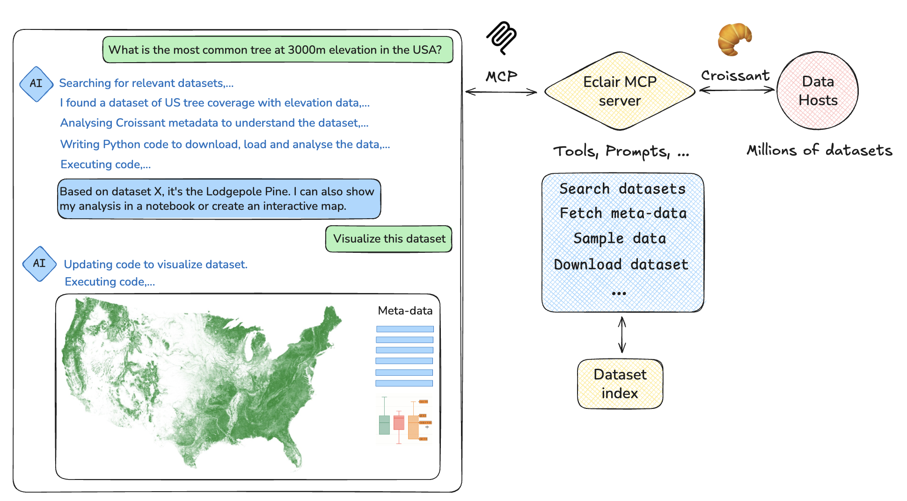
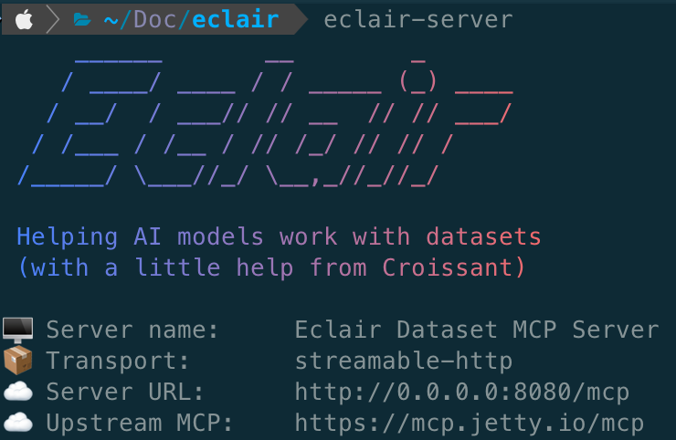

# ⚡️ Eclair ⚡️

## Helping AI Agents access the world's data

Eclair is a set of agentic tools that helps AI assistants (like Gemini and Claude) discover, download, and use datasets to answer questions based on factual data. Such AI models are trained on a lot of data from the internet and other sources, but usually not on the millions of large detailed structured datasets that humanity has gathered. That also means that they can't correctly answer questions about that data, which limits their scientific and analytical potential.

With Eclair, AI models can answer those questions by easily finding and accessing millions of datasets available all over the world, analyze this data on the fly to give accurate answers, reason about it and combine it with other data, as well as generate detailed analyses (e.g. notebooks) and custom UIs to explore the data in depth. It's like having your own personal, lightning-fast data scientist.



Eclair does this by combining three recent technologies:

* **[Model Context Protocol (MCP)](https://modelcontextprotocol.io/docs/getting-started/intro)** - Gives AI models easy access to millions of datasets available online (or your own), and tools to work effectively with that data.

* **[Croissant](https://github.com/mlcommons/croissant)** - A metadata standard to help AI models understand what information each dataset contains and how to download and extract that information.

* **[AI assistants](https://modelcontextprotocol.io/clients)** - That can 'think' about how to answer your questions, find relevant datasets, write code to download and analyze this data, and generate anything from direct textual answers to detailed notebooks, voice summaries, and custom user interfaces.

Most importantly, Eclair aims to create an **open, global ecosystem** of data sources, agentic tools, and other MCP servers that can be accessed by any AI agent and extended by anyone. You can also run Eclair servers locally, connect it to your own data sources, extend them with more advanced data analysis tools, actively generate data on the fly, or practically anything that you can imagine.

Get involved! With Eclair, your AI assistants can discover, analyze, and visualize real data to give you accurate, factual answers. Your contributions help make dataset discovery better for everyone. If you have questions about contributing or improving Eclair, please don't hesitate to ask in GitHub Discussions or open an issue.

!!! info "Fun Fact"
    Like 🥐 Croissant, Éclair was born in Paris. It's both a [delicious pastry](https://en.wikipedia.org/wiki/%C3%89clair) and the French word for ⚡️ lightning ⚡️.

## Quick Start

Get started with Eclair in just a few steps:

**1. Install Eclair**
   ```bash
   pip install eclair
   ```

!!! info "TODO"
    We'll publish on pypi as soon as the code is hosted on Github. For now, you'll need to install the developer version (see the installation guide).


**2. Start the Server**
   ```bash
   eclair-server
   ```

   

!!! info "Hosted Eclair"
    We provide a hosted test version of the MCP server at this address for demo purposes. You can plug it into your MCP client (e.g. Cursor, Windsurf, etc.). This is a hosted demo server, use at own risk and expect downtimes 😄.
    ```
    {
      "mcpServers": {
        "croissant-mcp": {
          "url": "http://35.87.210.99:8000/sse",
          "transport": "sse"
        }
      }
    }
    ```

**3. Use your favorite AI Agent**
   
🤖 You can use Eclair with any model that supports MCP. For instance:

- [Gemini CLI](usage/ai-agents/gemini-cli.md)
- [Claude Code](usage/ai-agents/claude-code.md)
- [VS Code + Copilot](usage/ide/vscode-copilot.md)
- [VS Code + Gemini Code Assist](usage/ide/vscode-gemini.md)

👩‍💻 You can also use Eclair directly in your code, notebooks, and scripts:

- [Python API](usage/python-api.md)
- [Command-Line Interface](usage/cli.md) 


## Available Tools

Eclair currently provides 7 essential tools for dataset discovery and analysis:

| Tool | Description |
|------|-------------|
| **search-datasets** | Search for datasets using a query string |
| **download-dataset** | Download a dataset with metadata |
| **datasets-preview-url** | Get a download URL for a dataset preview |
| **serve-croissant** | Get the Croissant metadata for a given dataset |
| **validate-croissant** | Validate a Croissant metadata file |
| **builder-context** | Guidance for LLM/agents on Croissant + TFDS/PyTorch best practices
| **pytorch-scaffold** | Generate a ready-to-run PyTorch Dataset scaffold from a Croissant URL
| **help** | Get instructions to use the Eclair tools |
| **ping** | Test that your Eclair server is working |


!!! info "Watch this space"
    We plan to extent these tools and add new ones, soon. E.g. a handy 'Dataset card' visualization?
    Let us know what you would like to see, or feel free to [build it yourself](development/index.md).


## Key Features

- **Built on Croissant**: A widely accepted machine-readable metadata format for datasets
- **FastMCP Implementation**: Built using the latest FastMCP library and MCP SDK
- **Seamless Integration**: Works with developer environments (e.g. VSCode), code assistants (e.g. Copilot and Gemini Code Assist) and command-line or desktop AI agents
- **Portable**: Easy to set up your own server and interact via Python code or command-line commands
- **Flexible Design**: Can relay to other MCP servers (e.g. [Jetty](https://jetty.io/)) and run anywhere as a stateless server


## What's Next?

- **New to Eclair?** Start with the [Installation Guide](getting-started/installation.md)
- **Start using Eclair** Check out the [Usage Guides](usage/overview.md)
- **Building on Eclair?** See the [API Documentation](api/tools.md)
- **Contributing?** Read the [Development Guide](development/index.md)

## Contributors

Eclair is developed and maintained by:

- **[Joaquin Vanschoren](https://github.com/joaquinvanschoren)** - OpenML, TU Eindhoven, Google Deepmind (Visiting Faculty)
- **[Omar Benjelloun](https://github.com/obenjelloun)** - Google Deepmind 
- **[Jon Lebenshold](https://github.com/jonlebensold)** - Jetty.io
- **[Natasha Noy](https://github.com/natashanoy)** - Google
- **[Luis Oala](https://github.com/luisoala)** - Brickroad
