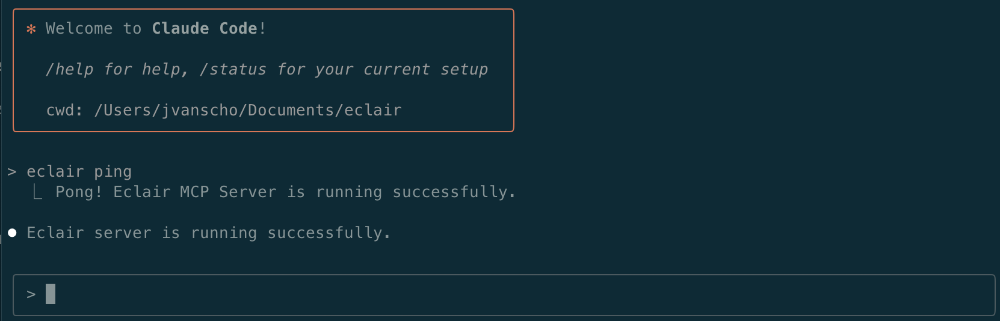
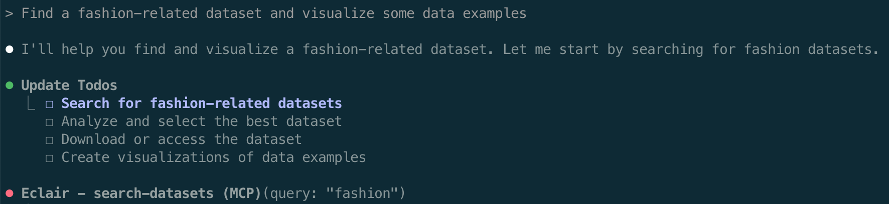
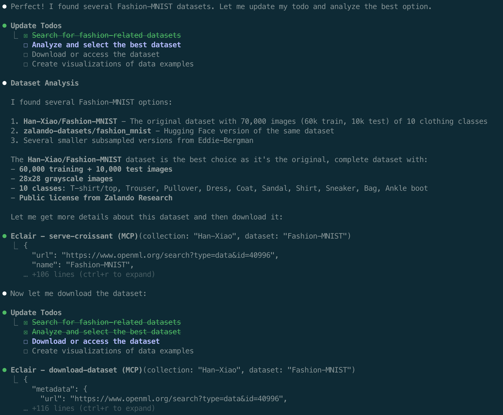
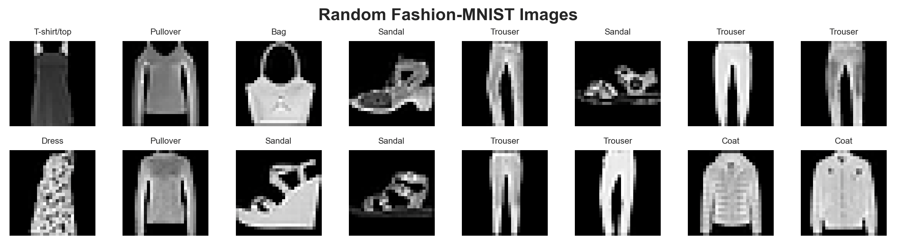

# Claude Code Integration

[Claude Code](https://claude.ai/code) by Anthropic is a powerful desktop application that brings Claude's advanced AI capabilities to your development workflow. When integrated with Eclair, Claude becomes a data-aware assistant that can discover, analyze, and work with real datasets.

## Prerequisites

Before setting up Claude Code with Eclair:

- ✅ Eclair server is [installed](../../getting-started/installation.md) and [running](../../getting-started/running-server.md)
- ✅ Node.js is installed on your system
- ✅ Anthropic account with Claude access

## Installation

### 1. Install Claude Code

```bash
npm install -g @anthropic-ai/claude-code
```

### 2. Initial Setup

If this is your first time using Claude Code:

```bash
claude
```

Follow the prompts to link your Anthropic account, then exit with Ctrl-C.

## Configuration

### 1. Register Eclair MCP Server

Add Eclair as an MCP server to Claude Code:

```bash
claude mcp add --transport http Eclair http://0.0.0.0:8080/mcp
```

This command:
- Registers Eclair as an MCP server named "Eclair"
- Uses HTTP transport to communicate with the server
- Connects to your local Eclair instance

### 2. Copy System Prompt

Claude works best with a system prompt that explains Eclair's capabilities:

```bash
cp src/eclair/client/claude/claude.md ./CLAUDE.md
```

This file helps Claude understand how to:
- Use Eclair tools effectively
- Interpret dataset metadata
- Generate appropriate analysis code
- Handle data download and processing

### 3. Verify Configuration

Check that Eclair is properly registered:

```bash
claude mcp list
```

You should see Eclair in the list of available MCP servers.

## Starting Claude Code

### 1. Ensure Eclair Server is Running

```bash
# Check server status
curl http://localhost:8080/mcp/health

# Start if not running
eclair-server
```

### 2. Start Claude Code

```bash
claude
```

You should see the Claude interface with:
- Connection to registered MCP servers
- Ready prompt for your requests



### 3. Test Eclair Connection

Verify the connection by running:

```
eclair ping
```

You should receive a successful ping response from the Eclair server.

## Usage Examples

### Fashion Dataset Analysis

Let's walk through the same example as with Gemini CLI:

```
> Find a fashion-related dataset and visualize some data examples
```

**Step 1: Permission Request**
Claude will use Eclair to find relevant datasets:


**Step 2: Dataset Selection**
Claude presents dataset options and gets your selection:


**Step 3: Data Analysis and Visualization**
Claude generates comprehensive analysis code:




**Step 4: Summary Report**
Claude provides a data scientist-quality summary:


## Troubleshooting

### Common Issues

**"MCP server not responding"**

- Check Eclair server status: `eclair-server --status`
- Restart the server: `eclair-server`
- Verify network connectivity

**"Permission denied for MCP operations"**

- Claude asks for permission before using MCP tools
- Grant permission when prompted
- Check MCP server registration: `claude mcp list`

**"Dataset download failed"**

- Check internet connectivity
- Verify dataset still exists at source
- Try alternative datasets
- Check for authentication requirements

**"Claude Code won't start"**

- Ensure Node.js is properly installed
- Check Claude Code installation: `claude --version`
- Try reinstalling: `npm uninstall -g @anthropic-ai/claude-code && npm install -g @anthropic-ai/claude-code`

### Debug Information

Get detailed debug information:

```bash
# Check MCP server status
claude mcp status

# View detailed logs
claude --verbose

# Test specific MCP server
claude mcp test Eclair
```

### Configuration Issues

Verify your setup:

```bash
# List registered MCP servers
claude mcp list

# Check Eclair connection
curl http://0.0.0.0:8080/mcp

# Remove and re-add if needed
claude mcp remove Eclair
claude mcp add --transport http Eclair http://0.0.0.0:8080/mcp
```