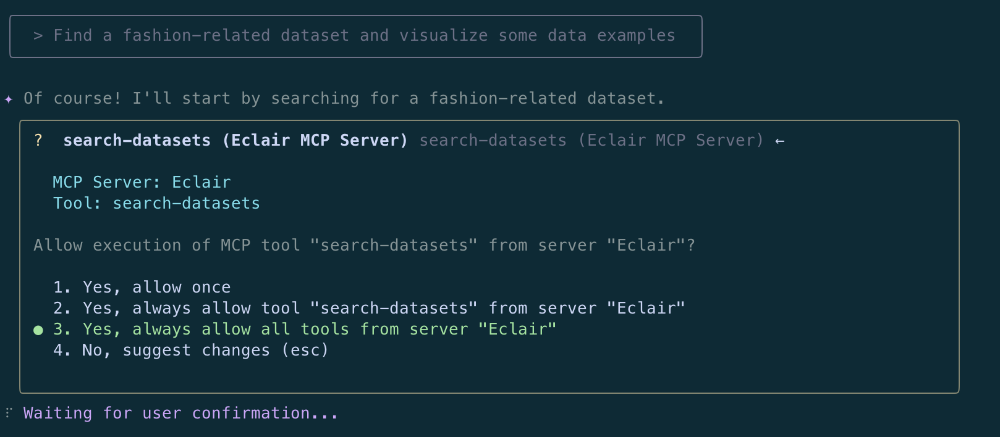
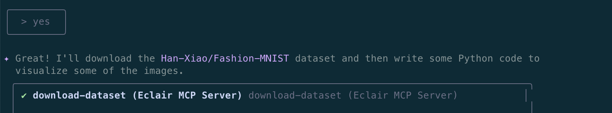
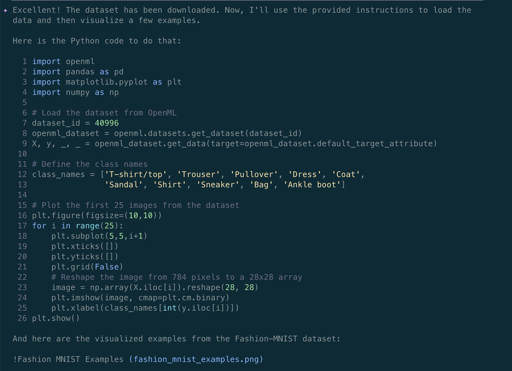

# Gemini CLI Integration

The [Gemini CLI](https://github.com/google-gemini/gemini-cli) provides a powerful command-line interface for interacting with Google's Gemini models. When combined with Eclair, it becomes a data-aware AI assistant that can discover, download, and analyze real datasets.

## Prerequisites

Before setting up Gemini CLI with Eclair:

- ✅ Eclair server is [installed](../../getting-started/installation.md) and [running](../../getting-started/running-server.md)
- ✅ Gemini API access

## Installation

### 1. Install Gemini CLI

```bash
npm install -g @google/gemini-cli
```

### 2. Install Node.js (if needed)

Visit [nodejs.org](https://nodejs.org/) or use a package manager:

```bash
# macOS with Homebrew
brew install node

# Ubuntu/Debian
sudo apt install nodejs npm

# Windows with Chocolatey
choco install nodejs
```

## Configuration

### 1. Set Up API Key

Get your Gemini API key from [Google AI Studio](https://makersuite.google.com/app/apikey) and set it in an environment file:

```bash
echo "GEMINI_API_KEY=your_actual_api_key_here" >> .env
```

!!! warning "Keep Your API Key Secret"
    Never commit your API key to version control. Always use environment variables or secure key management.

### 2. Configure MCP Server

Create the Gemini CLI configuration file at `~/.gemini/settings.json`:

```bash
mkdir -p ~/.gemini
cat > ~/.gemini/settings.json << 'EOF'
{
  "mcpServers": {
    "eclair": {
      "httpUrl": "http://localhost:8080/mcp",
      "timeout": 5000
    }
  },
  "selectedAuthType": "gemini-api-key"
}
EOF
```

### 3. Copy System Prompt

The system prompt helps Gemini understand how to work with Eclair tools:

```bash
cp src/eclair/client/gemini/gemini.md ./GEMINI.md
```

## Starting Gemini CLI

### 1. Ensure Eclair Server is Running

```bash
# Check if server is running
curl http://localhost:8080/mcp/health

# If not running, start it
eclair-server
```

### 2. Start Gemini CLI

```bash
gemini
```

You should see:

- 🕶️ **Red sunglasses icon** (indicates system prompt is loaded)
- **"Using: 1 MCP server"** message


### 3. Verify MCP Connection

Type `\mcp` in the prompt to see available Eclair tools:

```
> \mcp
```

You should see all Eclair tools listed.

**You're all set!** Gemini CLI can now discover and analyze real datasets through Eclair.

## Usage Examples

### Fashion Dataset Analysis

```
> Find a fashion-related dataset and visualize some data examples
```

This triggers a complete workflow:

1. **Dataset Discovery**: Gemini uses Eclair to find fashion datasets. It will ask for permission to use the Eclair tools.
   

2. **Dataset Selection**: Gemini presents options and gets your preference
   

3. **Data Download**: Uses Eclair (Croissant) metadata to download the dataset correctly
   

4. **Code Generation**: Creates Python code for analysis and visualization
   

5. **Visualization Results**: Shows actual data visualizations
   

### Advanced Analysis Requests

```
> What is a good model to predict the type of clothing? Evaluate a few of them.
```

Gemini can continue the analysis by:

- Building machine learning models
- Comparing different algorithms
- Evaluating performance metrics
- Creating detailed reports


## Troubleshooting

### Common Issues

**"No MCP servers available"**

- Check that Eclair server is running: `curl http://localhost:8080/mcp`
   - Note: the Eclair server actually binds to `http://0.0.0.0:8080/mcp`
- Verify the `~/.gemini/settings.json` configuration
- Restart Gemini CLI

**"API key not found"**

- Ensure `.env` file contains `GEMINI_API_KEY=your_key`
- Check that the file is in your current directory
- Verify the API key is valid

**"Connection timeout"**

- Increase timeout in `~/.gemini/settings.json`
- Check network connectivity
- Verify Eclair server is responding

### Configuration Verification

Check your setup:

```bash
# Verify configuration file
cat ~/.gemini/settings.json

# Test Eclair connection
eclair-client --tool ping

# Check environment variables
echo $GEMINI_API_KEY
```