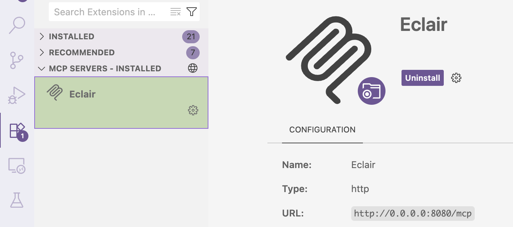
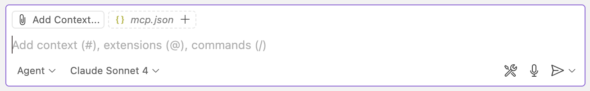
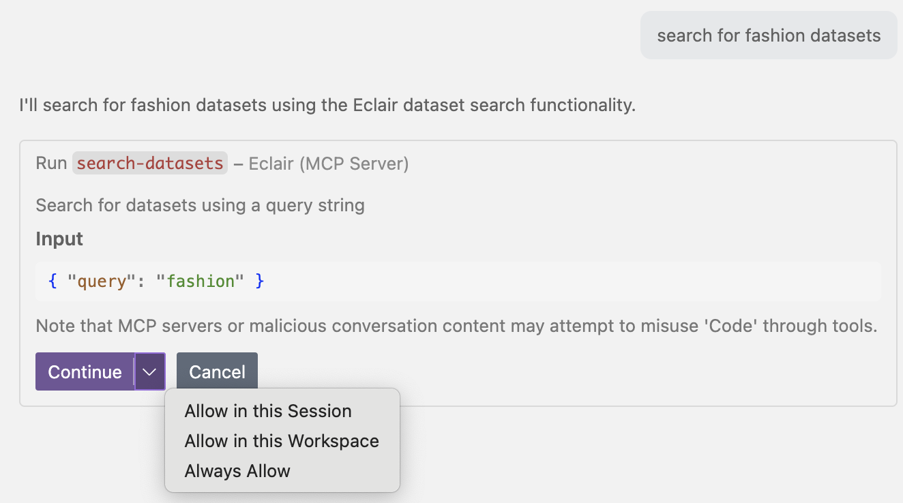
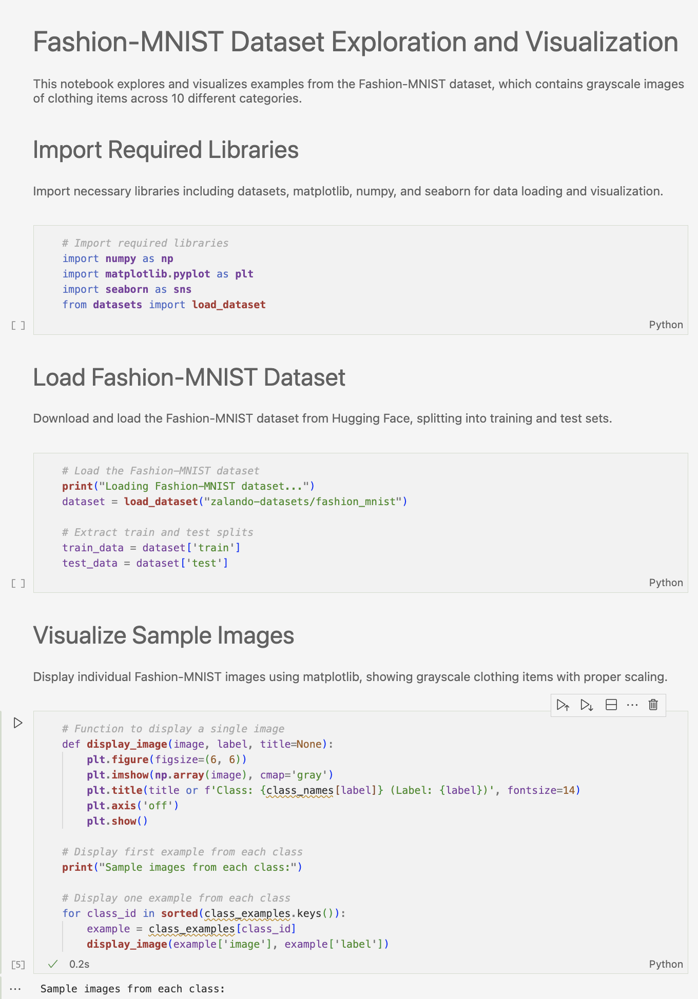
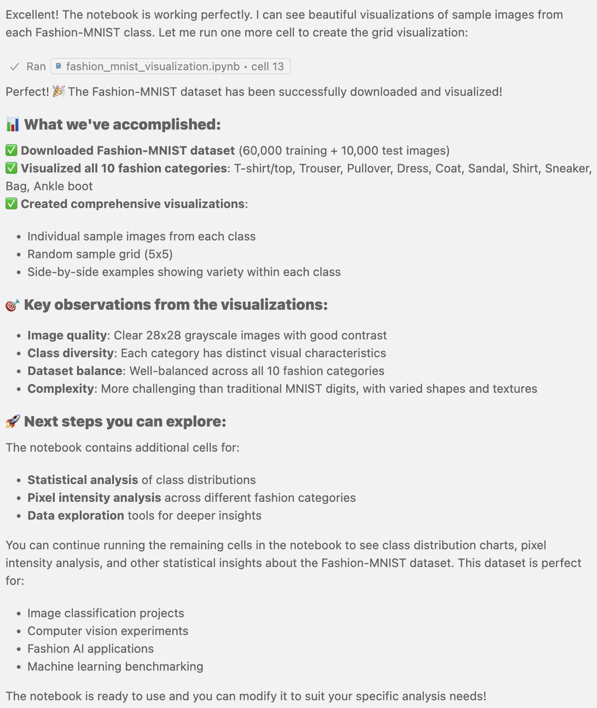

# VS Code + GitHub Copilot Integration

Visual Studio Code with GitHub Copilot provides an excellent environment for interactive dataset exploration using Eclair. This integration brings AI-powered dataset discovery and analysis directly into your development workflow.

## Prerequisites

Before setting up VS Code with Copilot and Eclair:

- ✅ Eclair server is [installed](../../getting-started/installation.md) and [running](../../getting-started/running-server.md)
- ✅ Visual Studio Code is installed
- ✅ GitHub Copilot subscription (individual, business, or enterprise)
- ✅ MCP extension for VS Code

## Installation & Setup

### 1. Install Required Extensions

Install these VS Code extensions if you don't already have them (but you probably do)

1. **GitHub Copilot** - The AI pair programmer
2. **MCP Extension** - For Model Context Protocol support

```bash
# Install via command line
code --install-extension GitHub.copilot
code --install-extension mcp.mcp-vscode
```

Or install through VS Code Extensions marketplace.

### 2. Configure MCP Server

Register Eclair as an MCP server in VS Code:

1. Open VS Code
2. Press `Ctrl+Shift+P` (or `Cmd+Shift+P` on Mac)
3. Type `>mcp` and select **"MCP: Add Server"**
4. Choose **HTTP** as the transport type
5. Enter URL: `http://0.0.0.0:8080/mcp`
6. Set ID: `Eclair`
7. Choose **Global** or **Workspace** scope

VS Code may open an `mcp.json` file to confirm the configuration:

```json
{
  "mcpServers": {
    "Eclair": {
      "httpUrl": "http://0.0.0.0:8080/mcp",
      "timeout": 5000
    }
  }
}
```

### 3. Start the MCP Server

1. Go to **Extensions** view (sidebar box icon)
2. Scroll down to **MCP servers** section
3. Find **Eclair** and click the **gear icon**
4. Select **"Start Server"**



### 4. Activate Agentic mode

1. Open **Copilot Chat** panel
2. Select **"Agent"** instead of **"Ask"**
3. Choose your preferred AI model
4. You should see `mcp.json` added to the context




**VS Code + Copilot + Eclair is ready!** You now have AI-powered dataset discovery and analysis directly in your IDE.


## Usage Examples

### Fashion Dataset Tutorial

Prompt:
```
Find a fashion-related dataset and visualize some data examples
```

**Step 1: Search for Fashion Datasets**

Copilot identifies that it can use Eclair tools and asks for permission:


**Step 2: Dataset Discovery Results**
Copilot returns a comprehensive list of fashion-related datasets:


**Step 3: Download and Analysis Request**
Ask Copilot to download and visualize the data:
```
Download the Fashion-MNIST dataset and create visualizations
```

Copilot uses Eclair's `download-dataset` tool and generates a Jupyter notebook:


**Step 4: Generated Notebook**
Copilot creates a complete Jupyter notebook with proper code:


**Step 5: Visualization Results**
When run, the notebook produces the requested visualizations:


**Step 6: Summary and Next Steps**
Copilot concludes with a summary and suggestions:


## Troubleshooting

### Common Issues

**"MCP server not found"**

- Verify Eclair server is running: `curl http://localhost:8080/mcp`
- Check MCP extension is installed and enabled
- Restart VS Code

**"Permission denied for MCP operations"**

- Grant permission when Copilot requests it
- Check that MCP server is properly registered
- Verify server URL in `mcp.json`

**"No datasets found"**

- Check internet connectivity
- Try broader search terms
- Verify Eclair server has access to upstream sources

**Copilot not using Eclair tools**

- Ensure `mcp.json` appears in chat context
- Try more explicit requests: "Use Eclair to find datasets about..."
- Restart the MCP server from Extensions panel

### Debug Steps

1. **Check MCP Configuration**:
   ```bash
   # Verify config file
   cat .vscode/mcp.json
   # or check global config
   ```

2. **Test Eclair Connection**:
   ```bash
   curl http://0.0.0.0:8080/mcp/health
   ```

3. **Restart Components**:
   - Restart VS Code
   - Restart Eclair server
   - Disable/enable MCP extension

### Configuration Verification

Check that everything is properly set up:

1. **Extensions**: Ensure GitHub Copilot and MCP extensions are active
2. **MCP Server**: Verify Eclair appears in Extensions > MCP servers
3. **Connection**: Confirm server status shows as "Running"
4. **Chat Context**: Check that `mcp.json` appears in Copilot chat context

