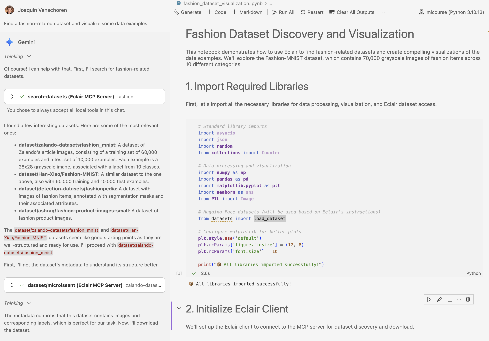
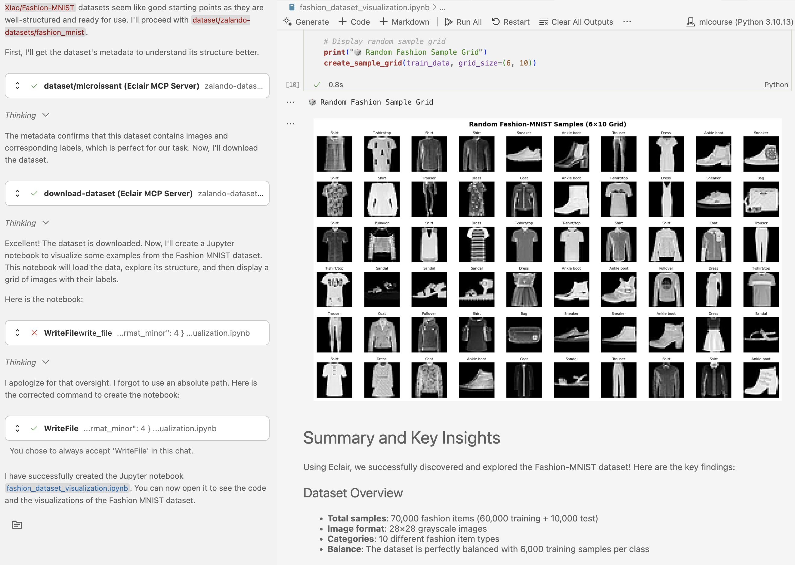

# VS Code + Gemini Code Assist Integration

Google's Gemini Code Assist for VS Code provides powerful AI-powered coding assistance. When combined with Eclair, it becomes a data-aware development environment that can discover, download, and analyze datasets directly within your IDE.

## Prerequisites

Before setting up VS Code with Gemini Code Assist and Eclair:

- ✅ Eclair server is [installed](../../getting-started/installation.md) and [running](../../getting-started/running-server.md)
- ✅ Visual Studio Code is installed
- ✅ Google Cloud account with Gemini API access
- ✅ Gemini API key

## Installation & Setup

### 1. Install Gemini Code Assist Extension

Install the Gemini Code Assist extension from the VS Code marketplace:

```bash
# Install via command line
code --install-extension Google.geminicodeassist
```

Or search for "Gemini Code Assist" in the VS Code Extensions panel.

### 2. Enable Agentic Mode

To use MCP servers with Gemini Code Assist, you need to enable Agentic mode:

1. Open VS Code
2. Press `Ctrl+Shift+P` (or `Cmd+Shift+P` on Mac)  
3. Type `> Open User Settings JSON`
4. Add this configuration:

```json
{
   "geminicodeassist.updateChannel": "Insiders"
}
```

5. Restart VS Code

### 3. Configure API Key

Set your Gemini API key in an `.env` file in your project directory:

```bash
echo "GEMINI_API_KEY=your_actual_api_key_here" >> .env
```

!!! warning "Keep Your API Key Secure"
    Never commit API keys to version control. Use environment files or secure key management.

### 4. Configure MCP Server

Create the Gemini configuration file at `~/.gemini/settings.json`:

```bash
mkdir -p ~/.gemini
cat > ~/.gemini/settings.json << 'EOF'
{
  "mcpServers": {
    "eclair": {
      "httpUrl": "http://localhost:8080/mcp",
      "timeout": 5000
    }
  },
  "selectedAuthType": "gemini-api-key"
}
EOF
```

### 5. Copy System Prompt

Copy the system prompt to help Gemini understand Eclair's capabilities:

```bash
cp src/eclair/client/gemini/gemini.md ./GEMINI.md
```

### 6. Activate Gemini Sidebar

1. Restart VS Code
2. Open the Gemini Sidebar (sparkle ✨ icon)
3. Set Gemini to **Agentic mode**
4. Verify MCP server connection by typing `/mcp`


**Gemini Code Assist + Eclair is ready!** You now have powerful AI-assisted dataset discovery and analysis directly in VS Code.


## Usage Examples

### Fashion Dataset Analysis Example

```
Find a fashion-related dataset and visualize some data examples
```

**Step 1: Automatic Tool Usage**
Gemini immediately uses Eclair's `search-datasets` tool:


**Step 2: Notebook Generation**
Gemini creates a complete Jupyter notebook with:

- Proper data loading code using Eclair's instructions
- Comprehensive data analysis
- Multiple visualization types


**Step 3: Visualization Results**
The generated notebook produces the requested visualizations:


## Further examples
Try these capabilities as well 

### 1. Intelligent Dataset Discovery

Gemini understands context and can find datasets based on:
- Domain (computer vision, NLP, time series, etc.)
- Size requirements
- Data format preferences
- Specific use cases

### 2. Automatic Code Generation

Based on Eclair's metadata, Gemini generates:
- Data loading scripts with proper error handling
- Preprocessing pipelines
- Visualization code
- Analysis workflows
- Complete Jupyter notebooks

### 3. Interactive Development

- Ask follow-up questions about datasets
- Request modifications to generated code
- Get explanations for data analysis steps
- Iterate on visualizations and analysis

### 4. Context Awareness

Gemini maintains context about:
- Previously discussed datasets
- Your project requirements
- Code that's already been generated
- Analysis results

## Troubleshooting

### Common Issues

**"MCP servers not loaded"**

- Ensure `~/.gemini/settings.json` is properly configured
- Verify Eclair server is running: `curl http://localhost:8080/mcp`
- Restart VS Code and check Agentic mode is enabled

**"API key not found"**

- Check `.env` file contains `GEMINI_API_KEY=your_key`
- Verify the API key is valid and has proper permissions
- Ensure the `.env` file is in your project root

**"Dataset access denied"**

- Some datasets require authentication
- Check dataset license and access requirements
- Try alternative datasets with open access

**"Code execution errors"**

- Install required dependencies: `pip install datasets pandas matplotlib`
- Check Python environment is properly configured
- Verify dataset URLs are still valid

### Debug Steps

1. **Verify Eclair Connection**:
   ```bash
   curl http://localhost:8080/mcp/health
   eclair-client --tool ping
   ```

2. **Check Configuration Files**:
   ```bash
   cat ~/.gemini/settings.json
   cat .env
   ls -la GEMINI.md
   ```

3. **Test MCP Integration**:
   In Gemini Code Assist, type `/mcp` to verify tools are loaded

### Configuration Issues

If MCP servers aren't loading:

1. **Check Settings Format**:
   ```json
   {
     "mcpServers": {
       "eclair": {
         "httpUrl": "http://localhost:8080/mcp",
         "timeout": 5000
       }
     },
     "selectedAuthType": "gemini-api-key"
   }
   ```

2. **Verify Server Status**: Eclair server must be running before starting VS Code

