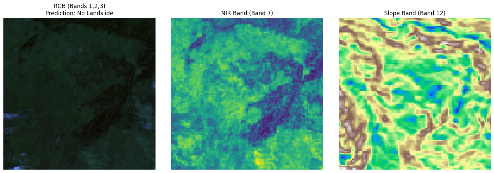
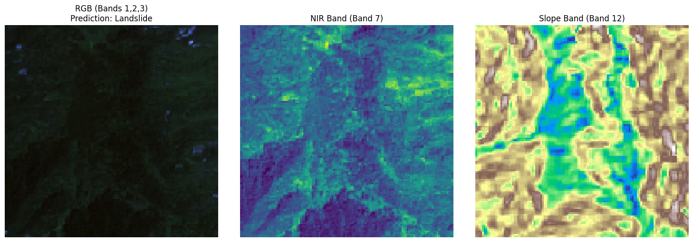

# Landslide4Sense Finetuning Documentation

## Overview

This document provides comprehensive information about the finetuning implementation for landslide detection using the Landslide4Sense dataset and the Prithvi-EO-1.0-100M foundation model.

## Dataset Information

### Landslide4Sense Dataset
- **Total Samples**: 4,844 image patches
- **Training Samples**: 3,799
- **Validation Samples**: 245  
- **Test Samples**: 800
- **Image Size**: 128x128 pixels
- **Total Bands**: 14 channels
- **Data Volume**: ~2.1GB
- **Format**: HDF5 (.h5) files
- **Metadata**: JSON file with complete dataset specifications

### Metadata File Information
- **File Path**: `/teamspace/studios/this_studio/Landslide4sense.json`
- **Schema**: GeoCroissant 1.0 compliant
- **Content**: 
  - Complete file listings for all splits
  - Band specifications and sensor information
  - Dataset statistics and geographical coverage
  - Evaluation metrics and task definitions

### Data Structure

The dataset is organized using a metadata-driven approach with the following structure:

#### Metadata File
- **Path**: `/teamspace/studios/this_studio/Landslide4sense.json`
- **Purpose**: Contains complete dataset information, file listings, and band specifications
- **Format**: JSON with Croissant schema compliance

#### Dataset Directory Structure
```
Landslide4Sense/
├── images/
│   ├── train/          # 3,799 H5 files
│   ├── validation/     # 245 H5 files
│   └── test/          # 800 H5 files
└── annotations/
    ├── train/          # 3,799 H5 files
    ├── validation/     # 245 H5 files
    └── test/          # 800 H5 files
```

#### Project Output Files
```
/teamspace/studios/this_studio/
├── Landslide4sense.json           # Dataset metadata
├── no_landslide.png               # Non-landslide classification example
├── landslide.png                   # Landslide classification example
└── Landslide4Sense/               # Dataset directory
```

#### File Naming Convention
- **Images**: `image_{id}.h5` (e.g., `image_1.h5`, `image_100.h5`)
- **Annotations**: `mask_{id}.h5` (e.g., `mask_1.h5`, `mask_100.h5`)
- **Format**: HDF5 (.h5) files with standardized internal structure

## Band Configuration

### 14-Channel Structure

The dataset contains 14 spectral bands organized as follows:

#### Sentinel-2 Bands (Bands 0-11)
| Band Index | Wavelength | Band Name | Description |
|------------|------------|------------|--------------|
| 0 | 443nm | Coastal aerosol | Atmospheric correction |
| 1 | 490nm | Blue | Water bodies, vegetation |
| 2 | 560nm | Green | Vegetation health |
| 3 | 665nm | Red | Vegetation, soil |
| 4 | 705nm | Vegetation Red Edge | Vegetation stress |
| 5 | 740nm | Vegetation Red Edge | Vegetation stress |
| 6 | 783nm | Vegetation Red Edge | Vegetation stress |
| 7 | 842nm | NIR | Vegetation biomass |
| 8 | 945nm | Water vapour | Atmospheric correction |
| 9 | 1375nm | SWIR - Cirrus | Cloud detection |
| 10 | 1610nm | SWIR | Soil moisture, vegetation |
| 11 | 2190nm | SWIR | Soil composition |

#### ALOS PALSAR Bands (Bands 12-13)
| Band Index | Data Type | Unit | Description |
|------------|------------|------|--------------|
| 12 | Slope | degrees | Terrain slope derived from DEM |
| 13 | Elevation | meters | Digital Elevation Model |

### Band Selection for Finetuning

**Critical Implementation Detail**: The finetuning model uses only 6 out of the 14 available bands.

#### Selected Bands (6 channels)
| Band Index | Band Name | Wavelength/Type | Selection Reason |
|------------|------------|------------------|------------------|
| 1 | Blue | 490nm | Water detection, vegetation contrast |
| 2 | Green | 560nm | Vegetation health assessment |
| 3 | Red | 665nm | Soil and vegetation analysis |
| 7 | NIR | 842nm | Vegetation biomass and stress |
| 10 | SWIR | 1610nm | Soil moisture and composition |
| 12 | Slope | degrees | Terrain characteristics |

#### Excluded Bands (8 channels)
- **Band 0**: Coastal aerosol (atmospheric noise)
- **Band 4-6**: Vegetation Red Edge (redundant with NIR)
- **Band 8**: Water vapour (atmospheric correction only)
- **Band 9**: SWIR Cirrus (cloud detection)
- **Band 11**: SWIR 2190nm (redundant with SWIR 1610nm)
- **Band 13**: DEM elevation (less critical than slope)

## Model Architecture

### Prithvi-EO-1.0-100M Foundation Model
- **Base Model**: IBM-NASA Prithvi-EO-1.0-100M
- **Parameters**: 100 million
- **Architecture**: Vision Transformer (ViT) with Masked Autoencoding
- **Pre-training**: Self-supervised learning on global satellite imagery
- **Input**: 6-band multispectral data (128x128x6)
- **Output**: 768-dimensional feature embeddings

### Finetuning Architecture

```
Input: 14-channel H5 images (128x128x14)
    ↓
Band Selection: Extract 6 optimal bands [1,2,3,7,10,12]
    ↓
Prithvi Encoder: Feature extraction (FROZEN)
    ↓
Feature Vector: 768-dimensional embeddings
    ↓
Classification Head: 3-layer MLP (TRAINABLE)
    ↓
Output: Binary classification [0: Non-landslide, 1: Landslide]
```

### Model Components

#### 1. Band Selection Layer
```python
# Fixed band selection - no training required
self.band_indices = torch.tensor([1, 2, 3, 7, 10, 12])
x = x[:, self.band_indices, :, :]  # [B, 14, H, W] -> [B, 6, H, W]
```

#### 2. Prithvi Encoder (Frozen)
- **Status**: Pre-trained weights loaded, parameters frozen
- **Function**: Feature extraction from 6-band input
- **Output**: 768-dimensional feature vectors

#### 3. Classification Head (Trainable)
```python
self.classifier = nn.Sequential(
    nn.Linear(768, 512),
    nn.ReLU(inplace=True),
    nn.Dropout(0.3),
    nn.Linear(512, 256),
    nn.ReLU(inplace=True),
    nn.Dropout(0.3),
    nn.Linear(256, 2)  # Binary classification
)
```

## Data Processing Pipeline

### Metadata-Driven Data Loading
```python
# Load dataset metadata from JSON file
metadata_path = "/teamspace/studios/this_studio/Landslide4sense.json"
with open(metadata_path, "r") as f:
    metadata = json.load(metadata)

# Extract file listings and paths
image_files = metadata["geocr:fileListing"]["images"][split]
annotation_files = metadata["geocr:fileListing"]["annotations"][split]
```

### H5 File Loading
```python
# Load 14-channel image data
with h5py.File(image_file, 'r') as f:
    data = f['img'][:]  # Shape: (14, 128, 128)
    
# Transpose to (128, 128, 14) format
image_data = np.transpose(data, (1, 2, 0))
```

### Data Normalization
```python
# Per-band normalization
for i in range(image_tensor.shape[0]):
    band = image_tensor[i]
    if band.std() > 0:
        image_tensor[i] = (band - band.mean()) / band.std()
```

### Data Augmentation
- **Random Horizontal Flip**: p=0.5
- **Random Vertical Flip**: p=0.5  
- **Random Rotation**: ±10 degrees
- **Brightness/Contrast**: ±10% variation

## Training Configuration

### Hyperparameters
- **Learning Rate**: 1e-4
- **Optimizer**: AdamW with weight decay 0.01
- **Scheduler**: Cosine annealing
- **Batch Size**: 16
- **Epochs**: 15
- **Loss Function**: CrossEntropyLoss

### Training Strategy
1. **Frozen Encoder**: Prithvi backbone remains unchanged
2. **Trainable Classifier**: Only the classification head is updated
3. **Transfer Learning**: Leverages pre-trained satellite imagery knowledge
4. **Band Optimization**: Uses domain-specific band selection

## Input/Output Specifications

### Input Requirements
- **Format**: HDF5 (.h5) files
- **Structure**: 14-channel multispectral data
- **Dimensions**: 128x128x14
- **Data Types**: Float32, normalized per band
- **Bands**: All 14 channels must be present

### Output Specifications
- **Format**: Binary classification
- **Classes**: 
  - 0: Non-landslide
  - 1: Landslide
- **Confidence**: Softmax probabilities
- **Evaluation**: F1-score optimization

### Output Visualization Examples
The finetuned model produces classification outputs that can be visualized using example images:

#### Non-Landslide Detection
- **File Path**: `/teamspace/studios/this_studio/no_landslide.png`
- **Content**: Example of terrain classified as non-landslide
- **Use Case**: Validation of model's ability to identify stable terrain


*Figure 1: Example of terrain classified as non-landslide by the finetuned model*

#### Landslide Detection  
- **File Path**: `/teamspace/studios/this_studio/landslide.png`
- **Content**: Example of terrain classified as landslide
- **Use Case**: Validation of model's ability to identify landslide-prone areas


*Figure 2: Example of terrain classified as landslide by the finetuned model*

## User Requirements

### For Users with 14-Channel Images

**Important**: Users must provide images with all 14 channels, even though the model only uses 6.

#### Required Input Format
```python
# Expected input shape
input_image.shape = (batch_size, 14, 128, 128)

# All 14 bands must be present:
# Bands 0-11: Sentinel-2 multispectral data
# Band 12: ALOS PALSAR slope data  
# Band 13: ALOS PALSAR DEM data
```

#### Band Order Validation
```python
# Verify band order matches expected structure
expected_bands = [
    "Coastal aerosol", "Blue", "Green", "Red",
    "Vegetation Red Edge 1", "Vegetation Red Edge 2", "Vegetation Red Edge 3",
    "NIR", "Water vapour", "SWIR Cirrus", "SWIR 1", "SWIR 2",
    "Slope", "Elevation"
]
```

### Model Adaptation
The model automatically:
1. **Accepts 14-channel input**
2. **Selects optimal 6 bands** [1,2,3,7,10,12]
3. **Processes through Prithvi encoder**
4. **Outputs binary classification**

## Performance Characteristics

### Model Efficiency
- **Total Parameters**: 86,237,184
- **Frozen Parameters**: 86,237,184 (Prithvi encoder)
- **Trainable Parameters**: 526,286 (classifier only)
- **Memory Usage**: Optimized for GPU training

### Training Benefits
1. **Fast Convergence**: Only classifier parameters updated
2. **Stable Training**: Frozen encoder prevents overfitting
3. **Domain Knowledge**: Leverages pre-trained satellite imagery understanding
4. **Band Optimization**: Uses most relevant spectral information

## Implementation Files

### Core Files
- `finetune_landslide_complete.py`: Main finetuning script
- `prithvi_mae.py`: Prithvi model architecture  
- `config.json`: Model configuration
- `FINETUNING_FIXES.md`: Implementation details and fixes
- `Landslide4sense.json`: Dataset metadata and file listings

### Output Files
- `no_landslide.png`: Example of non-landslide classification
- `landslide.png`: Example of landslide classification

### Key Classes
- `LandslideDataset`: H5 dataset loader with 14-channel support
- `PrithviLandslideClassifier`: Main model with band selection
- `MultispectralTransforms`: Data augmentation for multispectral data

## Model Evaluation and Output Analysis

### Classification Results
The finetuned model provides binary classification outputs that can be analyzed through:

#### Visual Validation
- **Non-Landslide Example**: `/teamspace/studios/this_studio/no_landslide.png`
  - Shows terrain correctly classified as stable
  - Helps validate model's precision for negative cases
- **Landslide Example**: `/teamspace/studios/this_studio/landslide.png`
  - Shows terrain correctly classified as landslide-prone
  - Helps validate model's recall for positive cases

#### Performance Metrics
- **F1-Score**: Primary evaluation metric for imbalanced dataset
- **Precision**: Accuracy of landslide predictions
- **Recall**: Ability to detect actual landslides
- **Confidence Scores**: Model's certainty in predictions

#### Online Monitoring and Visualizations
- **Wandb Dashboard**: [https://wandb.ai/Silvamillion/prithvi-landslide-finetuning/runs/q7buntz9](https://wandb.ai/Silvamillion/prithvi-landslide-finetuning/runs/q7buntz9)
- **Real-time Metrics**: Live training progress, loss curves, and accuracy plots
- **Sample Predictions**: Visual examples of model classifications during training
- **Model Comparison**: Track multiple training runs and compare performance

## Usage Instructions

### 1. Prepare Data
- Ensure your H5 files contain all 14 channels in the correct order
- Verify the metadata file `Landslide4sense.json` is accessible at `/teamspace/studios/this_studio/`
- Check that file paths in metadata match your actual dataset structure

### 2. Run Finetuning
```bash
python finetune_landslide_complete.py
```

### 3. Monitor Training
- Uses Weights & Biases (wandb) for comprehensive logging and monitoring
- **Wandb Project**: `prithvi-landslide-finetuning`
- **Run URL**: [https://wandb.ai/Silvamillion/prithvi-landslide-finetuning/runs/q7buntz9](https://wandb.ai/Silvamillion/prithvi-landslide-finetuning/runs/q7buntz9)
- **Metrics Tracked**: 
  - F1-score (primary evaluation metric)
  - Training and validation accuracy
  - Loss curves (training/validation)
  - Learning rate scheduling
  - Model parameters and configuration
- **Visualizations**: Training progress charts, confusion matrices, sample predictions
- **Model Checkpoints**: Automatic saving of best performing models

### 4. Inference
```python
# Load trained model
model = PrithviLandslideClassifier(prithvi_model)
model.load_state_dict(torch.load('best_model.pth'))

# Input: 14-channel image
input_image = torch.randn(1, 14, 128, 128)
prediction = model(input_image)
```

## Summary

The Landslide4Sense finetuning implementation successfully addresses the challenge of using a 6-band pre-trained model with 14-channel input data by:

1. **Accepting 14-channel input** from users
2. **Automatically selecting 6 optimal bands** for landslide detection
3. **Leveraging pre-trained Prithvi knowledge** through transfer learning
4. **Maintaining model efficiency** by freezing the encoder
5. **Providing robust binary classification** for disaster management

This approach ensures users can utilize their full 14-channel multispectral data while benefiting from the optimized band selection and pre-trained satellite imagery understanding of the Prithvi foundation model.
