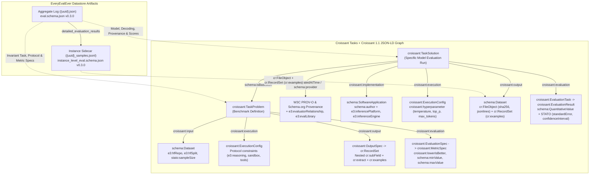

# [Experimental] Integrating EveryEvalEver (E3) with Croissant Tasks (CT)

> [!NOTE]
> **Status: Early Exploratory Work / Experimental Proposal**
> This document and the accompanying JSON-LD examples are an early exploration of how benchmarks and evaluation runs from **EveryEvalEver (E3)** (`arXiv:2606.14516`, schema `v0.3.0`) could be represented in **MLCommons Croissant Tasks (CT)** (`arXiv:2605.29786`) and **Croissant 1.1** (`http://mlcommons.org/croissant/1.1`). The proposed vocabulary boundaries, experimental properties (such as `croissant:lowerIsBetter`), and structural patterns are meant to spark discussion and iteration between the Croissant Tasks and EveryEvalEver communities rather than prescribe a finalized specification.

All generated JSON-LD files for the E3 homepage example are available in the workspace artifacts:
- **Problem Definition (`croissant:TaskProblem`)**: [mmlu_pro_problem.jsonld](../examples/every_eval_ever/mmlu_pro_problem.jsonld)
- **Model Evaluation Run (`croissant:TaskSolution`)**: [mmlu_pro_solution_kimi_k2.jsonld](../examples/every_eval_ever/mmlu_pro_solution_kimi_k2.jsonld)
- **Self-Contained Single-File Task (`croissant:Task`)**: [mmlu_pro_combined_task.jsonld](../examples/every_eval_ever/mmlu_pro_combined_task.jsonld)

---

## 1. Architectural Synergy & Single Source of Truth

While both **Croissant Tasks (CT)** and **EveryEvalEver (E3)** address AI evaluation reproducibility and interoperability, they operate at different layers:

| Dimension | Croissant Tasks (CT) + Croissant 1.1 | EveryEvalEver (E3) (`v0.3.0`) | Unified Architecture |
| :--- | :--- | :--- | :--- |
| **Primary Abstraction** | **Task-centric & Problem/Solution Duality**: Decouples the reusable benchmark challenge (`croissant:TaskProblem`) from each model run (`croissant:TaskSolution`). | **Run-centric Log Format**: Captures an empirical evaluation run (`{uuid}.json` aggregate + `{uuid}_samples.jsonl` per-item sidecar). | Factors invariant benchmark definitions (`TaskProblem`) out of individual E3 evaluation files (`TaskSolution`), linking runs via `schema:isBasedOn`. |
| **Dataset & File Modeling** | **Croissant 1.1 `FileObject` & `RecordSet`**: Native support for JSONL distributions (`application/jsonlines`), SHA-256 checksums, `cr:subField` nesting, `cr:extract` (`jsonPath`), and `cr:examples` (`@type: @json`). | Custom `detailed_evaluation_results` (`file_path`, `format`, `checksum`) and `instance_level_eval.schema.json`. | Maps E3 `.jsonl` instance logs directly to Croissant `cr:FileObject` and `cr:RecordSet` with `cr:subField` and `cr:examples` so `mlcroissant` loaders can read E3 logs natively. |
| **Statistical & Metric Modeling** | `croissant:MetricSpec`, `croissant:EvaluationResult`, and `schema:QuantitativeValue`. | `metric_config` (`lower_is_better`, `score_type`, `min_score`, `max_score`, `level_names`) and `score_details.uncertainty` (`standard_error`, `confidence_interval`, `num_samples`). | Uses `croissant:lowerIsBetter` (default `false`), Croissant `sc:Enumeration` recordsets for discrete score levels, `schema:QuantitativeValue` for bounds, and OBO Foundry **STATO** for uncertainty. |
| **Serving & Eval Provenance** | High-level `croissant:implementation` and `croissant:execution`. | Fine-grained operational metadata (`evaluator_relationship`, `inference_platform`, `inference_engine`, `deployment_type`, `model_availability`, `extraction_method`). | Uses **W3C PROV-O** (`prov:generatedAtTime`) and **Schema.org** (`schema:provider`, `schema:author`) for provenance, reserving the `e3:` namespace strictly for E3-specific operational attributes. |

---

## 2. Graph Topology & Namespace Partitioning



### JSON-LD 1.1 `@context`

To eliminate redundant dual-population of properties while maintaining full compatibility with `mlcroissant`, Croissant Tasks SHACL shapes, and RDF reasoners, every document shares the following `@context`:

```json
{
  "@context": {
    "@version": 1.1,
    "cr": "http://mlcommons.org/croissant/",
    "croissant": "http://mlcommons.org/croissant/",
    "sc": "https://schema.org/",
    "schema": "https://schema.org/",
    "dct": "http://purl.org/dc/terms/",
    "prov": "http://www.w3.org/ns/prov#",
    "xsd": "http://www.w3.org/2001/XMLSchema#",
    "stato": "http://purl.obolibrary.org/obo/STATO_",
    "e3": "https://evalevalai.com/schema/0.3.0/",
    "examples": {
      "@id": "cr:examples",
      "@type": "@json"
    },
    "data": {
      "@id": "cr:data",
      "@type": "@json"
    },
    "dataType": {
      "@id": "cr:dataType",
      "@type": "@vocab"
    },
    "subField": "cr:subField",
    "extract": "cr:extract",
    "jsonPath": "cr:jsonPath",
    "fileObject": "cr:fileObject",
    "isArray": "cr:isArray",
    "lowerIsBetter": "cr:lowerIsBetter",
    "standardError": "stato:0000037",
    "confidenceInterval": "stato:0000198",
    "confidenceLevel": "stato:0000088",
    "sampleSize": "stato:0000047",
    "standardDeviation": "stato:0000164"
  }
}
```

> [!IMPORTANT]
> **Why `"examples": { "@id": "cr:examples", "@type": "@json" }` is used:**
> In Croissant 1.1 (`mlcroissant/_src/core/rdf.py`), `cr:examples` is typed as an `rdf:JSON` literal (`@type: @json`). This allows verbatim E3 instance records (such as sample `test_1042` from `{uuid}_samples.jsonl`) to be embedded directly inside `cr:RecordSet.examples` using their native E3 JSON keys (`sample_id`, `input`, `output`, `answer_attribution`, `token_usage`) without requiring `e3:` prefixing on every nested key.

---

## 3. Vocabulary Boundary & Field-by-Field Mapping

Each E3 property is assigned to a single canonical vocabulary—preferring **Schema.org**, **Croissant 1.1 (`cr:`/`croissant:`)**, **W3C PROV-O (`prov:`)**, or **STATO (`stato:`)** whenever a standard exists, and reserving **`e3:`** for concepts unique to LLM evaluation harnesses.

### 3.1 Provenance & Harness Metadata

| E3 JSON Path | Target Node | Canonical Property | Vocabulary | Notes |
| :--- | :--- | :--- | :--- | :--- |
| `evaluation_id` | `TaskSolution` | `schema:identifier` | Schema.org | E.g., `"lm-eval/moonshotai/kimi-k2-instruct/1764204739.50717"`. |
| `retrieved_timestamp` / `evaluation_timestamp` | `TaskSolution` / `EvaluationResult` | `prov:generatedAtTime` | W3C PROV-O | Converted from Unix epoch float to ISO-8601 `xsd:dateTime`. |
| `source_metadata.source_organization_*` | `TaskSolution` | `schema:provider` (`@type: schema:Organization`) | Schema.org | Captures `schema:name`, `schema:url`, and `schema:logo`. |
| `source_metadata.source_type` | `TaskSolution` | `e3:sourceType` | E3 | `"evaluation_run"` or `"documentation"`. |
| `source_metadata.evaluator_relationship` | `TaskSolution` | `e3:evaluatorRelationship` | E3 | `"first_party"`, `"third_party"`, `"collaborative"`, or `"other"`. |
| `eval_library` | `TaskSolution` | `e3:evalLibrary` (`@type: schema:SoftwareApplication`) | E3 + Schema.org | Uses `schema:name` (`"lm-eval"`) and `schema:version` (`"0.4.11"`). |

### 3.2 Model & Serving Stack (`model_info` $\to$ `croissant:implementation`)

| E3 JSON Path | Target Node | Canonical Property | Vocabulary | Notes |
| :--- | :--- | :--- | :--- | :--- |
| `model_info.name` | `croissant:implementation` | `schema:name` | Schema.org | E.g., `"Kimi K2 Instruct"`. |
| `model_info.id` | `croissant:implementation` | `schema:identifier` & `@id` | Schema.org | Canonical HF identifier (`"moonshotai/kimi-k2-instruct"`). |
| `model_info.developer` | `croissant:implementation` | `schema:author` (`@type: schema:Organization`) | Schema.org | Organization that developed the model (`"moonshotai"`). |
| `model_info.inference_platform` | `croissant:implementation` | `e3:inferencePlatform` | E3 | Hosting API provider (`"Together AI"`). |
| `model_info.inference_engine` | `croissant:implementation` | `e3:inferenceEngine` (`@type: schema:SoftwareApplication`) | E3 + Schema.org | Serving engine (`schema:name: "vLLM"`, `schema:version: "0.6.3"`). |
| `model_info.additional_details.deployment_type` | `croissant:implementation` | `e3:deploymentType` | E3 | `"self_deployed"` or `"externally_managed"`. |
| `model_info.additional_details.model_availability` | `croissant:implementation` | `e3:modelAvailability` | E3 | `"open_weights"` or `"closed_weights"`. |

### 3.3 Protocol vs. Solution Split (`generation_config` $\to$ `croissant:execution`)

E3's `generation_config.generation_args` mixes **benchmark protocol rules** with **model decoding choices**. In Croissant Tasks, these are partitioned across `TaskProblem` and `TaskSolution`:

| E3 JSON Path | Target Node | Canonical Property | Vocabulary | Notes |
| :--- | :--- | :--- | :--- | :--- |
| `prompt_template`, `reasoning`, `eval_limits`, `sandbox`, `agentic_eval_config.available_tools` | `TaskProblem.execution` | `croissant:environment`, `e3:reasoning`, `e3:availableTools`, `e3:evalLimits` | Croissant Tasks + E3 | Defines the rules, tools, and container sandbox required by the benchmark problem. |
| `temperature`, `top_p`, `top_k`, `max_tokens` | `TaskSolution.execution` | `croissant:hyperparameter` (`@type: schema:PropertyValue`) | Croissant Tasks + Schema.org | Single source of truth for run-time decoding hyperparameters. |

### 3.4 Metrics, Custom Types & Statistical Uncertainty

| E3 JSON Path | Target Node | Canonical Property | Vocabulary | Notes |
| :--- | :--- | :--- | :--- | :--- |
| `metric_config.lower_is_better` | `MetricSpec` & `EvaluationResult` | `croissant:lowerIsBetter` | Croissant Tasks | Boolean (`default: false`). Set `true` for loss, perplexity, latency, or error rates. |
| `metric_config.score_type` (`continuous`, `binary`, `levels`) | `MetricSpec` | `cr:dataType` | Croissant 1.1 | `"sc:Float"` (continuous), `"sc:Boolean"` (binary), or `"sc:Enumeration"` referencing a `cr:RecordSet` of allowed levels. |
| `metric_config.min_score` / `max_score` | `MetricSpec` & `QuantitativeValue` | `schema:minValue` / `schema:maxValue` | Schema.org | Numeric bounds (e.g., `0.0` to `1.0`). |
| `metric_config.metric_unit` | `MetricSpec` & `QuantitativeValue` | `schema:unitText` / `schema:unitCode` | Schema.org / QUDT | E.g., `"proportion"`, `"percent"`, or QUDT unit URI (`unit:MilliSEC`). |
| `metric_config.llm_scoring` | `EvaluationSpec` / `EvaluationTask` | `croissant:implementation` (judge models) + `e3:aggregationMethod`, `e3:expertBaseline` | Croissant Tasks + E3 | Models LLM judges/juries as `schema:SoftwareApplication` entities on the evaluation task itself. |
| `score_details.score` | `EvaluationResult.value` (`@type: schema:QuantitativeValue`) | `schema:value` | Schema.org | Point estimate (`0.819`). |
| `uncertainty.standard_error` | `QuantitativeValue` | `standardError` (`stato:0000037`) | STATO + Schema.org | Contains `schema:value` and `schema:measurementMethod` (`"analytic"`, `"bootstrap"`, `"jackknife"`). |
| `uncertainty.confidence_interval` | `QuantitativeValue` | `confidenceInterval` (`stato:0000198`) | STATO + Schema.org | Contains `schema:minValue` (`lower`), `schema:maxValue` (`upper`), `confidenceLevel` (`stato:0000088`), and `schema:measurementMethod`. |
| `uncertainty.standard_deviation` | `QuantitativeValue` | `standardDeviation` (`stato:0000164`) | STATO | Sample standard deviation. |
| `uncertainty.num_samples` / `source_data.samples_number` | `Dataset` / `RecordSet` / `QuantitativeValue` | `sampleSize` (`stato:0000047`) | STATO | Number of evaluated instances (`12032`). |

### 3.5 Instance-Level Files & Schemas (`detailed_evaluation_results` & `instance_level_eval.schema.json`)

| E3 JSON Path | Target Node | Canonical Property | Vocabulary | Notes |
| :--- | :--- | :--- | :--- | :--- |
| `detailed_evaluation_results.file_path`, `format`, `checksum` | `TaskSolution.output` (`schema:Dataset`) | `schema:distribution` $\to$ `cr:FileObject` (`schema:contentUrl`, `schema:encodingFormat`, `schema:sha256`) | Croissant 1.1 | Standard Croissant file distribution (`"application/jsonlines"`). |
| Nested JSONL fields (`input`, `output`, `answer_attribution`, `evaluation`, `token_usage`) | `TaskProblem.output` (`croissant:OutputSpec` $\to$ `cr:RecordSet`) | `cr:field` + nested `cr:subField` + `cr:extract` (`jsonPath`) + `cr:isArray` | Croissant 1.1 | Uses `sc:Text`, `sc:Float`, `sc:Integer`, `sc:Boolean` and `cr:key` (`sample_id`, `evaluation_result_id`). |
| Sample preview records | `cr:RecordSet` | `examples` (`@id: cr:examples`, `@type: @json`) | Croissant 1.1 | Embeds verbatim E3 instance JSON objects as `rdf:JSON` literals. |
| Multi-subtask `evaluation_results[]` | `TaskProblem` | `croissant:subTask` | Croissant Tasks | When an E3 file spans multiple dataset splits/subsets, each split maps to a `croissant:subTask`. |

---

## 4. Complete Example Based on the EveryEvalEver Homepage

Below are the updated Croissant Tasks JSON-LD representations for the **Kimi K2 Instruct on MMLU-Pro (Chain-of-Thought)** evaluation from the E3 homepage:

````carousel
```json
// 1. TaskProblem (mmlu_pro_problem.jsonld)
{
  "@context": {
    "@version": 1.1,
    "cr": "http://mlcommons.org/croissant/",
    "croissant": "http://mlcommons.org/croissant/",
    "sc": "https://schema.org/",
    "schema": "https://schema.org/",
    "dct": "http://purl.org/dc/terms/",
    "prov": "http://www.w3.org/ns/prov#",
    "xsd": "http://www.w3.org/2001/XMLSchema#",
    "stato": "http://purl.obolibrary.org/obo/STATO_",
    "e3": "https://evalevalai.com/schema/0.3.0/",
    "examples": {
      "@id": "cr:examples",
      "@type": "@json"
    },
    "data": {
      "@id": "cr:data",
      "@type": "@json"
    },
    "dataType": {
      "@id": "cr:dataType",
      "@type": "@vocab"
    },
    "subField": "cr:subField",
    "extract": "cr:extract",
    "jsonPath": "cr:jsonPath",
    "fileObject": "cr:fileObject",
    "isArray": "cr:isArray",
    "lowerIsBetter": "cr:lowerIsBetter",
    "standardError": "stato:0000037",
    "confidenceInterval": "stato:0000198",
    "confidenceLevel": "stato:0000088",
    "sampleSize": "stato:0000047",
    "standardDeviation": "stato:0000164"
  },
  "@type": "croissant:TaskProblem",
  "@id": "https://huggingface.co/datasets/TIGER-Lab/MMLU-Pro#problem",
  "dct:conformsTo": "http://mlcommons.org/croissant/1.1",
  "schema:name": "MMLU-Pro (Chain-of-Thought Multiple-Choice Reasoning)",
  "schema:description": "Massive Multitask Language Understanding Professional (MMLU-Pro) benchmark evaluating language models on challenging 10-option multiple-choice questions across 14 disciplines using chain-of-thought reasoning.",
  "croissant:input": {
    "@type": "schema:Dataset",
    "@id": "https://huggingface.co/datasets/TIGER-Lab/MMLU-Pro",
    "dct:conformsTo": "http://mlcommons.org/croissant/1.1",
    "schema:name": "MMLU-Pro",
    "e3:sourceType": "hf_dataset",
    "e3:hfRepo": "TIGER-Lab/MMLU-Pro",
    "e3:hfSplit": "test",
    "sampleSize": 12032
  },
  "croissant:execution": {
    "@type": "croissant:ExecutionInfo",
    "@id": "https://huggingface.co/datasets/TIGER-Lab/MMLU-Pro#protocolExecution",
    "schema:description": "Protocol-level task constraints: requires Chain-of-Thought (CoT) reasoning prior to final option letter selection.",
    "e3:reasoning": true,
    "e3:interactionType": "single_turn"
  },
  "croissant:output": {
    "@type": "croissant:OutputSpec",
    "@id": "https://huggingface.co/datasets/TIGER-Lab/MMLU-Pro#outputSpec",
    "schema:description": "Per-sample predictions, chain-of-thought reasoning traces, answer attribution, evaluation correctness, and token usage conforming to the EveryEvalEver v0.3.0 instance-level schema.",
    "croissant:schema": {
      "@type": "cr:RecordSet",
      "@id": "e3_instance_level_predictions",
      "schema:name": "e3_instance_level_predictions",
      "cr:key": [
        { "@id": "e3_instance_level_predictions/sample_id" },
        { "@id": "e3_instance_level_predictions/evaluation_result_id" }
      ],
      "cr:field": [
        {
          "@type": "cr:Field",
          "@id": "e3_instance_level_predictions/sample_id",
          "schema:name": "sample_id",
          "cr:dataType": "sc:Text",
          "cr:extract": { "jsonPath": "$.sample_id" }
        },
        {
          "@type": "cr:Field",
          "@id": "e3_instance_level_predictions/evaluation_result_id",
          "schema:name": "evaluation_result_id",
          "cr:dataType": "sc:Text",
          "cr:extract": { "jsonPath": "$.evaluation_result_id" }
        },
        {
          "@type": "cr:Field",
          "@id": "e3_instance_level_predictions/output",
          "schema:name": "output",
          "cr:subField": [
            {
              "@type": "cr:Field",
              "@id": "e3_instance_level_predictions/output/raw",
              "schema:name": "raw",
              "cr:dataType": "sc:Text",
              "cr:isArray": true,
              "cr:extract": { "jsonPath": "$.output.raw" }
            },
            {
              "@type": "cr:Field",
              "@id": "e3_instance_level_predictions/output/reasoning_trace",
              "schema:name": "reasoning_trace",
              "cr:dataType": "sc:Text",
              "cr:isArray": true,
              "cr:extract": { "jsonPath": "$.output.reasoning_trace" }
            }
          ]
        },
        {
          "@type": "cr:Field",
          "@id": "e3_instance_level_predictions/answer_attribution",
          "schema:name": "answer_attribution",
          "cr:isArray": true,
          "cr:subField": [
            {
              "@type": "cr:Field",
              "@id": "e3_instance_level_predictions/answer_attribution/extracted_value",
              "schema:name": "extracted_value",
              "cr:dataType": "sc:Text",
              "cr:extract": { "jsonPath": "$.answer_attribution[*].extracted_value" }
            },
            {
              "@type": "cr:Field",
              "@id": "e3_instance_level_predictions/answer_attribution/extraction_method",
              "schema:name": "extraction_method",
              "cr:dataType": "sc:Text",
              "cr:extract": { "jsonPath": "$.answer_attribution[*].extraction_method" }
            }
          ]
        },
        {
          "@type": "cr:Field",
          "@id": "e3_instance_level_predictions/evaluation",
          "schema:name": "evaluation",
          "cr:subField": [
            {
              "@type": "cr:Field",
              "@id": "e3_instance_level_predictions/evaluation/score",
              "schema:name": "score",
              "cr:dataType": "sc:Float",
              "cr:extract": { "jsonPath": "$.evaluation.score" }
            },
            {
              "@type": "cr:Field",
              "@id": "e3_instance_level_predictions/evaluation/is_correct",
              "schema:name": "is_correct",
              "cr:dataType": "sc:Boolean",
              "cr:extract": { "jsonPath": "$.evaluation.is_correct" }
            }
          ]
        }
      ],
      "examples": [
        {
          "schema_version": "0.3.0",
          "evaluation_id": "lm-eval/moonshotai/kimi-k2-instruct/1764204739.50717",
          "evaluation_result_id": "mmlu_pro_cot_correct",
          "model_id": "moonshotai/kimi-k2-instruct",
          "evaluation_name": "mmlu_pro",
          "sample_id": "test_1042",
          "interaction_type": "single_turn",
          "input": {
            "raw": "Question: Which is a scalar?...",
            "reference": ["C"],
            "choices": ["Velocity", "Force", "Speed"]
          },
          "output": {
            "raw": ["Speed is a scalar. The answer is C."],
            "reasoning_trace": ["Velocity has direction..."]
          },
          "answer_attribution": [
            {
              "turn_idx": 0,
              "source": "output.raw",
              "extracted_value": "C",
              "extraction_method": "regex",
              "is_terminal": true
            }
          ],
          "evaluation": {
            "score": 1.0,
            "is_correct": true
          },
          "token_usage": {
            "input_tokens": 365,
            "output_tokens": 42,
            "total_tokens": 407
          }
        }
      ]
    }
  },
  "croissant:evaluation": {
    "@type": "croissant:EvaluationSpec",
    "@id": "https://huggingface.co/datasets/TIGER-Lab/MMLU-Pro#evaluationSpec",
    "schema:description": "Evaluates exact-match accuracy of regex-extracted final choice letters after chain-of-thought reasoning.",
    "croissant:expectedMetric": [
      {
        "@type": "croissant:MetricSpec",
        "@id": "https://huggingface.co/datasets/TIGER-Lab/MMLU-Pro#metric_accuracy",
        "schema:name": "Accuracy",
        "schema:description": "Fraction of correct answers after chain of thought",
        "cr:dataType": "sc:Float",
        "croissant:lowerIsBetter": false,
        "schema:minValue": 0.0,
        "schema:maxValue": 1.0,
        "schema:unitText": "proportion",
        "e3:metricId": "accuracy",
        "e3:metricKind": "accuracy"
      }
    ]
  }
}
```
<!-- slide -->
```json
// 2. TaskSolution (mmlu_pro_solution_kimi_k2.jsonld)
{
  "@context": {
    "@version": 1.1,
    "cr": "http://mlcommons.org/croissant/",
    "croissant": "http://mlcommons.org/croissant/",
    "sc": "https://schema.org/",
    "schema": "https://schema.org/",
    "dct": "http://purl.org/dc/terms/",
    "prov": "http://www.w3.org/ns/prov#",
    "xsd": "http://www.w3.org/2001/XMLSchema#",
    "stato": "http://purl.obolibrary.org/obo/STATO_",
    "e3": "https://evalevalai.com/schema/0.3.0/",
    "examples": {
      "@id": "cr:examples",
      "@type": "@json"
    },
    "data": {
      "@id": "cr:data",
      "@type": "@json"
    },
    "dataType": {
      "@id": "cr:dataType",
      "@type": "@vocab"
    },
    "subField": "cr:subField",
    "extract": "cr:extract",
    "jsonPath": "cr:jsonPath",
    "fileObject": "cr:fileObject",
    "isArray": "cr:isArray",
    "lowerIsBetter": "cr:lowerIsBetter",
    "standardError": "stato:0000037",
    "confidenceInterval": "stato:0000198",
    "confidenceLevel": "stato:0000088",
    "sampleSize": "stato:0000047",
    "standardDeviation": "stato:0000164"
  },
  "@type": "croissant:TaskSolution",
  "@id": "https://huggingface.co/datasets/evaleval/EEE_datastore/blob/main/data/mmlu_pro/moonshotai/kimi-k2-instruct/59ee0934-f60d-4d4b-b986-844fc51e89a3.json",
  "dct:conformsTo": "http://mlcommons.org/croissant/1.1",
  "schema:name": "MMLU-Pro Solution - Kimi K2 Instruct (Chain-of-Thought)",
  "schema:identifier": "lm-eval/moonshotai/kimi-k2-instruct/1764204739.50717",
  "schema:isBasedOn": {
    "@id": "https://huggingface.co/datasets/TIGER-Lab/MMLU-Pro#problem"
  },
  "prov:generatedAtTime": "2025-11-27T00:52:19.507170Z",
  "schema:provider": {
    "@type": "schema:Organization",
    "schema:name": "EleutherAI",
    "schema:url": "https://www.eleuther.ai"
  },
  "e3:schemaVersion": "0.3.0",
  "e3:sourceName": "lm-eval",
  "e3:sourceType": "evaluation_run",
  "e3:evaluatorRelationship": "third_party",
  "e3:evalLibrary": {
    "@type": "schema:SoftwareApplication",
    "schema:name": "lm-eval",
    "schema:version": "0.4.11"
  },
  "croissant:implementation": {
    "@type": "schema:SoftwareApplication",
    "@id": "https://huggingface.co/moonshotai/kimi-k2-instruct",
    "schema:name": "Kimi K2 Instruct",
    "schema:identifier": "moonshotai/kimi-k2-instruct",
    "schema:author": {
      "@type": "schema:Organization",
      "schema:name": "moonshotai"
    },
    "e3:inferencePlatform": "Together AI",
    "e3:inferenceEngine": {
      "@type": "schema:SoftwareApplication",
      "schema:name": "vLLM",
      "schema:version": "0.6.3"
    },
    "e3:deploymentType": "externally_managed",
    "e3:modelAvailability": "open_weights"
  },
  "croissant:execution": {
    "@type": "croissant:ExecutionInfo",
    "@id": "https://huggingface.co/datasets/evaleval/EEE_datastore/blob/main/data/mmlu_pro/moonshotai/kimi-k2-instruct/59ee0934-f60d-4d4b-b986-844fc51e89a3.json#execution",
    "schema:description": "Greedy decoding (temperature 0.0) with chain-of-thought reasoning up to 2048 tokens.",
    "croissant:hyperparameter": [
      {
        "@type": "schema:PropertyValue",
        "schema:name": "temperature",
        "schema:value": 0.0
      },
      {
        "@type": "schema:PropertyValue",
        "schema:name": "top_p",
        "schema:value": 1.0
      },
      {
        "@type": "schema:PropertyValue",
        "schema:name": "top_k",
        "schema:value": -1
      },
      {
        "@type": "schema:PropertyValue",
        "schema:name": "max_tokens",
        "schema:value": 2048
      }
    ]
  },
  "croissant:output": {
    "@type": "schema:Dataset",
    "@id": "https://huggingface.co/datasets/evaleval/EEE_datastore/blob/main/data/mmlu_pro/moonshotai/kimi-k2-instruct/59ee0934-f60d-4d4b-b986-844fc51e89a3_samples.jsonl",
    "dct:conformsTo": "http://mlcommons.org/croissant/1.1",
    "schema:name": "Instance-level evaluation outputs for Kimi K2 Instruct on MMLU-Pro",
    "schema:distribution": [
      {
        "@type": "cr:FileObject",
        "@id": "samples_jsonl_file",
        "schema:name": "59ee0934-f60d-4d4b-b986-844fc51e89a3_samples.jsonl",
        "schema:contentUrl": "data/mmlu_pro/moonshotai/kimi-k2-instruct/59ee0934-f60d-4d4b-b986-844fc51e89a3_samples.jsonl",
        "schema:encodingFormat": "application/jsonlines",
        "schema:sha256": "a1b2c3d4e5f60718293a4b5c6d7e8f90123456789abcdef0123456789abcdef0"
      }
    ],
    "cr:recordSet": [
      {
        "@type": "cr:RecordSet",
        "@id": "e3_instance_records",
        "schema:name": "e3_instance_records",
        "sampleSize": 12032,
        "examples": [
          {
            "schema_version": "0.3.0",
            "evaluation_id": "lm-eval/moonshotai/kimi-k2-instruct/1764204739.50717",
            "evaluation_result_id": "mmlu_pro_cot_correct",
            "model_id": "moonshotai/kimi-k2-instruct",
            "evaluation_name": "mmlu_pro",
            "sample_id": "test_1042",
            "interaction_type": "single_turn",
            "input": {
              "raw": "Question: Which is a scalar?...",
              "reference": ["C"],
              "choices": ["Velocity", "Force", "Speed"]
            },
            "output": {
              "raw": ["Speed is a scalar. The answer is C."],
              "reasoning_trace": ["Velocity has direction..."]
            },
            "answer_attribution": [
              {
                "turn_idx": 0,
                "source": "output.raw",
                "extracted_value": "C",
                "extraction_method": "regex",
                "is_terminal": true
              }
            ],
            "evaluation": {
              "score": 1.0,
              "is_correct": true
            },
            "token_usage": {
              "input_tokens": 365,
              "output_tokens": 42,
              "total_tokens": 407
            }
          }
        ]
      }
    ]
  },
  "croissant:evaluation": {
    "@type": "croissant:EvaluationTask",
    "@id": "https://huggingface.co/datasets/evaleval/EEE_datastore/blob/main/data/mmlu_pro/moonshotai/kimi-k2-instruct/59ee0934-f60d-4d4b-b986-844fc51e89a3.json#evaluation",
    "schema:name": "MMLU-Pro - COT correct",
    "schema:isBasedOn": {
      "@id": "https://huggingface.co/datasets/TIGER-Lab/MMLU-Pro#problem"
    },
    "croissant:evaluatedSolution": {
      "@id": "https://huggingface.co/datasets/evaleval/EEE_datastore/blob/main/data/mmlu_pro/moonshotai/kimi-k2-instruct/59ee0934-f60d-4d4b-b986-844fc51e89a3.json"
    },
    "croissant:evaluationResults": [
      {
        "@type": "croissant:EvaluationResult",
        "@id": "https://huggingface.co/datasets/evaleval/EEE_datastore/blob/main/data/mmlu_pro/moonshotai/kimi-k2-instruct/59ee0934-f60d-4d4b-b986-844fc51e89a3.json#result_mmlu_pro_cot_correct",
        "schema:identifier": "mmlu_pro_cot_correct",
        "schema:name": "MMLU-Pro - COT correct",
        "schema:description": "Fraction of correct answers after chain of thought",
        "prov:generatedAtTime": "2025-11-27T00:52:19.507170Z",
        "croissant:metric": {
          "@id": "https://huggingface.co/datasets/TIGER-Lab/MMLU-Pro#metric_accuracy"
        },
        "croissant:lowerIsBetter": false,
        "croissant:value": {
          "@type": "schema:QuantitativeValue",
          "schema:value": 0.819,
          "schema:minValue": 0.0,
          "schema:maxValue": 1.0,
          "schema:unitText": "proportion",
          "standardError": {
            "schema:value": 0.0035,
            "schema:measurementMethod": "analytic"
          },
          "confidenceInterval": {
            "schema:minValue": 0.812,
            "schema:maxValue": 0.826,
            "confidenceLevel": 0.95,
            "schema:measurementMethod": "bootstrap"
          },
          "standardDeviation": 0.385,
          "sampleSize": 12032
        }
      }
    ]
  }
}
```
````
